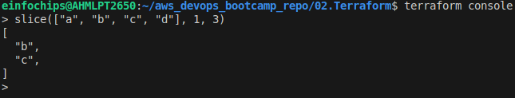
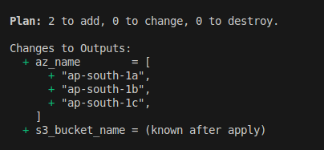
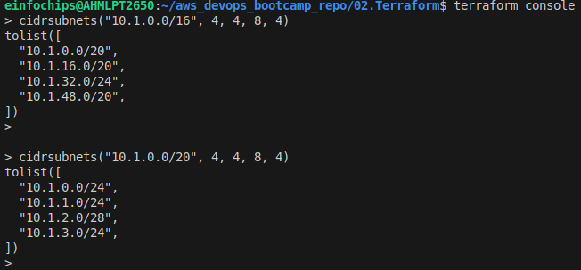
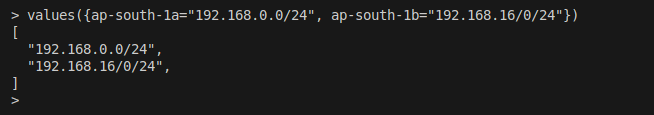
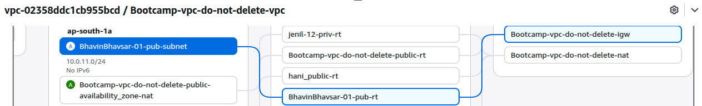
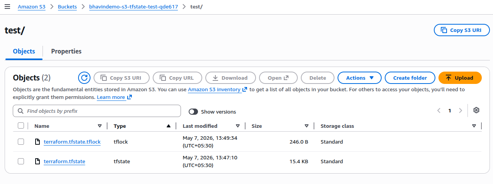

Terraform - The way of managing and provisioning Infrastructure
---

**Terraform Commands**

1. Initialize Terraform configurations files in the working dir.

```bash
terraform init
```

- **Install Provider Plugins** 
    
  - It will install required providers from looing into provider.tf. It will create **.terraform** dir where your required providers plugin will downloads.

- **Create .terraform.lock.hcl**

  - It will create **.terraform.lock.hcl** file where your providers versions will defined and used to ensure consistency across diff envs.

- **Initialize the Backend**

  - It will initialize terraform backend to store your state file locally or remote based on defined backedin in `terraform backend` block.

**Important Init Commands**

  - **-upgrade** - use to switch / modify provider plugin and its verions.

  - **reconfigure** - Reinitialize backend configurations to use new one backend configurations instead of existing.


- 2. Plan of resource provisions

```bash
terraform plan
```

- It will give the whole plan of terraform executions to provisions, delete, update resources.

- 3. validate configurations and syntax

```bash
terraform validate
```

- This will validate your terraform resource block arguments and its syntax before failing any of execution during plan and apply.

- 4. Authenticate and provision plans

```bash
terraform apply
```

- 5. Destroy terraform managed resources

```bash
terraform destroy
```

- 6. List all defined output block for resource attributes.

```bash
terraform output
```

- 7. Create terraform plan files

```bash
terraform plan -out=<file_name>

terraform plan -out=s3planv1
```

- 8. Create plan files for destroy

```bash
terraform plan -destroy -out=s3destroy
```

- This will use by CI/CD Automations tools to review, approve by user.

- This will `never execute terraform plan and not require to wait for plans`

- This will `reduce terraform executions times`.

- 9. Destory resources by using this `s3destroy`

```bash
terraform apply "s3destroy"
```

- Here, `terraform destory "s3destroy" will not work.

- 10. Show state file

```bash
terraform show
```

- 11. Show s3destroy or s3plan files

```bash
terraform show s3destroy
```

- 12. Create and show plan in jsons

```bash
terraform show -json s3destroy | jq > s3destroy.json
```

- 13. Destroy

```bash
terraform apply --destory
```

## Data Source

- To fetch existing resource into terraform which is not managed by terraform or created manually.

```bash
data "aws_availability_zones" "available" {
    state = "available"
}
```

- `available` is a argument we are passing and its shows only availabe availability zones.

- For instance, there are 10 azs, but 2 are downs for aws maintenance. So only 8 azs are availalbe. So only 8 azs will be shows.


## Locals Block

- Local block is used to Assign name to the Expressions, which letting you use this local name multiple times without repeating that expressions.

- This will reduce human typo error by reusability.

- Define Local values by `locals` block.

```bash
locals {
  # Naming convention
  resource_name = "${var.project_name}-${var.environment}"

  # Process the subnet list # Functions Use
  primary_public_subnet = var.subnet_ids[0]
  subnet_count          = length(var.subnet_ids)

  # Environmental deployment settings # Resource Attributes
  is_production      = var.environment == "prod"
  monitoring_enabled = var.monitoring || local.is_production
}
```

- Access or Give Reference to use this Locals value in your resource block by using `local`.

```bash
resource "aws_instance" "web" {
  ami           = data.aws_ami.ubuntu.id
  instance_type = var.instance_type
  subnet_id     = local.primary_public_subnet
  monitoring    = local.monitoring_enabled

  tags = {
    Name        = local.resource_name
    Environment = var.environment
  }
}

resource "aws_security_group" "web" {
  name = "${local.resource_name}-sg"

  tags = {
    Name = "${local.resource_name}-security-group"
  }
}
```


## Functions

### 1. Slice Functions

```bash
slice(list, startindex, endindex)

slice(["a", "b", "c", "d"], 1, 3)
# Ans is - "b", "c"
```

- login to terraoform console

```bash
terraform console

slice(["a", "b", "c", "d"], 1, 3)
```



- Let's create locals block and try to list first 3 available azs.

```bash
# Use Locals to define the expressions for reusability

data "aws_availability_zones" "available" {
    state = "available"
}

locals {
  azs = slice(data.aws_availability_zones.available.names, 0, 3)
}

output  "az_name" {
  value = local.azs
}
```

- Plan it



### 2. cidrsubnets Functions

- cidrsubnets calculates a sequence of consecutive IP address ranges within a particular CIDR prefix.

```bash
cidrsubnets(prefix, newbits...)
```

- `prefix` must be given in CIDR notations `/24`.

- `newbits`  specify the number of additional network prefix bits for one returned address range.



Meta-Arguments
---

- Meta-arguments are a class of arguments that control how Terraform creates and manages your infrastructure. 

- You can use meta-arguments in any type of resource. 

- You can also use most meta-arguments in module blocks.

### 1. depends_on

- This is a way of explicitly define dependencies in the resource block.

### 2. lifecycle

- Its a meta arguments to contorl how your resource should accept rule and provisoin, update, delete resources.

#### 2.1 create_before_destroy

  - It will create a new resource of existing resource, after that it will destory existing resource.

#### 2.2 prevent_destroy
 
  - It will prevent resource from terraform destroy command for resource like vpc.

#### 2.3 ingnore_changes

  - To ingore specific or all chnages made manually after provision resource by terraform.
  - For instance, Instance name, tags can be ingored but `Instance Type` can't be ignored.


### 3. count


### 4. for_each

- Its a meta arguments to create multiple instance of a resource block.

- For instance, create multiple ec2, subnets.

**values functions**

- `values` takes a map and returns a list containing the values of the elements in that map.

This are maps

```bash
ap-south-1a = 192.168.0.0/24
ap-south-1b = 192.168.16.0/24
ap-south-1c = 192.168.32.0/24
```

- We want to attach nat gateway in public subnet `ap-south-1a` only.

- Genereally we doing like this

```bash
resource "aws_nat_gateway" "nat" {
    allocation_id = aws_eip.nat.id
    subnet_id = aws_subnet.pub[0].id
}
```

- `But this will failed`. map can't use into this subnet_id. 

- We have to pick one value from map values.

- **values** functions will use here.



## Setup VPC

### 1. Use Exisiting VPC Resources

- NAT and IGW Gateway, VPC, Pub and Pvt Route Table.

- Use Data source to fetch and use existing resources

```bash
# Use existing vpc
data "aws_vpc" "exist" {
  id = "vpc-02358ddc1cb955bcd"
}

# Use IGW
data "aws_internet_gateway" "existing" {
  filter {
    name   = "attachment.vpc-id"
    values = [data.aws_vpc.exist.id]
  }
}

output "igw_name" {
  value = data.aws_internet_gateway.existing.attachments
}

# Use NAT Gateway
data "aws_nat_gateway" "existing" {
  filter {
    name   = "tag:Name"
    values = ["Bootcamp-vpc-do-not-delete-nat"] # Replace with your NAT GW Name tag
  }

  filter {
    name   = "state"
    values = ["available"]
  }
}

output "ngw_id" {
  value = data.aws_nat_gateway.existing.id
}
```

### 2. Create Rest of vpc resource

- Pub and Pvt subnet.

- Create Route table for both subnet

```bash
# Create locals to use expressions
locals {
  pub_rt_name  = "BhavinBhavsar-01-pub-rt"
  priv_rt_name = "BhavinBhavsar-01-priv-rt"
}

resource "aws_route_table" "public" {
  vpc_id = data.aws_vpc.exist.id
  route {
    cidr_block = "0.0.0.0/0"
    gateway_id = data.aws_internet_gateway.existing.id

  }

  tags = {
    Name = local.pub_rt_name
  }
}


resource "aws_route_table" "private" {
  vpc_id = data.aws_vpc.exist.id
  route {
    cidr_block     = "0.0.0.0/0"
    nat_gateway_id = data.aws_nat_gateway.existing.id
  }

  tags = {
    Name = local.priv_rt_name
  }

}
```

- Associate pub and pvt subnet to respected route table.

```bash
resource "aws_route_table_association" "public" {
  subnet_id      = aws_subnet.public.id
  route_table_id = aws_route_table.public.id
}

resource "aws_route_table_association" "private" {
  subnet_id      = aws_subnet.private.id
  route_table_id = aws_route_table.private.id
}
```

### 3. Provision resources

- Once validate configurations files , apply it.

### 4. Varify resource map from Console




Terraform Variables Precedence Orders
---

| Priority | Source |
| -------- | ------ |
| **1(Highest)** | --var-file=<file_name> |
| 2 | *.auto.tfvars |
| 3 | terraform.tfvars.json |
| 4 | terraform.tfvars |
| 5 | TF_VAR_env | 
| `6` | `variable.tf` |

State Management
---

- We will use AWS S3 Bucket for Remote state management

  - Write backend block in provider block.
  - Use `use_lockfile = true`.
  - Use `encrypt = true` for encryptions.

```bash
backend "s3" {
  bucket = "bhavindemo-s3-tfstate-test-qde617"
  key = "test/terraform.tfstate"
  region = "ap-south-1"
  encrypt = true
  use_lockfile = true
      
  }
```

- Now provision your resources.

- Your `terraform.tfstate` will be located in S3/test/terraform.tfstate.




- `terraform.tfstate.tflock` will be temporary created during provisioning resource period.

- Once provisioned it will deleted.

- At provisioning time any of other user can't access your state file bcz of `terraform.tfstate.tflock`.

- This is called **state-lockings**.

