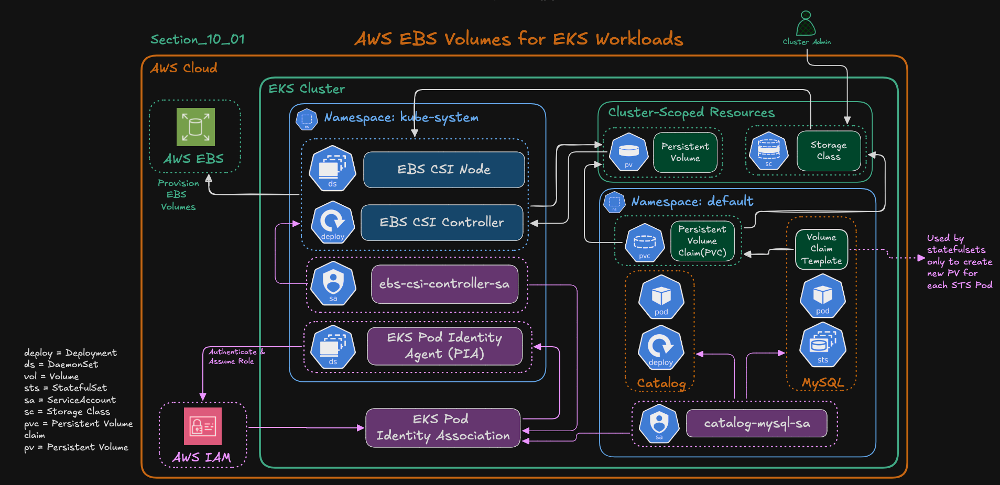
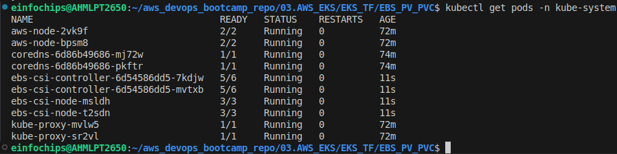

EBS PV PVC
---



`EBS_CSI_Controller` - Create/Manage EBS PV.

`EBS CSI Node` - DeamonSet / Mount volumes to nodes

`EBS CSI Service Account` - Having IAM Permissions by PIA Assume Role. It will give temporary authenticated token to pods/ebs.

`Pod Identity Agent` - Is bridge between EKS and AWS Resources to authenticate EBS Volumes.

`PIA Assoications` - This will have IAM Permissions for EKS EBS Driver Policy to create / manage EBS Volumes.

`Storage Class` - Have defined which types of Storage Options we can use like EBS, EFS etc

`VolumeClaim Templates` - Usefull while using StateFulSets applications , where we will requires Each pods having its own PV, PVC.


## Install EBS CSI Driver

### Step 1: What we will do

  - Create a trust policy file for the EBS CSI Driver IAM Role.

  - Create the IAM Role and attach the AmazonEBSCSIDriverPolicy managed policy.

  - Create a Pod Identity Association for the EBS CSI controller ServiceAccount.

  - Install the Amazon EBS CSI Driver add-on using AWS CLI.
  
  - Verify installation using kubectl.

### Step 2: Export Env Vars

```bash
# Replace the placeholders below with your actual values
export AWS_REGION="ap-south-1"
export EKS_CLUSTER_NAME="bhavindemo-eks-test"
export AWS_ACCOUNT_ID=$(aws sts get-caller-identity --query Account --output text)
```

### Step 3: Create Trust Policy 

```bash
cat <<EOF > ebs-csi-driver-trust-policy.json
{
  "Version": "2012-10-17",
  "Statement": [
    {
      "Effect": "Allow",
      "Principal": {
        "Service": "pods.eks.amazonaws.com"
      },
      "Action": [
        "sts:AssumeRole",
        "sts:TagSession"
      ]
    }
  ]
}
EOF
```

### Step 4: Create IAM Role and Attach Policy

```bash
# Create IAM Role
aws iam create-role \
  --role-name Bhavin_AmazonEKS_EBS_CSI_DriverRole_${EKS_CLUSTER_NAME} \
  --assume-role-policy-document file://ebs-csi-driver-trust-policy.json

# Attach IAM Policy to IAM Role
aws iam attach-role-policy \
  --role-name Bhavin_AmazonEKS_EBS_CSI_DriverRole_${EKS_CLUSTER_NAME} \
  --policy-arn arn:aws:iam::aws:policy/service-role/AmazonEBSCSIDriverPolicy

# Verify:
aws iam list-attached-role-policies \
  --role-name Bhavin_AmazonEKS_EBS_CSI_DriverRole_${EKS_CLUSTER_NAME}
```

### Step 5: Create Pod Identity Associations

```bash
# Create EKS Pod Identity Assocication
aws eks create-pod-identity-association \
  --cluster-name ${EKS_CLUSTER_NAME} \
  --namespace kube-system \
  --service-account ebs-csi-controller-sa \
  --role-arn arn:aws:iam::${AWS_ACCOUNT_ID}:role/Bhavin_AmazonEKS_EBS_CSI_DriverRole_${EKS_CLUSTER_NAME}
```

### Step 6: Install the EBS CSI Driver Add-ons

```bash
# First list how many add-ons are installed
aws eks list-addons --cluster-name ${EKS_CLUSTER_NAME}

# Install EKS EBS CSI Addon
aws eks create-addon \
  --cluster-name ${EKS_CLUSTER_NAME} \
  --addon-name aws-ebs-csi-driver \
  --service-account-role-arn arn:aws:iam::${AWS_ACCOUNT_ID}:role/Bhavin_AmazonEKS_EBS_CSI_DriverRole_${EKS_CLUSTER_NAME}

```



This command will do:

  - Installs the Amazon EBS CSI Driver add-on on your EKS cluster.

  - Associates it with the IAM Role you created earlier.
  
  - Deploys the following components automatically:
  
    - ebs-csi-controller (Deployment)
    
    - ebs-csi-node (DaemonSet)

AWS EBS CSI Integration for Catalog Microservice
---

### Step 1 – Create StorageClass for Amazon EBS

- Create storage class for ebs csi driver

```bash
apiVersion: storage.k8s.io/v1
kind: StorageClass
metadata:
  name: ebs-sc
provisioner: ebs.csi.aws.com
volumeBindingMode: WaitForFirstConsumer
```

### Step 2: Update MySQL StatefulSet to Use EBS Storage

- Update statefulset for this:

  - Added volumeClaimTemplates to dynamically create a PVC per Pod

  - Linked to storageClassName: `ebs-sc`

  - Mounted `/var/lib/mysql` to persistent EBS-backed volume

  - Replace `emptydir` with actual pv name


