Helm
---

Install Retail UI Helm Chart
---

### Step 1: Install UI Helm Chart from ECR OCI

```bash
# Install v 1.0.0

helm install ui oci://public.ecr.aws/aws-containers/retail-store-sample-ui-chart \
  --version 1.2.4 \
  --set app.theme=orange
# It will ask for authentications to pull ECR's Helm Chart

aws ecr-public get-login-password --region us-east-1 | helm registry login -u AWS --password-stdin public.ecr.aws
```

### Step 2: List Helm Release

```bash
# List helm releases
helm list
helm ls
```
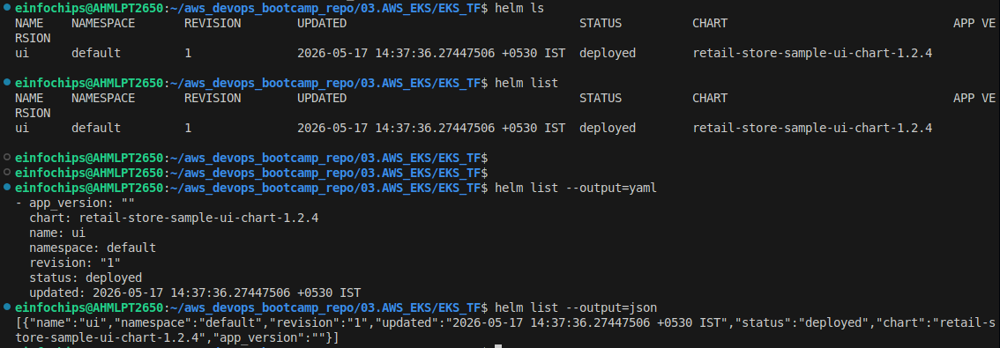

```bash
# List helm releases in YAML JSON By using --output=yaml

helm list --output=yaml
helm list --output=json
```

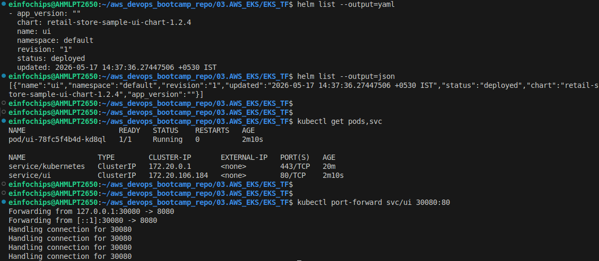


### Step 3: Ensure k8s resources of helm UI

```bash
kubectl get pods,svc

# Access UI
kubectl port-forward svc/ui 300080:80

# On browser
localhost:30080
```

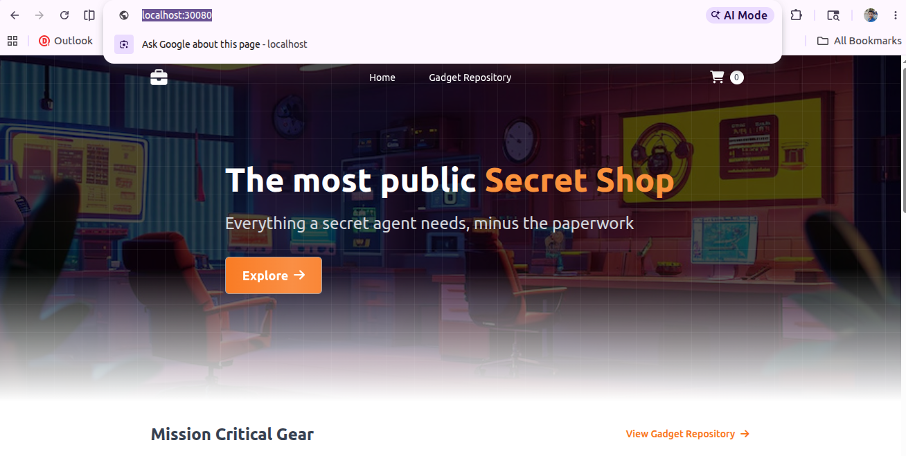

### Step 4: upgrade UI Theme to Greens

- To upgrade apps by helm, Use 
```bash
helm upgrade <deployment_name> <oci://ecr_address> \ --version 1.2.4 \
--set app.theme=orange
```

```bash
helm upgrade ui oci://public.ecr.aws/aws-containers/retail-store-sample-ui-chart \
  --version 1.2.4 \
  --set app.theme=orange
```

- See helm history

```bash
# To see all history of how many times you did upgraded ?

# Use helm history <helm_release_name>

helm history ui
```

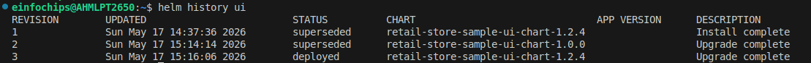

- Access apps

```bash
kubectl port-forward svc/ui 30080:80
```

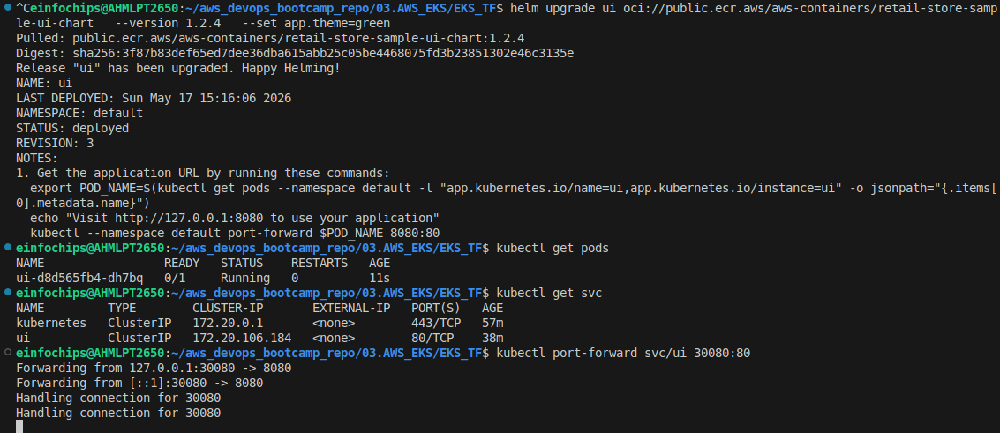

- Access app on browser

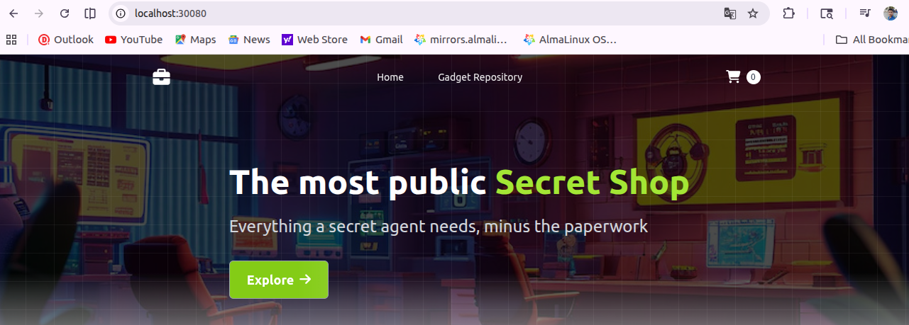

### Step 5: Print Helm Values & Manifests

- To get whatever you made changes to UI release

- Use `get values`

```bash
helm get values ui
```

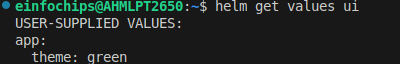


- To see default values + applied changes

```bash
helm get values ui --all
```

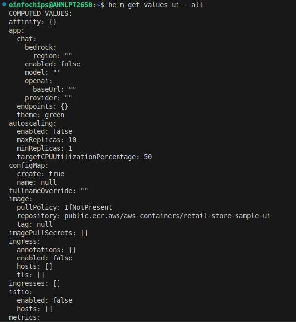


- To print `rendered` k8s manifests

- **To get all manifests deployed by helm** like `deployments`, `svc`, `serviceaccounts`, `configmap`, `secrets`, `hpa`, `pv-pvc` etc.

```bash
helm get manifests ui --all
```

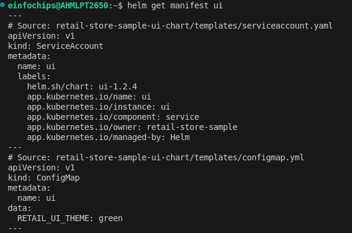

- Get service

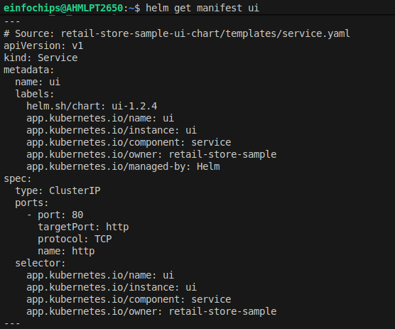


- Get deployment

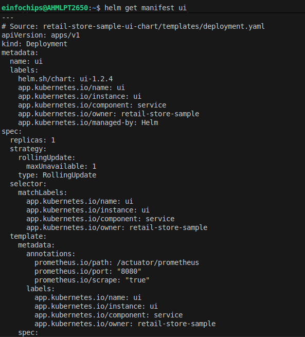

### Step 6: Rollback to previous versions

```bash
# First see all release history
helm history ui

# pick one of release history like realease 1
helm rollback ui 1

# Ensure right rollback ui to 1 release
helm list

kubectl get pods -w

kubectl port-forward svc/ui 30080:80
```

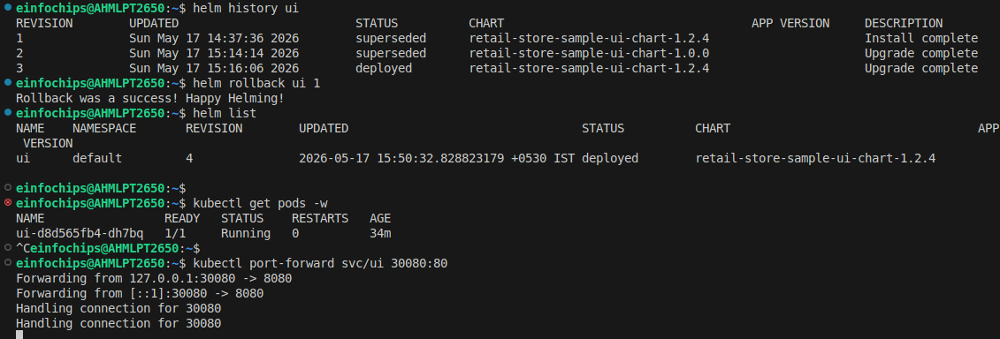

- Access apps on browser


**NOTE**

- If you want to Only see **What will change/apply**

- If you want to **NOT APPLY** changes but want to see what will change , how it will look

- use `dry run`.

```bash
helm rollback ui 2 --dry-run
```

### Step 7: Update Application to v1.3.0

-  1) Update app to v1.3.0
- 2) Set RETAIL_UI_THEME=green
- 3) Rollout restart deployment/ui to load this changes
- 4) Verify chnages

#### 1) Update app to v1.3.0

```bash
helm upgrade ui oci://public.ecr.aws/aws-containers/retail-store-sample-ui-chart \
--version 1.3.0
```

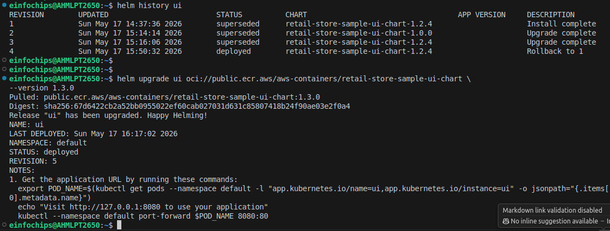

#### 2) Set env to greens

```bash
helm upgrade ui oci://public.ecr.aws/aws-containers/retail-store-sample-ui-chart \
--version 1.3.0 \
--set app.theme=green
```

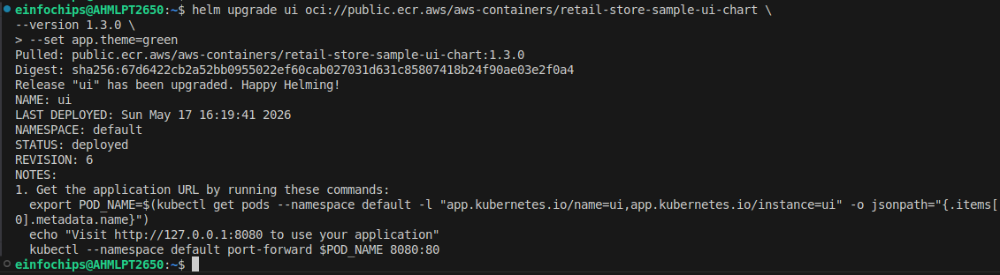

- Ensure its updated ConfigMap `RETAIL_UI_THEME=green` by

```bash
helm get manifest ui
```

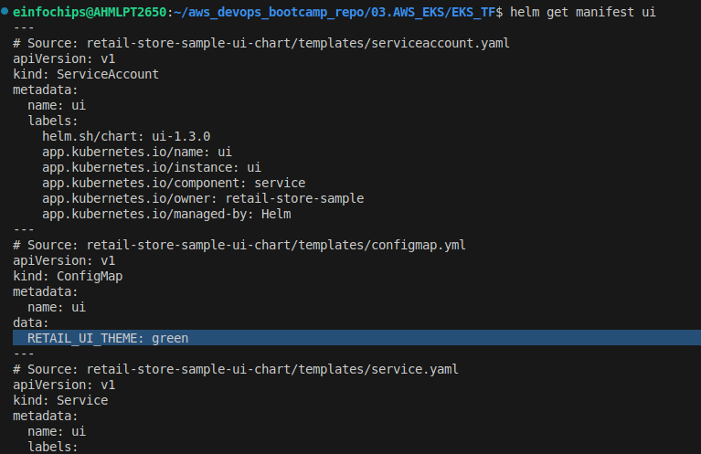


#### 3) Load changes

```bash
kubectl rollout restart deployment/ui
```

#### 4) Verify Changes

```bash
kubectl get pods
kubectl port-forward svc/ui 30080:80
```

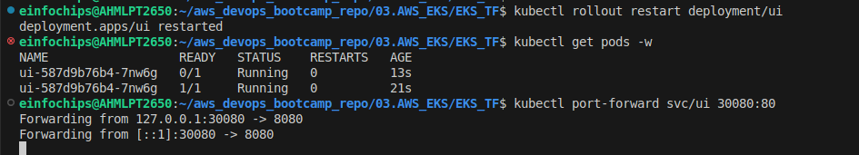

- Varify changes on browser


### Step 8: Clean Helms

```bash
helm list

helm uninstall <helm_release_name>
helm uninstall ui
```


Introductions to Helm Custom Values
---

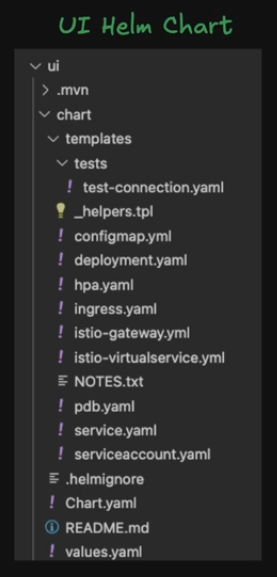

- `chart` - having `templates`- under templates, our k8s manifests is there which uses values.yml for variables.

- values.yml has actual values passing to templates's manifests.yml

**Way for passing values**

  - 1. values.yml

  - 2. overrides

    - 2.1 `-f values-ui.yml`, `-f values-<custom-name>.yml`

    - 2.2 `--set app.theme=green` 

**Precedence of passing values**

1. High - `--set` - use while upgrading , installing helm apps.

2. `-f <custom-values-name>.yml

3. Low - `values.yml`

**Inspect & Preview**

- To show actual default values from helm charts, use `helm show values <helm_repo> --version 1.3.0

```bash
helm show values oci://public.ecr.aws/aws-containers/retail-store-sample-ui-chart --version 1.3.0
```

- Dry run to preview for what and which values will be applied

```bash
helm install ui oci://public.ecr.aws/aws-containers/retail-store-sample-ui-chart --version 1.3.0 -f <custom_values>.yaml --dry-run --debug | less


helm install ui oci://public.ecr.aws/aws-containers/retail-store-sample-ui-chart --version 1.3.0 -f values-ui.yaml --dry-run --debug | less
```

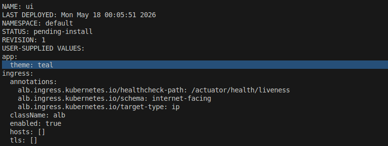


**Upgrade helm with your values.yml**

```bash
helm upgrade ui <helm_repo> -f values-ui.yaml
```

- `values-ui.yaml`

```yml
app:
  theme: teal # orange, green, default

# Ingress for ALB

ingress:
  enabled: true
  className: alb
  annotations:
    alb.ingress.kubernetes.io/schema: internet-facing
    alb.ingress.kubernetes.io/target-type: ip
    alb.ingress.kubernetes.io/healthcheck-path: /actuator/health/liveness
  tls: []
  hosts: []
```

### Step 1: Install helm with custom values.yml

```bash
kubectl get deployment -n kube-system aws-load-balancer-controller

kubectl get pods -n kube-system

# Install ui from helm chart with your values.yml

helm install ui oci://public.ecr.aws/aws-containers/retail-store-sample-ui-chart \
  --version 1.3.0 \
  -f values-ui.yaml
```

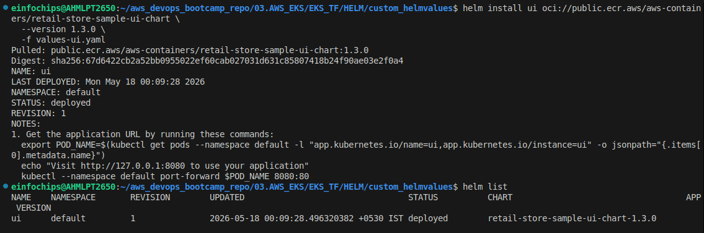

### Step 2: Verify Ingress

```bash
helm list

# Show all resources which is created by helm
helm status ui --show-resources
```

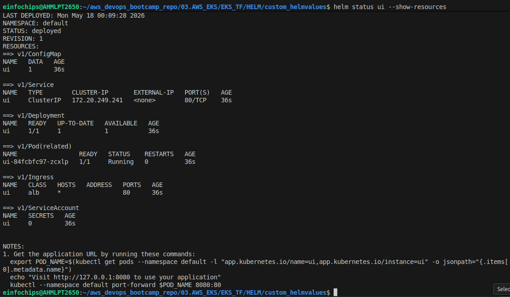


- Show all values default + changed

```bash
helm get values ui --all
```

- Show all manifest of ui

```bash
helm get manifest ui
```

- Ensure Ingress & ALB

```bash
kubectl get pods
kubectl get svc

kubectl get ingress
kubectl describe ingress
```

Helm Chart Exploration - Retail UI
---

- We will learn how values.yml works, how templates works

### Step 1: Pull & Unpack the Chart

```bash
helm pull oci://public.ecr.aws/aws-containers/retail-store-sample-ui-chart \
  --version 1.3.0 \
  --untar
```

- This is how our helm has structure


```bash
├── Chart.yaml
├── README.md
├── templates
│   ├── configmap.yaml
│   ├── deployment.yaml
│   ├── _helpers.tpl
│   ├── hpa.yaml
│   ├── ingress.yaml
│   ├── istio-gateway.yml
│   ├── istio-virtualservice.yaml
│   ├── NOTES.txt
│   ├── pdb.yaml
│   ├── serviceaccount.yaml
│   ├── service.yaml
│   └── tests
│       └── test-connection.yaml
└── values.yaml
```

### Step 2: What each files Does ?

- **`Chart.yaml`** - Stores metadata like: `name`, `descriptions`, `type`, `versions`, `appversions`.

- **`values.yaml`** - default values will passing into templates each manifests.

- **`.helmignore`** - ignore files while packaging

- **`templates`** - Here our k8s manifests lives


### Step 3: Lint & Render

- **lint** - validate helm charts. For instance, all values has defined / missed ?

- `ui` is **NOT Release Name**, `ui is a dir name`

```bash
helm lint ui
helm lint retail-store-sample-ui-chart/
```

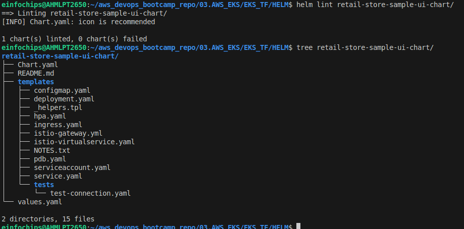


