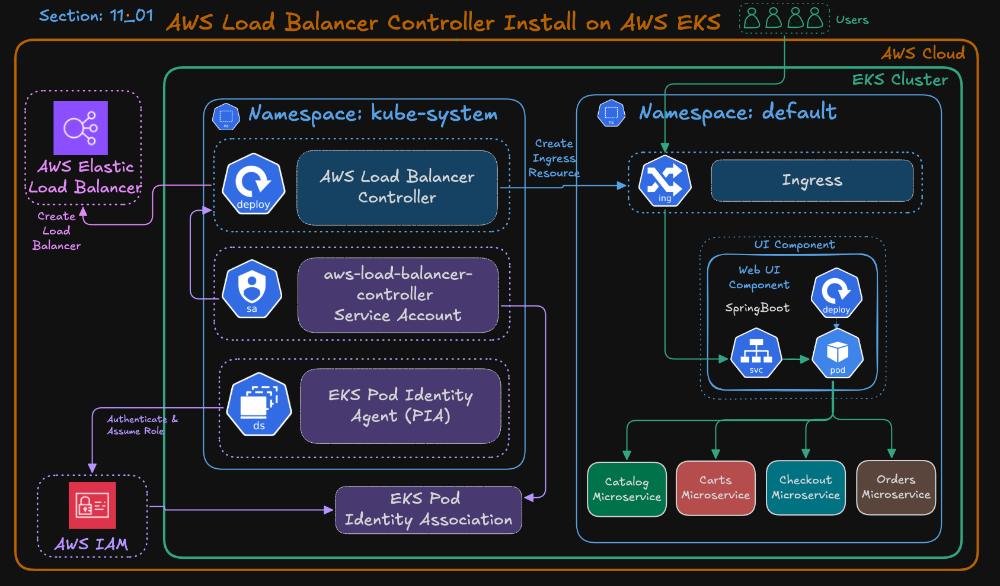
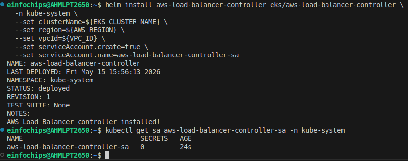
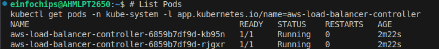

Kubernetes Ingress
---

Ingress exposes HTTP and HTTPS routes from outside the cluster to services within the cluster. Traffic routing is controlled by rules defined on the Ingress resource.


- `Ingress managed lb` is a **ALB** - works on Layer 7 - Appliation layer 

- Supports for HTTP/HTTPS protocol with Hostname based, path based, header based routing.

- Receives a lot of traffic from internet.

- **ALB** is = **Ingress**.

- **`NLB`** == Service type == `LoadBalancer`.

  - `hostname routing` - **</app1>.<domain.com>** 
    - /app1.google.com
    - /app2.google.com
    - /app3.goolge.com


  - `header routing` - what had you defined in rule for header it  will check for that.

    - path is `https://app1.example.com`
    - header send:

```bash
Host: example.com
X-Tester-Group: beta-qa
User-Agent: Mozilla/5.0... # From this browser user made a requests
```

Setup Ingress Controller with PIA Associations
---




### Step 1: Export Env Vars

```bash
# Replace the placeholders below with your actual values
export AWS_REGION="ap-south-1"
export EKS_CLUSTER_NAME="bhavindemo-eks-test"
export AWS_ACCOUNT_ID=$(aws sts get-caller-identity --query Account --output text)
```

### Step 2: Create IAM Policy for Load Balancer Controller

```bash
# Download policy
curl -o aws-load-balancer-controller-policy.json \
https://raw.githubusercontent.com/kubernetes-sigs/aws-load-balancer-controller/main/docs/install/iam_policy.json
```

- Create AWS Policy for Load Balancer Controlle

```bash
aws iam create-policy \
  --policy-name Bhavin_AWSLoadBalancerControllerIAMPolicy_${EKS_CLUSTER_NAME} \
  --policy-document file://aws-load-balancer-controller-policy.json
```

### Step 3: Create Trust Policy

```bash
cat <<EOF > aws-load-balancer-controller-trust-policy.json
{
  "Version": "2012-10-17",
  "Statement": [
    {
      "Effect": "Allow",
      "Principal": {
        "Service": "pods.eks.amazonaws.com"
      },
      "Action": [
        "sts:AssumeRole",
        "sts:TagSession"
      ]
    }
  ]
}
EOF
```

### Step 4: Create IAM Role and Attach Policy

- Create IAM Role and attach trust policy

```bash
aws iam create-role \
  --role-name Bhavin_AmazonEKS_LBC_Role_${EKS_CLUSTER_NAME} \
  --assume-role-policy-document file://aws-load-balancer-controller-trust-policy.json
```

- Attach IAM Policy to this IAM roles

```bash
aws iam attach-role-policy \
  --role-name Bhavin_AmazonEKS_LBC_Role_${EKS_CLUSTER_NAME} \
  --policy-arn arn:aws:iam::${AWS_ACCOUNT_ID}:policy/Bhavin_AWSLoadBalancerControllerIAMPolicy_${EKS_CLUSTER_NAME}
```

- Attach IAM loadbalancer policy which we had downloaded.

- Attach to this IAM Roles

```bash
aws iam list-attached-role-policies \
  --role-name Bhavin_AmazonEKS_LBC_Role_${EKS_CLUSTER_NAME}
```

### Step 5: Create EKS Pod Identity Association

```bash
aws eks create-pod-identity-association \
  --cluster-name ${EKS_CLUSTER_NAME} \
  --namespace kube-system \
  --service-account aws-load-balancer-controller-sa \
  --role-arn arn:aws:iam::${AWS_ACCOUNT_ID}:role/Bhavin_AmazonEKS_LBC_Role_${EKS_CLUSTER_NAME}
```

**NOTE** - service account - `aws-load-balancer-controller-sa` has not created yet.

- We will create it later.

`This will assign Bhavin_AmazonEKS_LBC_Role_${EKS_CLUSTER_NAME} roles iam permissions to sa named **aws-load-balancer-controller-sa** by **Pod Identity Associations**`.

- We just did Pod Identity Associations for load balancer controller.

Install AWS Load Balancer Controller (Helm)
---

### Step 6: Add Helm Repo

```bash
helm repo add eks https://aws.github.io/eks-charts
helm repo update
```

### Step 7: Install Load Balancer Controller

- Fetch your VPC ID first

```bash
# Get VPC ID
VPC_ID=$(aws eks describe-cluster \
  --name ${EKS_CLUSTER_NAME} \
  --query "cluster.resourcesVpcConfig.vpcId" \
  --output text)
```


```bash
# Install AWS Load Balancer Controller using HELM
helm install aws-load-balancer-controller eks/aws-load-balancer-controller \
  -n kube-system \
  --set clusterName=${EKS_CLUSTER_NAME} \
  --set region=${AWS_REGION} \
  --set vpcId=${VPC_ID} \
  --set serviceAccount.create=true \
  --set serviceAccount.name=aws-load-balancer-controller-sa  
```

**NOTE** - We keep here `serviceAccount.create=true`.

- So, within installing load balancer controller it will create service account and also assign IAM Roles by already assoicated to PIA.



- Ensure aws-load-balancer-controller has running pods

```bash
# List Pods
kubectl get pods -n kube-system -l app.kubernetes.io/name=aws-load-balancer-controller
```




**Ingress Modes**

- There are 2 modes, **1. Instance Mode**, **2. IP Mode**

1. Instance Mode 

  - Traffic from the load balancer reaches the Kubernetes nodes on a specific NodePort. From there, kube-proxy routes the traffic to the destination pods.

  - Best for: General-purpose, simple networking setups.

  - Requirements: The backend service must be of type NodePort or LoadBalancer

  - Characteristics:
    
    - Adds an extra network hop (ALB -> Node -> Pod).
    
    - NodePort must be opened


2. IP Mode

  - Traffic from the load balancer is routed directly to the pod IP address. It bypasses the NodePort and kube-proxy.

  - Requirements: Requires a CNI plugin that supports direct pod IP routing (e.g., Amazon VPC CNI plugin).
  
  - Best for: High-performance, low-latency requirements, and Fargate. It is required for sticky sessions on ALBs.

  - Characteristics:
    
    - Faster, more direct routing.
    
    - Supports AWS Fargate


| Feature | Instance Mode | IP Mode |
| ------- | ------------- | ------- |
| Target | EC2 Node Port `(<NodeIP>:<NodePort>)` | Pod IP `(<PodIP>:<PodPort>)` |
|Traffic Path | ALB - Node - Pod | ALB -  Pod | 
| Kube-proxy | Required | Bypassed | 
| Service Type| NodePort or LoadBalancer| Any (ClusterIP/NodePort) | 
| Best For | Simplicity, Existing Setup | High Performance, Fargate |