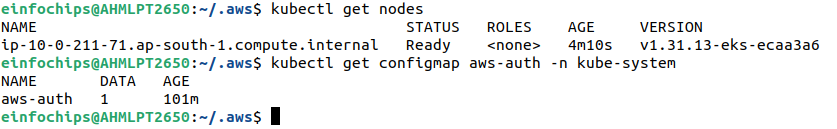
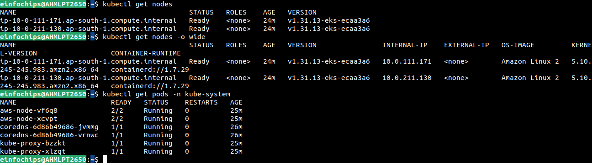
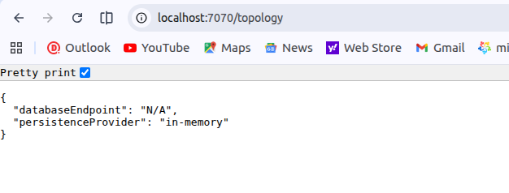
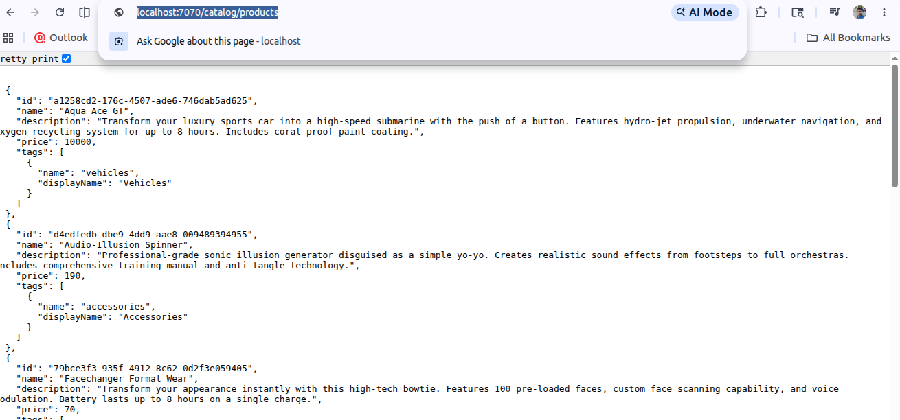
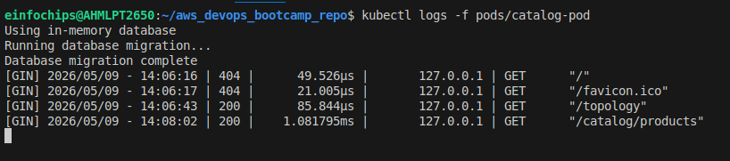
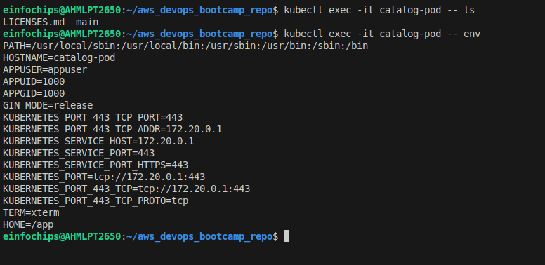
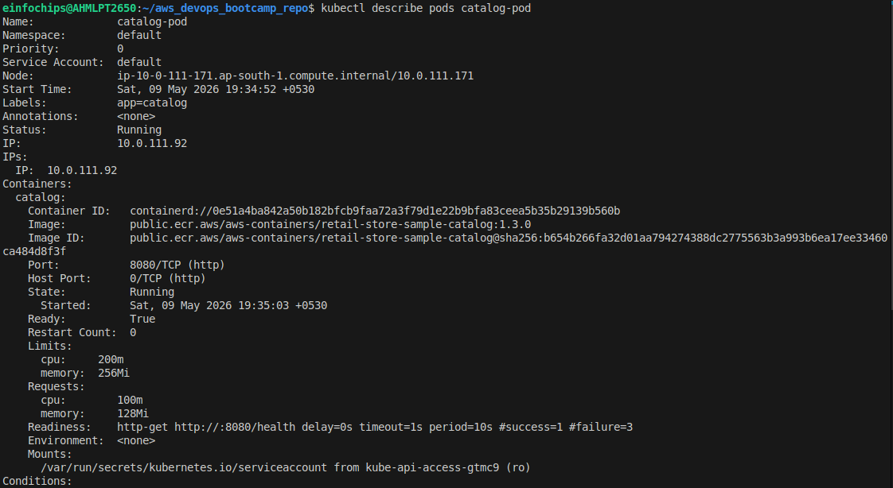
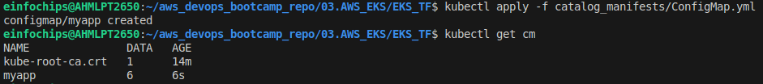
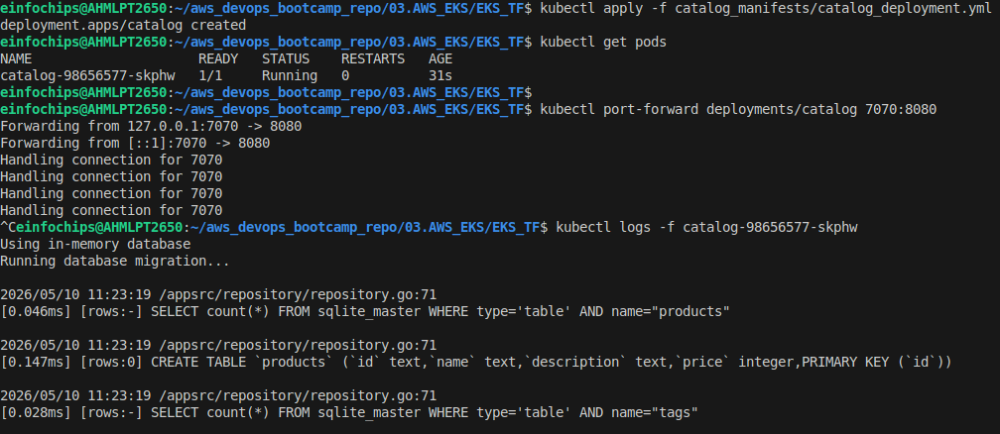

# Kubernetes Architecture: Complete Guide

## Table of Contents
1. [Overview](#overview)
2. [Master Node (Control Plane)](#master-node-control-plane)
3. [Worker Nodes](#worker-nodes)
4. [User Request Flow (ALB to Pods)](#user-request-flow-alb-to-pods)
5. [Key Concepts](#key-concepts)
6. [What Makes Kubernetes Powerful](#what-makes-kubernetes-powerful)
7. [Quick Reference](#quick-reference)

---

## Overview

Kubernetes is a container orchestration platform that manages containerized applications across a cluster of machines. It consists of two main types of nodes:

- **Master Node (Control Plane)**: Makes decisions about the cluster
- **Worker Nodes**: Run your actual application containers

Think of Kubernetes as an automated system administrator that:
- Deploys applications
- Manages networking
- Handles scaling and updates
- Ensures applications stay healthy
- Restarts failed containers automatically

---

## Master Node (Control Plane)

The master node is the brain of Kubernetes. It coordinates all activities in the cluster and manages the state of all worker nodes and pods.

### 1. API Server

**What it does:**
- Central hub of Kubernetes
- Every request (from users, CLI tools, internal components) goes through the API Server first
- Validates requests and checks permissions
- Processes requests and stores the desired state
- Provides REST API endpoints for cluster management

**How it works:**
- When you run `kubectl apply -f deployment.yaml`, the API Server receives this request
- It validates the YAML syntax and your permissions
- Stores the desired state in etcd
- Notifies other components (Scheduler, Controller Manager) about the change

**Example workflow:**
```
You: kubectl create pod nginx
  ↓
API Server: "Create a pod named 'nginx' with image 'nginx:latest'"
  ↓
Stored in etcd database
  ↓
Scheduler and Controller Manager notified
```

---

### 2. Scheduler

**What it does:**
- Watches for new Pods that haven't been assigned to any node yet
- Evaluates available worker nodes
- Decides which worker node is best for each Pod
- Assigns the Pod to the selected node

**Scheduling criteria:**
- Available CPU and memory
- Node affinity (prefer certain nodes)
- Pod requirements and constraints
- Taints and tolerations
- Resource requests and limits

**Example:**
```
Scheduler sees: "Need to create Pod-A with 2GB RAM"

Checks available nodes:
  - Node-1: 512MB free (not enough)
  - Node-2: 3GB free (perfect!)
  - Node-3: 100MB free (not enough)

Decision: Assign Pod-A to Node-2
```

---

### 3. Controller Manager

**What it does:**
- Continuously monitors cluster state
- Compares desired state (what you want) with actual state (what's running)
- Takes corrective actions to match desired state
- Runs multiple controllers for different resources

**Key controllers:**
- **ReplicaSet Controller**: Ensures correct number of Pod replicas
- **Deployment Controller**: Manages deployments and rolling updates
- **StatefulSet Controller**: Manages stateful applications
- **Job Controller**: Manages one-time tasks
- **Service Controller**: Creates/manages load balancers

**Example:**
```
You declare: "I want 3 replicas of my app"

Current state: Only 2 Pods are running (one crashed)

Controller Manager action: "Create 1 new Pod to match desired state"

Now: 3 Pods running ✓
```

---

### 4. etcd (Database)

**What it does:**
- Persistent key-value store
- Stores ALL cluster data
- Source of truth for cluster state
- Uses Raft consensus for consistency

**What it stores:**
- Pod configurations and status
- Service definitions
- Secrets and ConfigMaps
- Node information
- Persistent Volume claims
- All resource definitions

**Why it's important:**
- If the master node crashes and restarts, etcd remembers everything
- Without etcd, you'd lose all cluster configuration

**Data example:**
```json
{
  "deployments": {
    "default": {
      "myapp": {
        "replicas": 3,
        "image": "myapp:v1.0",
        "status": "running"
      }
    }
  },
  "services": {
    "default": {
      "myapp-service": {
        "type": "LoadBalancer",
        "port": 80
      }
    }
  }
}
```


## Worker Nodes

Worker nodes are where your actual application containers run. Each worker node has several components that manage pods and networking.

### 1. Kubelet (Node Agent)

**What it does:**
- Runs on every worker node
- Communicates with the Master Node (API Server)
- Creates, updates, and deletes Pods on the node
- Ensures containers are running and healthy
- Reports node status to the master

**Responsibilities:**
- Receives Pod specifications from the master
- Pulls container images from registries
- Instructs the container runtime to start containers
- Monitors Pod and container health
- Restarts failed containers
- Reports node metrics (CPU, memory, disk)
- Sends heartbeats to the master

**Workflow:**
```
Master: "Hey Node-1, please create Pod-A"
  ↓
Kubelet: "Received. Creating Pod-A..."
  ↓
Kubelet: "Pod-A is now running. Health check: OK"
  ↓
Kubelet: "Sending heartbeat and status to master"
```

**Health checks:**
- Readiness probe: Is the app ready to receive traffic?
- Liveness probe: Is the app still alive, or should we restart it?
- Startup probe: Has the app finished starting up?

---

### 2. kube-proxy (Network Component)

**What it does:**
- Manages network rules on every worker node
- Routes traffic to Pods
- Load balances requests across multiple Pod replicas
- Implements Services networking

**How it works:**
- Watches the API Server for Service and Endpoint changes
- Updates iptables (Linux firewall) rules based on Services
- When a request comes to a Service IP, kube-proxy intercepts it
- Routes the request to one of the healthy Pod IPs (load balancing)
- Can use round-robin, session affinity, or other algorithms

**Real-world example:**
```
Service: "myapp-service" has 3 Pod replicas
  - Pod-1 (10.0.1.5)
  - Pod-2 (10.0.1.6)
  - Pod-3 (10.0.1.7)

Request comes to: 10.0.0.100:80 (Service IP)

kube-proxy logic:
  Request 1 → Pod-1
  Request 2 → Pod-2
  Request 3 → Pod-3
  Request 4 → Pod-1 (round-robin)
```

---

### 3. Container Runtime (Docker/containerd)

**What it does:**
- Pulls container images from registries
- Creates container processes
- Manages container networking
- Manages container storage
- Runs and stops containers

**Container lifecycle:**
```
1. Image Pull: Download image from Docker Hub/ECR/private registry
2. Create: Create container from image
3. Start: Run container process
4. Health Checks: Monitor container health
5. Stop: Gracefully stop container
6. Cleanup: Remove container and volumes
```

**Example:**
```
Kubelet: "Run image nginx:latest"
  ↓
Container Runtime: "Pulling nginx:latest..."
  ↓
Container Runtime: "Creating container..."
  ↓
Container Runtime: "Container ID: abc123def456"
  ↓
Container Runtime: "Container running, listening on port 80"
```

---

### 4. Pods (Your Applications)

**What is a Pod?**
- Smallest deployable unit in Kubernetes
- Wrapper around one or more containers
- Usually contains one container (can have more for sidecar patterns)
- All containers in a Pod share networking (same IP address)

**Pod characteristics:**
- Ephemeral: Pods can be created and destroyed quickly
- Mortal: Pods are not meant to be permanent
- Identifiable: Have unique IP addresses within the cluster
- Isolated: Have their own network namespace

**Containers in a Pod share:**
- IP address and port space
- Storage volumes
- Configuration information (environment variables)
- Local inter-process communication (localhost)

**Example Pod with sidecar:**
```yaml
Pod: my-app-pod
├── Container 1: app (main application)
│   └── Port 8080
└── Container 2: logging-sidecar (sends logs to central system)
    └── Port 3000

Both share: 10.0.1.50 (Pod IP)
Can communicate via: localhost:8080 or localhost:3000
```

---

## User Request Flow (ALB to Pods)

This is the complete journey of an HTTP request from when a user clicks a link to when it reaches your application.

### The Complete Journey

```
┌─────────────────────────────────────────────────┐
│ Step 1: User hits ALB public URL                │
│ URL: http://myapp.example.com                   │
│ User's browser sends HTTP request               │
└─────────────────────────────────────────────────┘
                        ↓
┌─────────────────────────────────────────────────┐
│ Step 2: ALB receives request                    │
│ - ALB is AWS load balancer with public IP       │
│ - Has routing rules configured                  │
│ - Forwards to Ingress Controller Pod            │
└─────────────────────────────────────────────────┘
                        ↓
┌─────────────────────────────────────────────────┐
│ Step 3: Ingress Controller intercepts           │
│ - Reads Ingress resources (Kubernetes objects)  │
│ - Matches hostname/path to Service              │
│ - Example routing rules:                        │
│   /api/* → payment-service                      │
│   /images/* → image-service                     │
│   / → frontend-service                          │
└─────────────────────────────────────────────────┘
                        ↓
┌─────────────────────────────────────────────────┐
│ Step 4: Request reaches Service                 │
│ - Service is virtual network address            │
│ - Stable DNS name: frontend-service.default     │
│ - ClusterIP: 10.0.0.100                         │
│ - Service itself doesn't process requests      │
│ - Just a routing rule/load balancer             │
└─────────────────────────────────────────────────┘
                        ↓
┌─────────────────────────────────────────────────┐
│ Step 5: kube-proxy load balances                │
│ - Intercepts request at Service IP              │
│ - Has list of Pod IPs backing this Service:     │
│   • Pod-1: 10.1.1.5 (Node-1)                    │
│   • Pod-2: 10.1.2.6 (Node-2)                    │
│   • Pod-3: 10.1.3.7 (Node-1)                    │
│ - Selects Pod-2 using load balancing algorithm  │
│ - Rewrites destination IP to Pod IP (10.1.2.6)  │
└─────────────────────────────────────────────────┘
                        ↓
┌─────────────────────────────────────────────────┐
│ Step 6: Network overlay routes to Pod's node    │
│ - Request destination: Node-2 (10.1.2.6)        │
│ - If Pod is on different node, overlay network  │
│   (Flannel, Calico, Weave) tunnels packet       │
│ - Packet arrives at Node-2 interface            │
└─────────────────────────────────────────────────┘
                        ↓
┌─────────────────────────────────────────────────┐
│ Step 7: Kubelet on Worker Node                  │
│ - Kubelet receives packet at node interface     │
│ - Has mapping: Pod IP → Container process       │
│ - Routes packet to correct container namespace  │
│ - Container runtime sees incoming connection    │
└─────────────────────────────────────────────────┘
                        ↓
┌─────────────────────────────────────────────────┐
│ Step 8: Container Runtime                       │
│ - Docker/containerd receives packet             │
│ - Forwards to container process (app)           │
│ - Container listens on port 8080 (or configured)│
└─────────────────────────────────────────────────┘
                        ↓
┌─────────────────────────────────────────────────┐
│ Step 9: Your Application processes request      │
│ - Node.js server, Python Flask, Go app, etc.    │
│ - Reads request headers and body                │
│ - Executes business logic                       │
│ - Queries databases if needed                   │
│ - Generates HTTP response                       │
└─────────────────────────────────────────────────┘
                        ↓
┌─────────────────────────────────────────────────┐
│ Step 10: Response travels BACK (reverse path)   │
│ Container → Container Runtime → Kubelet         │
│ → kube-proxy → Service → Ingress → ALB          │
│ → User's browser displays response              │
└─────────────────────────────────────────────────┘
```

### Request Flow Diagram Summary

```
External User
    ↓ (HTTP request)
┌─────────────┐
│   ALB       │ ← Public endpoint
└─────────────┘
    ↓
┌─────────────────────────────────────┐
│ Master Node (Control Plane)         │
│ - API Server (processes requests)   │
│ - Scheduler (assigns pods)          │
│ - Controller Manager (maintains)    │
│ - etcd (database)                   │
└─────────────────────────────────────┘
    ↓ (manages)
┌──────────────────────┬──────────────────────┐
│  Worker Node 1       │  Worker Node 2       │
│ ┌────────────┐      │ ┌────────────┐       │
│ │ Kubelet    │      │ │ Kubelet    │       │
│ │ kube-proxy │      │ │ kube-proxy │       │
│ │ Runtime    │      │ │ Runtime    │       │
│ ├────────────┤      │ ├────────────┤       │
│ │ Pod-1      │      │ │ Pod-2      │       │
│ │ Pod-3      │      │ │ Pod-4      │       │
│ └────────────┘      │ └────────────┘       │
└──────────────────────┴──────────────────────┘
    ↓ (actual app containers)
Your Applications (Node.js, Python, Go, etc.)
```

---

## Key Concepts

### Master Node vs Worker Node

| Aspect | Master Node | Worker Node |
|--------|-------------|-------------|
| **Purpose** | Manages cluster | Runs applications |
| **Key Components** | API Server, Scheduler, Controller Manager, etcd | Kubelet, kube-proxy, Container Runtime |
| **Makes Decisions** | Yes | No (follows master orders) |
| **Runs Pods** | Usually no | Yes |
| **High Availability** | Run 3+ masters in production | Can have many workers |
| **Failure Impact** | Cluster management stops | Individual pods stop, others continue |

### Important Terms

**Service**
- Virtual network address for a group of Pods
- Stable IP that doesn't change even if Pods are recreated
- Types: ClusterIP (internal), NodePort (node IP), LoadBalancer (cloud LB)
- Example: All database pods are behind `db-service`

**Ingress**
- Routes external HTTP/HTTPS traffic to Services
- Understands HTTP paths and hostnames
- Manages SSL certificates
- Example: Route `api.example.com` to `api-service`, `www.example.com` to `web-service`

**Deployment**
- Describes desired state of application
- How many replicas, which image, resource limits, etc.
- Kubernetes maintains this desired state automatically

**StatefulSet**
- Like Deployment but for stateful applications
- Provides stable network identities
- Manages persistent storage
- Example: Databases, caches, message queues

**ConfigMap**
- Store non-sensitive configuration data
- Key-value pairs that Pods can read
- Example: App settings, feature flags

**Secret**
- Store sensitive data (passwords, API keys, tokens)
- Base64 encoded (not encrypted by default)
- Should be encrypted at rest in production

**Namespace**
- Virtual cluster within a cluster
- Isolate resources, teams, environments
- Example: `production`, `staging`, `development` namespaces

**Persistent Volume (PV)**
- Storage resource independent of Pods
- Survives Pod restarts
- Can be backed by cloud storage, NFS, local disk, etc.

**Persistent Volume Claim (PVC)**
- Pod's request for storage
- Claims a Persistent Volume
- Pods use PVCs to access storage

---

## What Makes Kubernetes Powerful

### 1. Self-Healing
```
Pod crashes → Kubelet detects it → Controller Manager creates new Pod
Automatically, without manual intervention
```

### 2. Auto-Scaling
```
kubectl scale deployment myapp --replicas=10
# 10 Pods created automatically on available nodes
```

### 3. Rolling Updates (Zero-Downtime Deployments)
```
Old version: 3 Pods running
Deploy new version: Kubernetes gradually replaces old Pods with new ones
Throughout process: Traffic continues, no downtime
```

### 4. Service Discovery
```
Pod-1 needs to talk to Pod-2
Doesn't need to know Pod-2's IP (it changes when Pod restarts)
Just uses DNS: pod2-service.default.svc.cluster.local
Automatically resolves to Pod-2's current IP
```

### 5. Load Balancing
```
Service with 3 Pod replicas
Each request automatically distributed to one Pod
Handles traffic spikes smoothly
```

### 6. Resource Management
```
Set resource requests and limits:
- Scheduler ensures nodes have capacity
- If Pod exceeds limit, Kubernetes kills and restarts it
- Efficient cluster utilization
```

### 7. Declarative Configuration
```yaml
# You describe desired state in YAML
apiVersion: apps/v1
kind: Deployment
metadata:
  name: myapp
spec:
  replicas: 3
  image: myapp:v1.0
  
# Kubernetes makes it reality
# You don't worry about HOW, just declare WHAT you want
```

### 8. Multi-Cloud and Hybrid Cloud
```
Same Kubernetes cluster can run on:
- AWS
- Google Cloud
- Azure
- On-premises
- Multiple clouds simultaneously

No vendor lock-in
```

### 9. Storage Orchestration
```
Pods need storage
Kubernetes automatically provisions and mounts volumes
Can be cloud storage, NFS, local disk, etc.
```

### 10. Secret and Configuration Management
```
Store secrets separately from code
Pods access them without hardcoding credentials
Easy to rotate secrets without redeploying apps
```

---

## Architecture Summary

### Component Relationships

```
User Request
    ↓
┌─────────────────────────────────────┐
│ CLUSTER BOUNDARY                    │
│                                     │
│ ┌──────────────────────────────┐    │
│ │ Master Node (Control Plane)  │    │
│ │ - API Server                 │    │
│ │ - Scheduler                  │    │
│ │ - Controller Manager         │    │
│ │ - etcd                       │    │
│ └──────────────────────────────┘    │
│         ↓ orchestrates              │
│ ┌──────────────────────────────┐    │
│ │ Worker Nodes (Multiple)      │    │
│ │                              │    │
│ │ Node 1:                      │    │
│ │ ├─ Kubelet                   │    │
│ │ ├─ kube-proxy                │    │
│ │ ├─ Container Runtime         │    │
│ │ └─ Pods (running containers) │    │
│ │                              │    │
│ │ Node 2: (Same structure)     │    │
│ │ Node N: (Same structure)     │    │
│ │                              │    │
│ └──────────────────────────────┘    │
│                                     │
└─────────────────────────────────────┘
    ↓
Application Response
```

### Data Flow

```
1. Desired State (YAML)
   ↓
2. API Server validates and stores in etcd
   ↓
3. Controller Manager reads desired state, compares with actual
   ↓
4. Scheduler assigns Pods to Nodes
   ↓
5. Kubelet receives assignments, creates Pods
   ↓
6. Container Runtime pulls images, runs containers
   ↓
7. kube-proxy sets up networking
   ↓
8. Service routes traffic to running Pods
   ↓
9. Ingress routes external traffic to Services
   ↓
10. Your application receives and processes requests
```

---

## Quick Reference

### Master Node Components Checklist
- [ ] API Server - Entry point for all requests
- [ ] Scheduler - Assigns Pods to Nodes
- [ ] Controller Manager - Maintains desired state
- [ ] etcd - Persists cluster state

### Worker Node Components Checklist
- [ ] Kubelet - Creates and manages Pods
- [ ] kube-proxy - Routes traffic to Pods
- [ ] Container Runtime - Runs containers
- [ ] Pods - Your application containers

### Request Path Checklist
1. [ ] ALB receives request
2. [ ] Ingress Controller routes to Service
3. [ ] Service routes to Pod
4. [ ] kube-proxy load balances
5. [ ] Network overlay tunnels if needed
6. [ ] Kubelet forwards to Container Runtime
7. [ ] Container Runtime forwards to application
8. [ ] Application processes and responds
9. [ ] Response travels back through same path

---

## Conclusion

Kubernetes is a powerful, self-healing container orchestration platform. Understanding these core components helps you:

- **Deploy applications reliably**: Master ensures desired state
- **Scale automatically**: Scheduler distributes work
- **Handle failures gracefully**: Controller Manager restarts failed Pods
- **Manage networking**: Services and kube-proxy route traffic
- **Persist data**: etcd and storage solutions
- **Monitor and debug**: View logs, metrics, events

The master node makes intelligent decisions, while worker nodes execute those decisions by running your containerized applications. Together, they create a resilient, scalable platform for modern cloud-native applications.


**understand variables**

- `cluster_endpoint_public_access = true`

- This makes your eks cluster's endpoints publically accessible.

- So, public user can access your applications directly from internet.

- `cluster_endpoint_public_access_cidr = ["0.0.0.0/0"]`

- This is inbound traffic restrictions.

- It will allow anybody from internet to your applications directly.

- If you set to `["1.2.3.4/24"]` or your ip ranges , then it will allow from this CIDR only.


**After Registered Nodes into NodeGroup**

```bash
aws eks --region ap-south-1 update-kubeconfig --name bhavindemo-eks-test
```

```bash
kubectl get nodes
kubectl get configmap aws-auth -n kube-system
```



- Check kube-system ns pods




########################


# Kubernetes Pods

I'll break down this comprehensive guide on Kubernetes Pods, covering all essential concepts that frequently appear in interviews.

---

## 1. **What is a Kubernetes Pod?**

### Definition
A **pod** is the **smallest deployable unit in Kubernetes**. It's a wrapper/abstraction layer around one or more containers.

### Key Components Inside a Pod
```
┌─────────────────────────────────────┐
│        Kubernetes Pod               │
│  ┌──────────────────────────────┐   │
│  │    Container(s)              │   │
│  │  (One or more Docker images) │   │
│  └──────────────────────────────┘   │
│  ┌──────────────────────────────┐   │
│  │    Network (Networking)      │   │
│  └──────────────────────────────┘   │
│  ┌──────────────────────────────┐   │
│  │    Storage                   │   │
│  └──────────────────────────────┘   │
│  ┌──────────────────────────────┐   │
│  │    Identity                  │   │
│  └──────────────────────────────┘   │
└─────────────────────────────────────┘
```

### Why Pods Exist?
Kubernetes doesn't manage containers directly because:
- It needs a higher-level abstraction
- Containers alone don't provide networking, storage, and identity management
- Pods provide these capabilities automatically

---

## 2. **Docker vs. Kubernetes Architecture**

### Docker Approach
```
Docker Image → docker run command → Container → Application runs
```
- Direct container management
- Container = single instance of your application
- Multiple instances = multiple containers

### Kubernetes Approach
```
Docker Image → Kubernetes Pod (wrapper) → Container inside Pod → Application runs
```
- Pods are the smallest unit, never containers directly
- Pod wraps the container with networking, storage, and identity
- More managed and orchestrated approach

### Interview Question
**Q: Why can't Kubernetes run containers directly?**

**A:** Because containers alone lack the necessary infrastructure like:
- Networking capabilities
- Storage management
- Identity and lifecycle management
- Resource scheduling

Kubernetes needs a higher abstraction (pod) to manage all these aspects.

---

## 3. **Prerequisites Before Understanding Pods**

### Assumption 1: Docker Image Ready
- You have a pre-built Docker image for your application
- Example: Catalog microservice (CTM) from a retail store
- Image is stored in a registry (Docker Hub, ECR, etc.)

### Assumption 2: Kubernetes Cluster Ready
- EKS (Amazon Elastic Kubernetes Service)
- AKS (Azure Kubernetes Service)
- Self-managed Kubernetes cluster
- Or any other Kubernetes distribution

**Why these matter?** You can't deploy pods without these prerequisites.

---

## 4. **How Pods Run on Worker Nodes**

### Architecture
```
┌──────────────────────────────┐
│   Kubernetes Cluster         │
│                              │
│  ┌────────────────┐  ┌─────┐│
│  │ Worker Node 1  │  │Node2││
│  │  ┌──────────┐  │  │┌──┐ ││
│  │  │Pod (CTM) │  │  ││Pod││
│  │  │Container │  │  │└──┘ ││
│  │  └──────────┘  │  └─────┘│
│  │  ┌──────────┐  │         │
│  │  │Pod (CTM) │  │         │
│  │  │Container │  │         │
│  │  └──────────┘  │         │
│  └────────────────┘         │
└──────────────────────────────┘
```

### Pod Scheduling
- **Kubernetes Scheduler** decides which worker node gets each pod
- Considers: CPU availability, memory, node capacity
- Automatic distribution across nodes
- If Node 1 is full → pod goes to Node 2

### Key Points
- Pods are ephemeral (can be created/destroyed)
- Worker nodes must have enough resources
- Scheduler continuously balances load

---

## 5. **Scaling and Load Distribution**

### Scenario: High Traffic to Catalog Service

**Problem:** Your catalog microservice receives heavy traffic

**Solution:** Create more pods

```
Before (1 instance):
┌──────────┐
│ Pod (CTM)│
└──────────┘
Request rate: 1000 req/s

After (3 instances):
┌──────────┐
│ Pod (CTM)│  ← 333 req/s
├──────────┤
│ Pod (CTM)│  ← 333 req/s
├──────────┤
│ Pod (CTM)│  ← 333 req/s
└──────────┘
```

### Key Features
- Each pod runs **identical copy** of your container
- Kubernetes scales automatically based on:
  - Available worker node resources
  - CPU/Memory requirements
  - Load
- Pod = single instance of your application
- More instances = more pods (not more containers in one pod)

**Q: How does Kubernetes scale applications?**

**A:** By creating additional pods. Each pod is an independent instance of your application. If you need more capacity, you create more pods; you don't add more containers to existing pods.

---

## 6. **One Container Per Pod (Best Practice) ⭐**

### The Golden Rule
```
RECOMMENDED APPROACH:
┌─────────────────┐
│ Pod 1           │
│ └─ CTM Container│
└─────────────────┘

┌─────────────────┐
│ Pod 2           │
│ └─ CTM Container│
└─────────────────┘

NOT RECOMMENDED:
┌──────────────────────┐
│ Pod 1                │
│ ├─ CTM Container 1   │  ← WRONG!
│ └─ CTM Container 2   │
└──────────────────────┘
```

### Why One Container Per Pod?

| Aspect | One Container Per Pod | Multiple Containers |
|--------|----------------------|-------------------|
| Scaling | Easy - create new pods | Complex - changes pod logic |
| Isolation | Better - each instance separate | Poor - coupled instances |
| Failure | One failure = one pod | One failure = multiple instances |
| Management | Simple and clean | Complicated |
| Recommended |  YES |  NO |

**Q: Is it a best practice to run multiple containers of the same application in one pod?**

**A:** No, absolutely not. Best practice is one container per pod. If you need multiple instances of your application, create multiple pods, not multiple containers in one pod. This provides better isolation, easier scaling, and simpler management.

---

## 7. **Multi-Container Pods (Exception to the Rule)**

### When to Use: Sidecar/Helper Patterns

You can run multiple containers in one pod **only** for helper/sidecar containers that support your main application.

### Example 1: Logging Agent
```
┌──────────────────────────────┐
│ Pod (Multi-Container)        │
│                              │
│ ┌────────────────────────┐   │
│ │ Main Container (CTM)   │   │
│ │ Catalog Microservice   │   │
│ │ → Generates logs       │   │
│ └────────────────────────┘   │
│          ↓ (shares storage)  │
│ ┌────────────────────────┐   │
│ │ Sidecar Container      │   │
│ │ Logging Agent          │   │
│ │ → Reads logs           │   │
│ │ → Sends to CloudWatch  │   │
│ └────────────────────────┘   │
│                              │
│ [Shared Network & Storage]   │
└──────────────────────────────┘
```

### Example 2: Service Mesh Proxy
```
┌─────────────────────────────────┐
│ Pod (Multi-Container)           │
│                                 │
│ ┌──────────────────┐            │
│ │ Main Container   │            │
│ │ (Your App)       │            │
│ └──────────────────┘            │
│          ↕ (intercepts traffic) │
│ ┌──────────────────┐            │
│ │ Sidecar: Envoy   │            │
│ │ (Istio Proxy)    │            │
│ │ → Traffic control│            │
│ │ → Load balancing │            │
│ └──────────────────┘            │
│                                 │
│ [Shared Network & Storage]      │
└─────────────────────────────────┘
```

### Common Sidecar Use Cases
1. **Logging Agents** - Collect and forward logs
2. **Service Mesh Proxies** - Istio, Linkerd (Envoy proxy)
3. **Monitoring Agents** - Prometheus, monitoring sidecars
4. **Config Management** - Init containers that setup configs
5. **Security Sidecars** - Network policies, encryption

### Key Characteristics of Sidecars
- Run alongside main container
- Share the same **network** namespace
- Share the same **storage** namespace
- Support main application functionality
- Not instances of your main application


**Q: When would you use multiple containers in a single pod?**

**A:** Only for sidecar or helper patterns. For example:
- Adding a logging agent to collect and ship logs to CloudWatch
- Adding an Envoy proxy for service mesh capabilities like Istio
- Adding monitoring or security sidecars

The key rule: never multiple containers of the *same* application; only helper containers that support your main application.

---

## 8. **Pod Lifecycle and Ephemeral Nature**

### Important Characteristic
Pods are **ephemeral** (temporary):
- Can be created and destroyed dynamically
- When a pod dies, it's gone
- New pods are created to replace failed ones
- Kubernetes handles this automatically

### Why This Matters
- Don't store persistent data inside pods
- Use **Persistent Volumes** for data that must survive pod death
- Design applications to be stateless when possible

---

## 9. **Complete Recap**

### The 5 Core Concepts

| Concept | Explanation |
|---------|------------|
| **Pod Definition** | Smallest deployable unit in Kubernetes; wrapper around containers |
| **Not Direct Containers** | Kubernetes never runs containers directly; always uses pods |
| **One Container Best Practice** | One container per pod is recommended for main applications |
| **Scaling via Pods** | Scale by creating more pods, not more containers per pod |
| **Sidecar Containers** | Only exception: helper/sidecar containers for logging, proxies, etc. |

### What Pods Provide
- **Networking** - Pods share network namespace
- **Storage** - Shared storage access
- **Identity** - Unique identification
- **Orchestration** - Kubernetes manages them

### Worker Node Distribution
- Pods are scheduled on worker nodes
- Kubernetes scheduler decides placement
- Automatic distribution based on resources
- Pods spread across multiple nodes for reliability

---

## 10. **Typical Interview Questions & Answers**

### Q1: What is a Kubernetes Pod?
**A:** A pod is the smallest deployable unit in Kubernetes. It's a wrapper around one or more containers that provides networking, storage, and identity management. Unlike Docker where you run containers directly, Kubernetes always wraps containers in pods.

### Q2: Why can't Kubernetes run Docker containers directly?
**A:** Because containers alone don't provide:
- Networking abstraction
- Storage management
- Identity and lifecycle management

Kubernetes needs a higher-level abstraction (pod) to manage all these aspects and provide orchestration capabilities.

### Q3: Is it okay to run multiple containers of the same application in one pod?
**A:** No, that's not recommended. Best practice is one container per pod. If you need multiple instances, create multiple pods. Multiple containers should only be used for sidecar/helper patterns (logging agents, service mesh proxies, etc.).

### Q4: How are pods distributed across nodes?
**A:** The Kubernetes Scheduler automatically decides which worker node each pod runs on based on:
- Available CPU and memory
- Node capacity
- Resource requests and limits

If a node is full, new pods are scheduled on other available nodes.

### Q5: What happens when a pod fails?
**A:** Pods are ephemeral. If a pod dies, it's gone. Kubernetes uses higher-level controllers (Deployments, StatefulSets) to automatically create replacement pods to maintain the desired state.

### Q6: Can pods share resources?
**A:** Yes, containers within the same pod:
- Share the same **network namespace** (same IP, can communicate on localhost)
- Share the same **storage** (if volumes are mounted)
- Share the same **identity/hostname**

This is why sidecars work well - they can access the main container's network and storage.

### Q7: What's the difference between scaling in Docker vs Kubernetes?
**A:** 
- **Docker:** Create more containers using `docker run`
- **Kubernetes:** Create more pods through Deployments; Kubernetes handles scheduling

Kubernetes automatically distributes pods across nodes, provides service discovery, and self-heals failed pods.

### Q8: What are some real-world sidecar examples?
**A:**
- **Logging Agent:** Collects application logs and sends to CloudWatch/ELK
- **Envoy Proxy:** Adds service mesh capabilities (Istio)
- **Monitoring Agent:** Collects metrics for Prometheus
- **Init Container:** Sets up environment before main app starts

### Q9: Are pods suitable for storing persistent data?
**A:** No. Pods are ephemeral - they can be deleted anytime. For persistent data, use:
- **Persistent Volumes (PV)**
- **StatefulSets** for stateful applications
- **External databases** for application data

### Q10: How do pods communicate with each other?
**A:** Pods communicate through:
- **Service Names** (DNS)
- **IP addresses** (each pod gets unique IP)
- **Kubernetes Service** abstracts pod communication

## 11. **Key Terminology**

- **Ephemeral** - Temporary; pods can be created/destroyed
- **Sidecar** - Helper container running alongside main container
- **Worker Node** - Physical/virtual machine where pods run
- **Scheduler** - Kubernetes component that decides pod placement
- **Deployable Unit** - The smallest thing you can deploy in Kubernetes
- **Container Orchestration** - Kubernetes manages lifecycle and distribution
- **Service Mesh** - Like Istio, uses sidecar proxies
- **Namespace Sharing** - Containers in same pod share network/storage


## Create Pods

- Once pod created, map your local port to container port

```bash
kubectl port-forward <resource-type>/<resource-name> local_port:container_port

kubectl port-forward pods/catalog-pod 7070:8080
```



```bash
# Check health endponits
localhost:7070/health

# Check topology endponts
localhost:7070/topology

# list products
localhost:7070/catalog/products
```



- Check logs

```bash
kubectl logs -f pod/catalog-pod

# Topology, health ep accessed
```



- Run command in pods

```bash
kubectl exec -it catalog-pod -- sh
ls
```



- Run command inside pod from cli

```bash
kubectl exec -it catalog-pod -- ls
```



- **To Scale replicas from 1 to 3 in deployments**

```bash
kubectl scale deployment catalog --replicas=3
```

### Update the Deployment Image

```bash
# List Deployment Revisions
kubectl rollout history deployment/catalog

# Update Deployment to new image
kubectl set image deployment/catalog catalog: "public.ecr.aws/aws-containers/retail-store-sample-catalog:1.3.0"

# List deployment Revisions
kubectl rollout histroy deployment/catalog
```


## ConfigMaps

- A configmap is an API object used to `store non-confidencial data` in `key-value pairs`.

- Pods can consume `ConfigMap` as `Env Vars`, `Command-Line Arguments`, or as `Configuration files in a Volume`.

- A ConfigMap allows you to **decouple env specific config from your container images**, so that your apps are easier portable.


**`ConfigMap Doesn't provide Secrecy or Encryptions`**.

**`If You want to store Confidential , Sensitive Data`, use a **Secret** rather than a `ConfigMap`**.

- ConfigMap is not designed to hold large chunks of data.

- The data stored in a ConfigMap can't exceed **1 MiB**. 

- `If you store settings which is larger than this limit`, you should use those big files **data mounted in a volumes** or Use a **seperate database or file service**.

- The Pod , Deployment and ConfigMap Must be in a Same NameSpace.


  - Instead of hardcoding non-sensitive values in code, container image, pod, deployment WE KEEP THEM OUTSIDE THE APPLICATIONS.

**Difference between `Env` and `ConfigMap`**.

  - 1. `env` - Is a way to pass values into a containers.

    - By define values like DB_USER, DB_PASSWD in a container, pod, deployment in `env:` which is not recommended in `PROD`.

  - 2. `ConfigMap` - It stores value centrally.

  - Instead passing env hardcodly in a pod, deployment, or docker image directly, We can use `ConfigMap` which is stored this values centrally and outside of applications.


- Create ConfigMap

## Using Configmaps as environment variables

To use a Configmap in an environment variable in a Pod:

  - 1. For each container in your Pod specification, add an environment variable for each Configmap key that you want to use to the env[].valueFrom.configMapKeyRef field.
  - 2. Modify your image and/or command line so that the program looks for values in the specified environment variables.


```yml
apiVersion: v1
kind: ConfigMap
metadata:
  name: game-demo # This is configmap names.
data: # We are defining key-value pair in data block.
  # property-like keys; each key maps to a simple value
  player_initial_lives: "3"
  ui_properties_file_name: "user-interface.properties"

  # file-like keys
  game.properties: |
    enemy.types=aliens,monsters
    player.maximum-lives=5    
  user-interface.properties: |
    color.good=purple
    color.bad=yellow
    allow.textmode=true    
```

- Accessing this configmap each key and its value into this Pod.yml

```yml
# ConfigMap_Pod.yml

apiVersion: v1
kind: Pod
metadata:
  name: configmap-demo-pod
spec:
  containers:
    - name: demo
      image: alpine
      command: ["sleep", "3600"]
      env: # We are passing ConfigMap as Enviroment Vars.
        # Define the environment variable
        # PLAYER_INITIAL_LIVES is a env names
        - name: PLAYER_INITIAL_LIVES # Notice that the case is different here
                                     # from the key name in the ConfigMap.
          valueFrom:
            configMapKeyRef:
              name: game-demo           # The ConfigMap this value comes from.
              key: player_initial_lives # The key to fetch.
        - name: UI_PROPERTIES_FILE_NAME
          valueFrom:
            configMapKeyRef:
              name: game-demo
              key: ui_properties_file_name
      volumeMounts:
      - name: config
        mountPath: "/config"
        readOnly: true
  volumes:
  # You set volumes at the Pod level, then mount them into containers inside that Pod
  - name: config
    configMap:
      # Provide the name of the ConfigMap you want to mount.
      name: game-demo
      # An array of keys from the ConfigMap to create as files
      items:
      - key: "game.properties"
        path: "game.properties"
      - key: "user-interface.properties"
        path: "user-interface.properties"
```


**Bydefault If you use ConfigMap mounted on a Volume**, If you update configmap from that volume like add new env, key-value pair in that volume, **It will automatically updates in your pods**.

- A container using a ConfigMap as a **subPath volume mount** will `not receive ConfigMap updates`.

- ConfigMaps consumed as **environment variables** are `not updated automatically` and **require a pod restart**.

| Name | Descriptions | Default |
| ---- | ------------ | ------- |
| Port | The server is listions on port | 8080 |
| RETAIL_CATALOG_PERSISTENCE_PROVIDER | The persistence provider to use, can be `in-memory` or `mysql` | in-memory |
| RETAIL_CATALOG_PERSISTENCE_ENDPOINT | Database Endpoint URL | "" |
| RETAIL_CATALOG_PERSISTENCE_DB_NAME | Database Name | catalogdb |
| RETAIL_CATALOG_PERSISTENCE_USER | Database User | catalog_user |
| RETAIL_CATALOG_PERSISTENCE_PASSWORD | Database Password | "" |
| RETAIL_CATALOG_PERSISTENCE_CONNECT_TIMEOUT=5 | Database connection timeout in sec | 5 |


- Once configmap created , now deployment of applications do.

```bash
kubectl apply -f configmap.yml

kubectl apply -f catalog_deployments.yml
```



- Ensure all pods are runnning and its logs

```bash
kubectl get pods

kubectl logs -f <pod_name>
```

