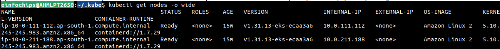
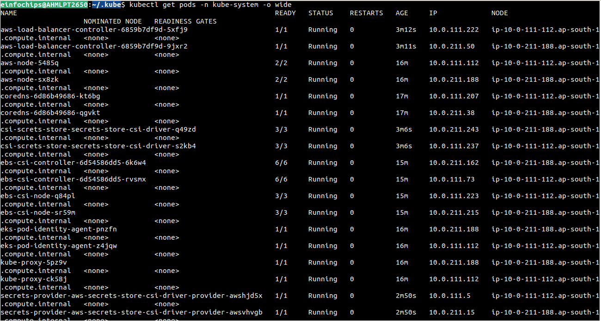

Provision EKS Cluster with AddOns by Terraform
---

Whatever we had did earlier like create eks cluster, install lbc controller by helm, PIA, Pod Identity Associations, Create roles, policy.

All things has done manually.

This all things we will provision and managed by Terraform.

Our Terraform code for VPC and EKS will be as it is till create cluster.

- We will write resource block, data block for create IAM Policy Assure Role, Create IAM Role - Attach actual downloaded/AWS Managed policy and assume role to this Role.

- We will - PIA Install, PIA Association for each resources like LBC, SecretsStores, EBS CSI Driver.

**Setup EKS Cluster and AddOns**

```bash
cd 04.TF_EKS_AddOns/

terraform init
terraform plan

# Review plans and approve it
terraform apply
```




- Ensure all required controller and pod identity agent has installed and running status.




**NOTES**

- Use `syncSecret.enabled` in secrets store.

- It will sync your secrets between the AWS Secrets Manager and your **Native k8s secrets**.

- It will help while you deleted your AWS Secrets Manager accidentaly.

- It is `less secure then the `**`Direct secret mount using external secret manager`**.

- Use `helm_release` to install, upgrade by helm.

- Use `set = [ { name = "lbc_controller" value = tf_resource_address } ]`.

- It is used to pass our custom value in helm during install upgrade just like -- vpcId, -- cluster_name

**What issue i had faced ?**

```bash
│ Error: installation failed │ │ with helm_release. secrets_store_csi_driver, │ on Install_SecretStore_helm.tf line 1, in resource "helm_release" "secrets_store_csi_driver": │ 1: resource "helm_release" "secrets_store_csi_driver" { │ │

Kubernetes cluster unreachable: unable to load root certificates: unable to parse bytes as PEM │ block ╵ ╷ │

Error: installation failed │ │ with helm_release.lbc_controller, │ on Install_lbc_helm.tf line 5, in resource "helm_release" "lbc_controller": │ 5: resource "helm_release" "lbc_controller" { │ │

Kubernetes cluster unreachable: unable to load root certificates: unable to parse bytes as PEM │ block ╵
```

- Error is: `unable to load root certificates: unable to parse bytes as PEM block`

- What Error says, `Terraform Helm provider cannot parse the EKS cluster CA certificate correctly.`

- Bcz of , Mis Configurations in the providers "kubernetes", "helm"

- EKS returns CA data as base64 encoded. which is not expects by helm Providers and kubernetes providers

- **Terraform expects decoded PEM certificate**.

- Use **base64decode** in provider block.

## We will deploy Persistance Application in Data Plans by Terraform


- In this architecture, we will deploy and setup our apps in 2 parts.

  1. Setup EKS Data Plan - We will setup / provision all AWS DBs, Pre-Requisites as we did in this parts

  2. Setup All MicroServices & Update all EndPoints in a manifests

- Let's go to next part `05.RetailStore_Microservices_with_AWS_Data_Plane`.