A Global Secondary Index (GSI) is used to query data using alternative keys instead of the table's primary partition key.
In DynamoDB, you can normally only look up items efficiently using the primary key. If you try to look up items using any other attribute, DynamoDB must perform a Scan, which reads every single item in the table. This is slow, expensive, and fails on large datasets. A GSI solves this problem.
------------------------------
## Why use a GSI? (Key Benefits)

* Fast Queries on Non-Key Attributes: A GSI creates a "shadow copy" of your table, rearranged by a new partition key. This allows for lightning-fast lookups (millions of requests per second) on attributes that are not your primary key.
* Flexible Data Access Patterns: Single-table design in NoSQL requires you to answer multiple business questions. A GSI lets you query the exact same data from different angles.
* Cost and Performance Optimization: By preventing full table scans, you drastically reduce read costs and application latency.
* Custom Scaling: A GSI has its own read/write capacity settings. If one specific query pattern is heavily used, you can scale that index independently without paying to scale the whole main table.

------------------------------
## Real-World Example
Imagine an E-commerce Orders table:

* Main Table Primary Key: OrderId (String)

| OrderId (Hash Key) | CustomerId | OrderDate | TotalAmount | Status |
|---|---|---|---|---|
| ORD-001 | CUST-99 | 2026-05-01 | $150.00 | Shipped |
| ORD-002 | CUST-44 | 2026-05-02 | $45.00 | Pending |
| ORD-003 | CUST-99 | 2026-05-03 | $80.00 | Shipped |

## The Problem
If your app needs to "Find all orders for Customer CUST-99", DynamoDB cannot do this efficiently because CustomerId is not the primary key. It has to scan the whole database.
## The GSI Solution
You create a GSI where:

* GSI Partition Key: CustomerId
* GSI Sort Key: OrderDate

DynamoDB automatically copies and maintains a secondary view behind the scenes:

| CustomerId (GSI Hash) | OrderDate (GSI Sort) | OrderId | TotalAmount | Status |
|---|---|---|---|---|
| CUST-44 | 2026-05-02 | ORD-002 | $45.00 | Pending |
| CUST-99 | 2026-05-01 | ORD-001 | $150.00 | Shipped |
| CUST-99 | 2026-05-03 | ORD-003 | $80.00 | Shipped |

Now, your application can instantly query by CustomerId to fetch all orders for a user, sorted by date.
------------------------------
If you are designing a table right now, I can help you set up the index. Let me know:

* What main attributes are in your data?
* What questions/queries does your application need to ask the database?
* How large do you expect the table to grow?


**CheckOut** - Will connect to the AWS ElastiCache - Redis

- It will not requires PIA, PIA Associations, Just need to connect to `AWS ElastiCache - Redis`.

**How ?**

- By SG of AWS EKS Nodes.

- AWS ElastiCache - Redis should create in pvt subnet

**What will do for CheckOut ?**

1. Create AWS ElasticCache - Redis Cluster in Pvt Subnet.

2. Create Redis Security Group

3. Create Pvt Subnet Group for Redis just like RDS MySQL.

4. Allow Traffic from source of AWS EKS Node's SG to Redis SG.


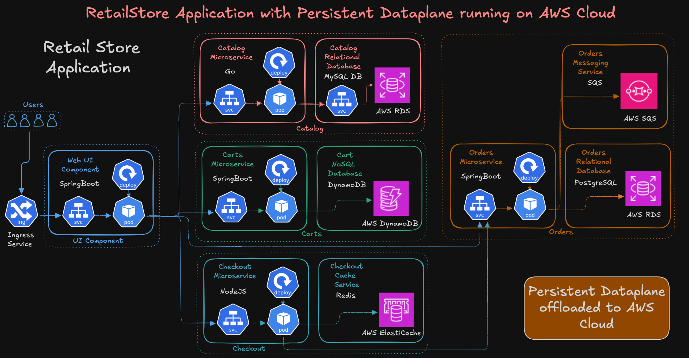

**Setup required IAM Policy, Roles and Use to PIA Associations**

- We have created all required resources like IAM Policy, IAM Roles, IAM role policy attachment for all services like orders, checkout, cart, catalog.

- This IAM Roles will used to Associate to PIA Assocations to get AWS Resource Access to assume role by Pods via Service Account.

```bash
# Initial Terraform and deploy resources

terraform init
terraform validate
terraform plan
terraform apply
```

- Ensure all resources has created

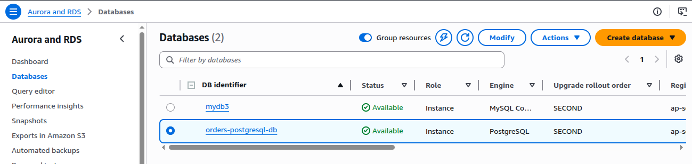

- DynamoDB Table

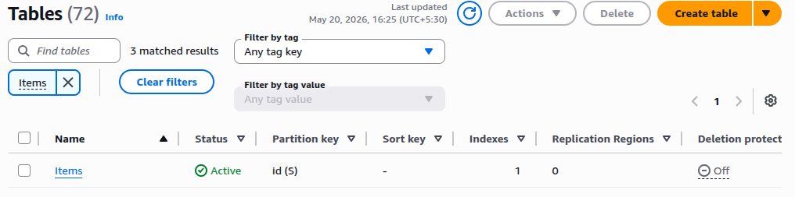

- ElastiCache Redis Cluster

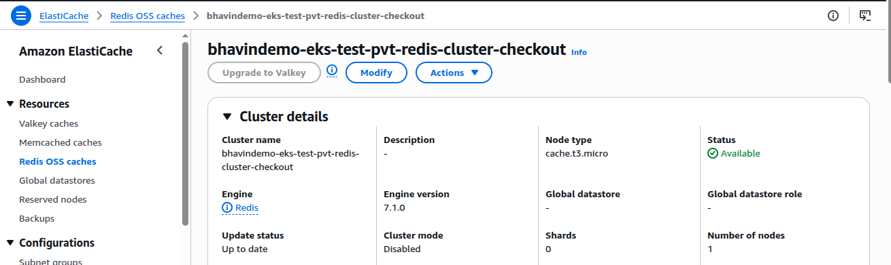

- AWS SQS Queue

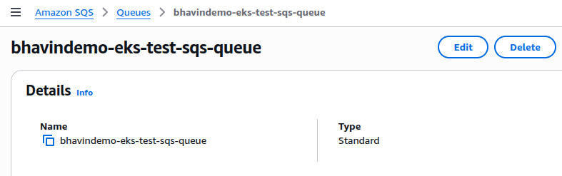

# External DNS with Ingress Controller

- External Dns is a DNS Management controller which will **Continuously Monitor your Kube-API Server**.

- Whenver you made change in your ingress, k8s deployments, k8s services it will make API Call request and this will receive by **API Server**.

- While **API Server** will recevie , this Change will detect by **External DNS Controller** and it will `Create`, `Update` your AWS Route53 DNS Records itself.

- Ex. Ingress - You defined to use ALB with HTTP or HTTPS with AWS Certificate ARNs - External DNS will update this ACM Certificates value in DNS Records as CNAME.

- Ex. Ingress - You defined to use your custom **Domain name like `app1.xyz.com`** which is pointing to your k8s services like ClusterIP, NodePort, `External DNS Controller` will create DNS Records for this.

Let's walk through Practical

### Step 1: Create IAM Role and attach to PIA Assoications

- Use AWS Managed Policy `AmazonRoute53FullAccess` for `Testing Only`.

- Use Least Previledged Policy

```yml
{
  "Version": "2012-10-17",
  "Statement": [
    {
      "Effect": "Allow",
      "Action": [
        "route53:ChangeResourceRecordSets"
      ],
      "Resource": [
        "arn:aws:route53:::hostedzone*"
      ]
    },
    {
      "Effect": "Allow",
      "Action": [
        "route53:ListHostedZones",
        "route53:ListResourceRecordSets",
        "route53:ListTagsForResource"
      ],
      "Resource": [
        "*"
      ]
    }
  ]
}
```

- Attach this role to PIA Associations

```bash
terraform apply -f ../04.TF_EKS_AddOns/externaldns_iam_policy.tf
```

### Step 2: Install AddOns of External-DNS Controller

```bash
terraform apply -f ../04.TF_EKS_AddOns/externaldns_addons.tf
```

- It will install in `external-dns` namesapce bydefault.

### Step 3: Issue AWS Certificate Public Certs

1. Register domain in AWS Route53.

2. Create a SSL Certificat in Certificate Manager

   - Go to AWS certificate manager > Request.

   - Give your domain name like *.mydomain.com.

   - Choose validation mathod as DNS Validations.

3. Update SSL Cert in Ingress Service

    - Add Annotations for SSL and DNS Domains Name.

```yml
 ## SSL Settings
    alb.ingress.kubernetes.io/listen-ports: '[{"HTTPS":443}, {"HTTP":80}]'

    alb.ingress.kubernetes.io/certificate-arn: <Your_ACM_Certificagte_ARNs>

    alb.ingress.kubernetes.io/ssl-redirect: "443"

    # External DNS - For creating DNS Record itself.
    external-dns.alpha.kubernetes.io/hostname: extdns1.bhavindevops.shop, extdns2.bhavindevops.shop
```

4. Create Route53 Hosted Zones for your domains.

    - Go to Route53 > HostedZones
    - Give your domain name `mydomain.com`.
    - Choose Type as `Public hosted zones`.
    - Click on Create.

5. Modify your **nameserver** in your controller domains.

    - Add 4 nameserver created in HostedZones into Your Controller Domains by

        - Go to Controller domains > DNS > NameServer > Add 4 nameserver.
    
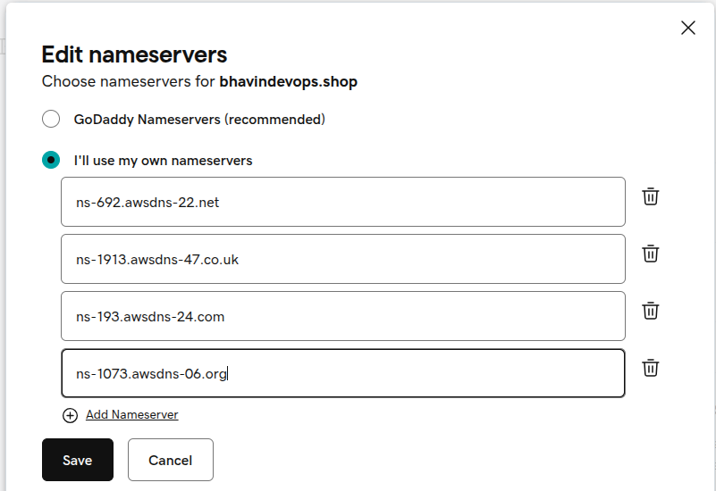

6. Create DNS Records in amazone Route53 for create validation records

    - Choose your Certificates created in AWS Certificate Manager > create records in route53.
    - Choose domains & create.

7. Use this cert arn into Ingress

### Step 4: Create Ingress

```bash
kubectl apply -Rf Ingress/
```

### Step 5: Deploy Microservices

- Deploy all Microservies with it svc, service accounts, configmpa, deployments, ServiceProviderClass.

```bash
kubectl apply -Rf MicroServices/
```

### Step 6: Varify Ext-DNS 

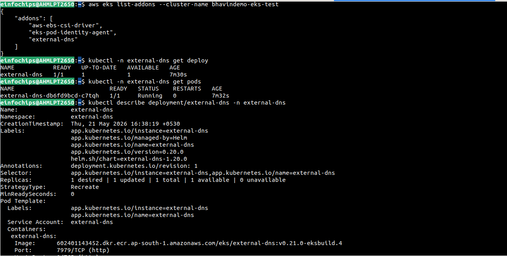


### Step 6: Access Web App by domain name

- Check topology

```bash
http://bhavindevops.shop
```

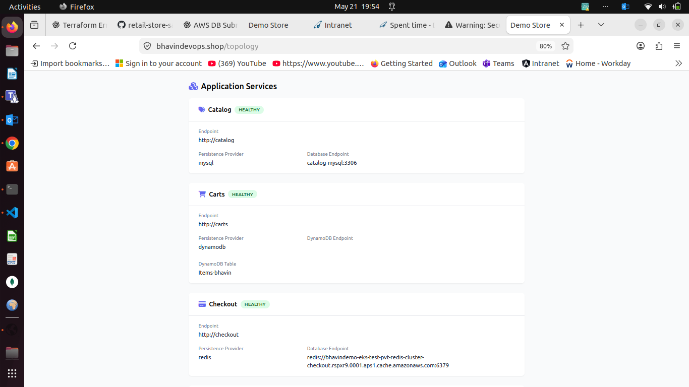

- Check App landing page

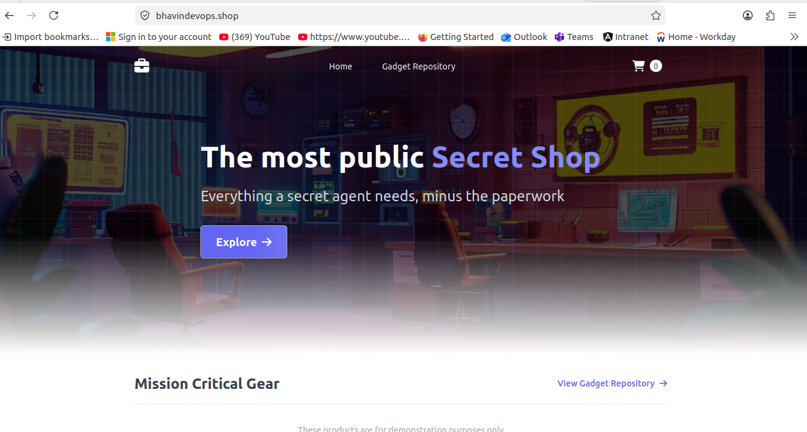

- Check cart svc

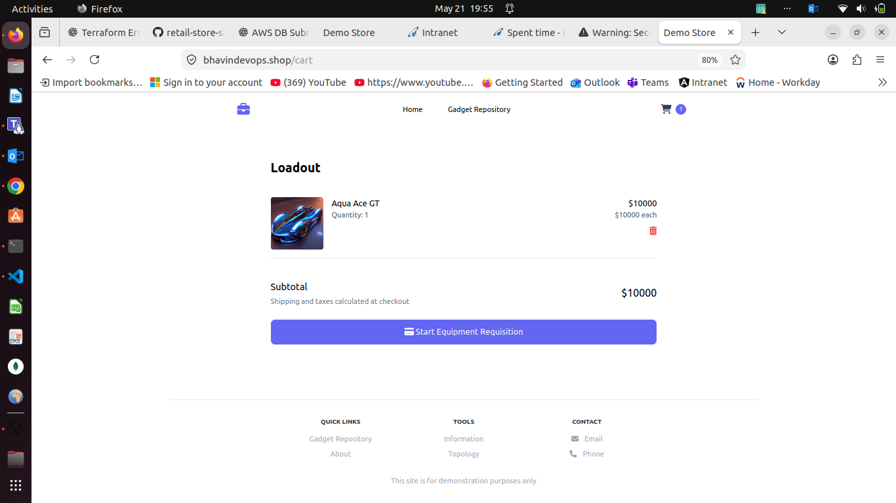

- Check Catalog svc

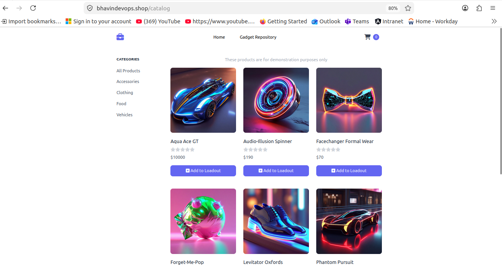

- Check Checkout svc

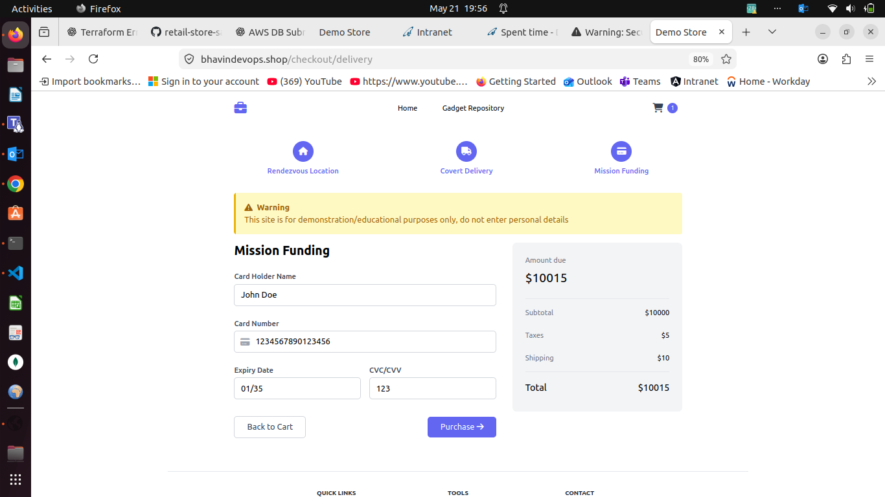


**NOTE**

**External-DNS Controller** is DNS controller to create, update, delete DNS records as per your Ingress Resources and K8s Svc, K8s Deployment resources.

**External-DNS Controller** - Will not delete DNS Records if you delet **Ingress**.

**Bcz It uses `Upsert-Policy`** by default.

```bash
kubectl get deployment external-dns -n external-dns -o yaml
```

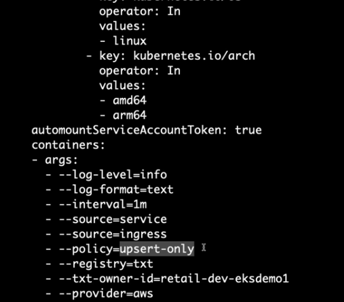


**--policy=upsert-only** - will only update, create DNS Records, it will not delete it.

**--policy=sync** - will keep your Ingress resources and K8s Resouces in `sync`, so it will delete DNS Records after you delete Ingress.

