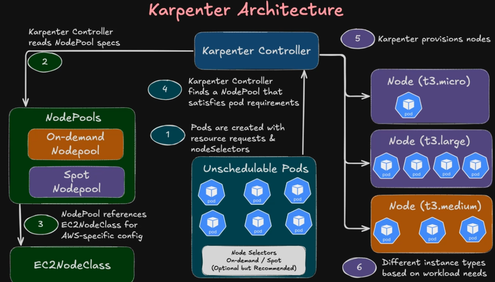
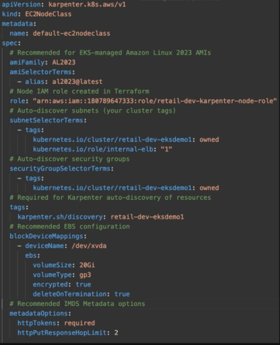

Karpenter
---

**Without Cluster AutoScaler**

  - EKS cluster has 2 worker nodes

  - each node has limited CPU and RAM

  - application suddenly needs more pods

  - 3 New pods requires `2 vcpu and 1 GB Ram`.

  - But existing nodegroup and node size is reached and exhast its resources.

  - So, Pods will never scheduled to any of worker nodes and will stay in pending state.


**With Cluster AutoScaler**

- Cluster AutoScaler watches `Pending state` Pods.

- CA will check nodegroup and node size defined in the nodegroup.

- Increase Worker Node with same size in nodegroup.

- `This 3 pods will scheduled in this new worker node`.

**Problem**

  - This 3 pods requires **2 vcpu and 1 GB RAM**.
  - But Node Size is **4 vcpu and 2 GB RAM**.

  - So **2 vcpu and 1 GB RAM** is a west of resources which will cause to higher cost.

  - You are paying Higher cost for which you didn't used and didn't requires any more.

**With Karpenter**

- Karpenter watches **Unscheduled pods / Pending Pods directly**.

- Analyze exact CPU/RAM requirement for only those **Unscheduled Pods**.

- Launches best suitable EC2 instance dynamically

**Benifits**

  1. No Predefined NodeGroups requires
  2. Faster Provisioning
    Cluster AutoScaler - Go to ASG - Launch Node - Register with kubernetes API EKS.
    - This takes 3-5 minutes.

    - karpenter makes directly API call to AWS EC2 - Provision Nodes - Register with EKS Cluster directly.

    - karpenter takes only 30-60 seconds only.

  3. Better cost optimizations.

  4. Active consolidations and deprovisioning.

  - It will deprovisions nodes while no pods are working or no pods available on that nodes.

[karpenter docs]("https://karpenter.sh/docs/)

Karpenter Architecture
---



- Karpenter works without nodegroups.

- When karpenter detects unschedules pods, first it will look for pods requirements like cpu, memory etc.

- **Karpenter** requires **NodePool and EC2NodeClass** before launch new worker node or create NodeGroup.

- In your Deployment manifest you must have to define the NodePool annotations wheather your node should shchedule to `On-Demand` or `Spot` NodePool.

- Based on Annotations and Pods resources requirements it will select NodePool and create NodeGroups and launch new nodes to that nodepool.

- `Karpenter NodePool` refers the `EC2NodeClass` where you can define your `Node Class` requirements.

```yml
subnetSelectorTerms:
  - tags:
      kubernetes.io/cluster/<cluster_name>: owned
      kubernetes.io/role/internal-elb: "1"
# Auto-discover security groups:
securityGroupSelectorTerms:
  - tags:
      kubernetes.io/cluster/<cluster_name>: owned
# Recommended EBS
blockDeviceMappings:
  - deviceName: /dev/xvda
    ebs:
      volumeSize: 20Gi
      volumeType: gp3
      encrypted: true
      deleteOnTermination: true
```

- `Every NodePool` refers the `nodeClassRef`

```yml
apiVersion: karpenter.sh/v1
kind: NodePool
metadata:
  name: ondemand-nodepool
spec:
  template:
    spec:
      nodeClassRef:
        group: karpenter.k8s.aws
        kind: EC2NodeClass
        name: default-ec2nodeclass
```

- This is `EC2NodeClass`



- `subnetSelectroTerms:` will select your `pvt subnets in your vpc.`

- `securityGroupSelectorTerms:` will select your EKS Node's Security Groups.

- `This two things is must requires for karpeneter`.

- karpenter instance must know in which subnet group as NodeGroup Your Node should launch and which Security Groups should assign to your new nodes.

- For that this 2 thigs is must requires.

