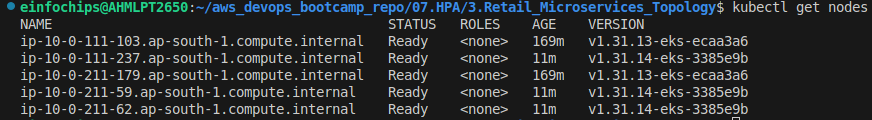
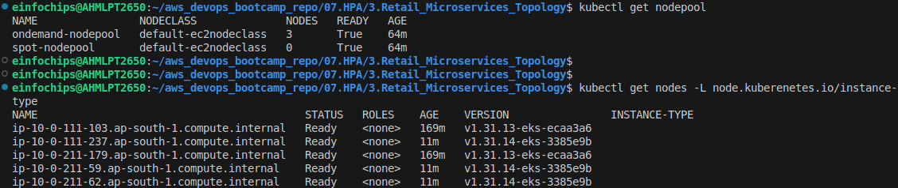
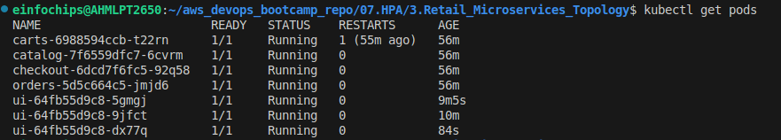
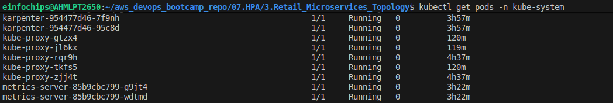
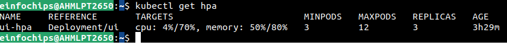

Horizontal Pod AutoScaling
---

- It will Increase/Decrease or Addup/Remove pods based on pod's resources target set in HPA yml and also depends on bahavior write into HAP yml.

HAP = When Addup/Remove Pods ?
behavior = How ScaleUP/ScaleDown Pods to avoid `Thrashing` , `Sudden pod kills`, `Slow scale up`.

```yml
behavior:

    scaleDown:
    stabilizationWindowSeconds: 300   # ← Wait 5 mins before scaling down
    policies:
        - type: Percent
        value: 50                      # ← Remove max 50% of pods...
        periodSeconds: 15              # ← ...per 15 seconds
        - type: Pods
        value: 1                       # ← OR remove max 1 pod...
        periodSeconds: 60              # ← ...per 60 seconds
    selectPolicy: Min                  # ← Pick the MORE conservative rule
```

| What it prevents | How |
| ---------------- | --- |
| Killing too many pods at once | 50% cap per 15s |
| Oscillation (scale down → spike → scale up loop) | 300s stabilization window |
| Aggressive removal | `selectPolicy: Min` picks the smallest reduction |

- ScalUp Behavior

```yml
scaleUp:
  stabilizationWindowSeconds: 0     # ← Scale up IMMEDIATELY, no waiting
  policies:
    - type: Percent
      value: 100                     # ← Double the pods (100%)...
      periodSeconds: 15              # ← ...every 15 seconds
    - type: Pods
      value: 4                       # ← OR add 4 pods...
      periodSeconds: 15              # ← ...every 15 seconds
  selectPolicy: Max                  # ← Pick the MORE aggressive rule
```

| What it ensures | How | 
| --------------- | --- |
| Fast reaction to traffic spikes|  `stabilizationWindowSeconds: 0` | 
| Rapid pod addition | 100% increase allowed every 15s | 
| Aggressive scale-up | `selectPolicy: Max` picks whichever adds **more pods** |


Pod Disruption Budgets
---

- PDB is way to protects your applications from losing too many pods during:

  - Node drain,
  - Node upgrade,

  - cluster autoscaler scale down
  - karpenter consolidations
  - maintenance
  - rolling updates

```yml
apiVersion: policy/v1
kind: PodDisruptionBudget
metadata:
  name: payment-pdb

spec:
  minAvailable: 2

  selector:
    matchLabels:
      app: payment
```

`minAvailable: 2` - At least 2 pods MUST remain running.

- If you have 3 pods, Only 1 pod can be disrupted.

- `maxUnavailable: 1` - At least 1 pod may be unavailable 

- If `replicas: 5` - Only 1 pod can be deleted/desrupted and rest of max 4 pods can be runnings.


Topology Spread Constraints (TSC) — Full Explanation
---

## What is TSC?

TSC tells Kubernetes **where to place pods** across your cluster topology (nodes, AZs) so no single node/zone gets overloaded or becomes a single point of failure.


### Block 1 — Spread Across Nodes (within same AZ)

```yaml
topologySpreadConstraints:
  - maxSkew: 1                          # Max allowed difference between most-loaded and least-loaded node
    topologyKey: kubernetes.io/hostname # Spread by NODE (each node = unique hostname)
    whenUnsatisfiable: ScheduleAnywhere # If constraint can't be met, schedule anyway (soft rule)
    labelSelector:
      matchLabels:
        app.kubernetes.io/name: catalog        # Only count pods belonging to "catalog" app
        app.kubernetes.io/component: service   # specifically the "service" component
```


### Block 2 — Spread Across Availability Zones

```yaml
  - maxSkew: 1
    topologyKey: topology.kubernetes.io/zone  # Spread by AZ (us-east-1a, 1b, 1c etc.)
    whenUnsatisfiable: ScheduleAnywhere
    labelSelector:
      matchLabels:
        app.kubernetes.io/name: catalog
        app.kubernetes.io/component: service
```


## Key Terms Explained

| Field | Meaning |
|---|---|
| `maxSkew` | Max **difference** in pod count between the busiest and least busy topology domain |
| `topologyKey: hostname` | Domain = individual **node** |
| `topologyKey: zone` | Domain = entire **AZ** (e.g. ap-south-1a) |
| `ScheduleAnywhere` | **Soft** constraint — violate if no better option |
| `DoNotSchedule` | **Hard** constraint — pod stays Pending if violated |
| `labelSelector` | Only count **these pods** when calculating skew |


## Why Top Example is ✅ GOOD

From your handwritten annotation with **5 pods, 3 nodes:**

```
Node A → 2 pods
Node B → 2 pods
Node C → 1 pod

maxSkew check: 2 - 1 = 1  ✅ (equals maxSkew, within limit)
```

```
[ Node A ]    [ Node B ]    [ Node C ]
  🟢 🟢         🟢 🟢         🟢
```

- Pods are **evenly distributed**
- Difference between max (2) and min (1) = **1**, which satisfies `maxSkew: 1`
- If Node C dies → only 1 pod lost, A and B survive
- No hotspot, no single point of failure ✅


## Why Bottom Example is ❌ BAD

From your handwritten annotation with **5 pods, 3 AZs:**

```
AZ A → 3 pods
AZ B → 2 pods
AZ C → 0 pods

maxSkew check: 3 - 0 = 3  ❌ (exceeds maxSkew of 1)
```

```
[ AZ-A ]         [ AZ-B ]      [ AZ-C ]
  🟢 🟢 🟢         🟢 🟢          ✗
```

- **AZ-C has zero pods** — completely unused
- **AZ-A is overloaded** — if AZ-A goes down, 3 pods lost at once
- The spread constraint is **violated** (skew = 3, not ≤ 1)
- This happens when Kubernetes scheduler **couldn't find space in AZ-C** and used `ScheduleAnywhere` to override


## Why This Matters in EKS Specifically

```
EKS Cluster
├── ap-south-1a  ← if all pods here and AZ fails = full outage
├── ap-south-1b
└── ap-south-1c
```

- AWS AZs can have **independent failures** (power, networking)
- EKS Node Groups may have **unequal capacity** across AZs
- Without TSC, the scheduler naturally packs pods into the first available nodes
- With TSC + `DoNotSchedule`, you **enforce** true HA

---

## Pro Tip — Use `DoNotSchedule` for Critical Services

```yaml
whenUnsatisfiable: DoNotSchedule   # ← Hard guarantee, pod stays Pending
```
vs
```yaml
whenUnsatisfiable: ScheduleAnywhere # ← Soft, can result in the BAD example above
```

**Pre-Requisites**

1. EKS with all AddOns and IAM Role Policy with PIA Associations (04.Tf_EKS_AddOns/)
2. All RetailStore Microservices and Ingress should running for data plans (05.RetailStore_Microservices_with_AWS_Data_Plane/)
3. Karpenter controller should installed (06.Karpenter_Controller/)

### Step 1: Install Metrics Server AddOns

- Metrics Servers is requires to fetch and monitor Metrics of pods like Cpu, Memory used by every pods in every namespace.

- You can use another way like use CW Agent, Datadog but you will requires more time to setup this. and Those tools are useful for APM Metrics Monitor.

- Metrics Server is a addons to monitor your pods metrics only.

```bash
kubectl apply -Rf 1.Metrics_Server_AddOns/
```

### Step 2: Setup HPA with behavior

- HPA has defined for all of the services.

```bash
kubectl apply -Rf 2.HPA/
```

### Step 3: Deploy MicroServices

```bash
kubectl apply -Rf 3.Retail_Microservices_Topology/
```

- Here we had defined Pod Distribution Budget and Topology Spread Constraints for all deployments.


```bash
kubectl get nodes
```



- karpenter nodepool



- varify pods



- varify karpenter and metrics server



- varify HPA




**NOTE**

- In deployment we used `whenUnsatisfiable: ScheduleAnyway`.

- If your replicas: 5 and you are using instance or zones.
- so, each node or zone will have 2 pods, so remaining pod is 1 and suggested by maxSkew 1.

- So this pod will schedule in any of instance node or zone in topology.

- so your instance node or zone may have now: 3 pods in 1 of instance node or zone and 2 pods in 2nd instance node or zone.

- **`whenUnsatisfiable: DoNotSchedule`** - if `maxSkew: 1` is set and your have 2 pods for maxSkew: 1.

- So this remaing 2 pods will be in a pending state.

- So, karpenter will see this `pending state pods of maxSkew: 1` and create new node and place this pods to this new node.

- `It Will not scheduel on same instance node or zones`. 


```yml
- maxSkew: 1
          topologyKey: topology.kubernetes.io/zone          
          whenUnsatisfiable: ScheduleAnyway
          labelSelector:
            matchLabels:
              app.kubernetes.io/name: checkout
              app.kubernetes.io/component: service
              app.kubernetes.io/instance: checkout  
```