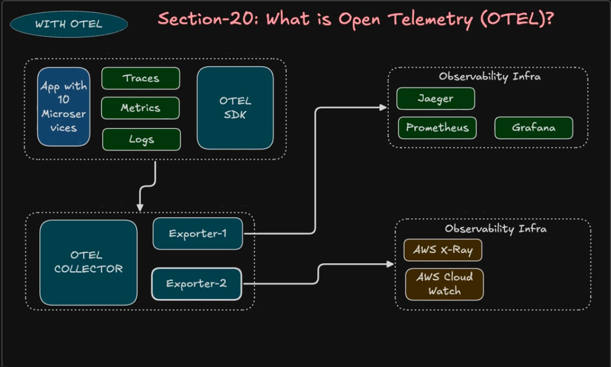
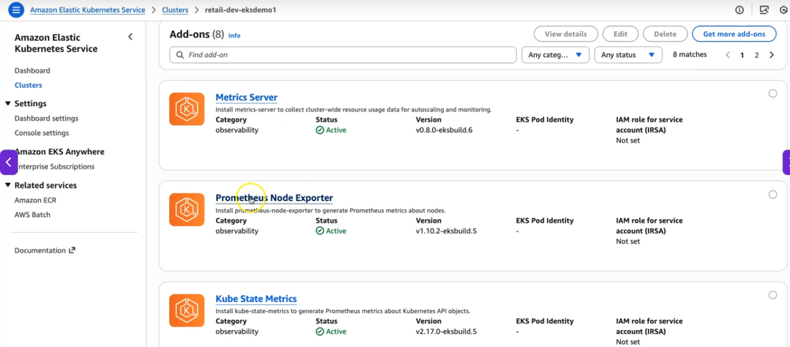
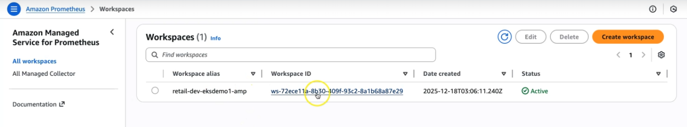
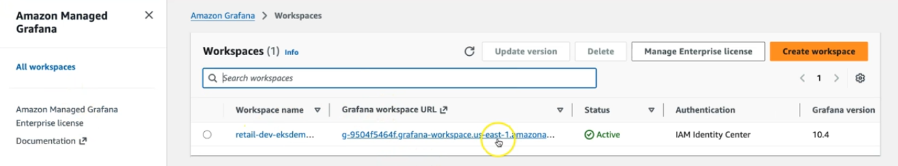
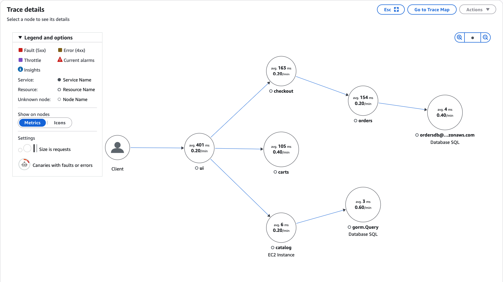

Observability
---

- Observability is the ability to understand the internal state of a system by analyzing its external outputs such as logs, metrics, and traces.

For interviews, certifications, and real DevOps understanding, the safest and most accepted definition is:

> **Observability is the ability to understand the internal state of a system by analyzing its external outputs such as logs, metrics, and traces.**

This definition is industry-standard and aligns with concepts used by:

* IBM
* Elastic
* Grafana Labs
* Datadog
* OpenTelemetry
* Amazon Web Services

For exams/interviews, remember this simple structure:

## Core Pillars of Observability

1. **Metrics** - tells what and when happens

   * CPU
   * Memory
   * Request count
   * Latency

2. **Logs** - what went wrong ? gives logs about failure

   * Application logs
   * Error logs
   * System logs

3. **Traces** - From where its brokens and why ? 

- Its gives whole journey about user send request to your apps and from where its brokens.

   * Request flow across microservices
   * Distributed tracing

Sometimes people add:

* Events
* Profiles

| Observability Component | AWS Service                                               |
| ----------------------- | --------------------------------------------------------- |
| Metrics                 | Amazon Managed Service for Prometheus / Amazon CloudWatch |
| Visualization           | Amazon Managed Grafana                                    |
| Logs                    | Amazon CloudWatch Logs                                    |
| Traces                  | AWS X-Ray                                                 |

> “Monitoring tells us that something is wrong, while observability helps us understand why it is wrong.”

What is OTEL Open Telemetry ?
---

- Open Telemetry is a std way to generate, create and send the telemtry data (logs, metrics, traces) to monitoring tools.

Telemtry data means: 
  - Apps logs,
  - Metrics,
  - Traces




**Before OTel**:
  - Every monitoring vendor had its own SDK/Agent, Dashboard.
  - Apps has vendor lock-in

  - If your monitoring vendor is Datadog and after few months you want to swith to Prometheus or Instana or ELK.

  - You would have to change setup and have to write code and configuration file to respected new Monitoring Vendors.

  - This is messy.

**After OTel**:

- You can easily switch between Monitoring Vendors just like from Datadog to ELK easily.

- You have to just make few configuration changes.

**Components of OTEL**

1. OTel Collector

- A Central agent/svc that will
  
  - Recives telemtry
  - Processes/filter data
  - export data to monitoring tools

2. Exporters

- Send data to tools like:
  
  - Aws CW
  - Aws Managed Svc for Prometheus
  - Aws managed Grafana
  - Aws X-Ray
  - Datadog
  - ElasticSerach
  - Jaeger

3. OTel SDK/Auto Instrumentations

- Code libraries/Agents added to apps


ADOT Aws Distro for Open Telemetry
---

ADOT is **AWS Managed OpenTelemetry Package**

- It helps to collect Metrics, Logs, Traces from apps and Kubernetes Workload on EKS and Send to AWS Observability Services.

- It is `AWS Managed EKS AddOns`.


ADOT Architecture
---

**1. OTEL Oeprator** 
 
  - It is AddOns for EKS.
  - We will install this **OTel Operatro**.

- It will automatically
  
  - Create collectors
  - Manage collectors
  - Updates colletors
  - Scales collectors
  - Validate configurations


  **OTEL OPerator NameSpace**
    
- This may contains:

| Component	| Purpose |
| --------- | ------- |
| operator-controller-manager deployment |	manages collectors |
| operator-controller-manager-metrics-service |	exposes operator metrics |
| operator-webhook-service | validates/mutates collector configs |


**2. OTel Collector**

- This will `Recives`, `Processes` and `Export` Telemetry Data.

- It is deployed as 4 ways:

- Install ADOT Collector managed by the Otel Operator.

- You can install OTel Collector as:

  1. Deploy as `Deployment`
  2. Deploy as `StatefulSet`
  3. Deploy as `SideCars` in your apps pods.
  4. Deploy as `DaemonSet`.

`When you install OTel Collector`, `In your application pods` **You have to enable OTel options** by helm.

Observability Components
---

**1. metrics-server**

- It will collect resource usage metrics from kubelets

- `CPU` , `Memory` usage of each `Pods` and `Nodes`.

**Use case**

- AutoScaling using Cluster Autoscaler or Karpenter.
- HPA for Pods using pods and nodes metrics.

**2. kube-state-metrics**

- It will read kubernetes API object and convert them into Prometheus metrics.

- It will raed whole kuberentes cluster state like No. of Deployments, Replicas, StatfulSets, How many pods are healthy and how many of pods are crashing etc.

| Kubernetes Object |	Example Metrics |
| ----------------- | --------------- |
| Pods |	running/pending/crashloop |
| Deployments	| replicas available |
| StatefulSets | ready replicas |
| Nodes | node conditions |
| PVCs	| bound/pending |
| Jobs |	succeeded/failed |

| **metrics-server** |	**kube-state-metrics** |
| ------------------ | ----------------------- |
| Resource usage |	Kubernetes object state |
| CPU/Memory metrics |	Pod/Deployment/Node status |
| Used by HPA |	Used by Prometheus/Grafana |

**3. Node Exporter**

- Node Exporter is a Prometheus Exporter that collects Node level Metrics/EC2 level Metrics.

- It will collect Infra and OS system metrics from kubernetes worker nodes.

- **Node Exporter will not collect `Kubernetes Object Metridcs`**.


| **Metric Type** |	**Examples** |
| --------------- | ------------ |
| CPU | node CPU usage |
| Memory | RAM usage |
|Disk | disk IO |
| Network	| packets/errors |
| Filesystem	| disk space |
| Load | system load |


### Step1: Install Metrics and OTel Addons

- Install ADOT Collector Addon

- Install Certificate Manager Addons

- Install Prometheus Node Exporter Addons

- Install Kube state metrics Addons

- Creae IAM policy and IAM role for all of this addons and attach role to PIA Associations.

### Step2: Create RBAC Role for ADOT Collector Pod

ADOT Collector Pod
        ↓
Uses ServiceAccount
        ↓
ServiceAccount attached to ClusterRole
        ↓
ClusterRole gives permissions
        ↓
Collector can read Kubernetes resources

- Your ADOT OTel Collector Pods wants to 

  - Scrape k8s metrics
  - Discover pods/svc
  - Read cluster metadat

- for OTel Collector Pod You have to attach role to PIA Associations, Create ServiceAccount to assume this role by OTel Collector Pod.

- Now, OTel Collector Pods perform K8s Ops like Discover Pods/svc, how many pods healhty and unhealthy, how many svc are there etc like kubect get svc, pods.

- To perform this ops by OTel collector Pods you also have to Provide its EKS Cluster Access by using **RBAC ClusterRole and ClusterRoleBinding**.

```bash
terraform apply -f 8.adot_rbac_rolebinding.tf
```

```bash
ADOT Collector Pod
        ↓
Uses ServiceAccount
        ↓
ServiceAccount attached to ClusterRole
        ↓
ClusterRole gives permissions
        ↓
Collector can read Kubernetes resources
```

### Step3 : Create Prometheus and Grafana

- Create IAM Policy and IAM Roles for AMG and AMP

- Attach to PIA Associations

```bash
terraform apply -f 9.amp_prometheus.tf 
terraform apply -f 10.amg_grafana_iam_policy.tf
terraform apply -f 11.amg_grafana_iam_role.tf
terraform apply -f 12.amg_grafanas.tf
```

### Step 4: Provision Pre-Requisites Resources

```bash
terraform apply -Rf ../04.TF_EKS_AddOns/
terraform apply -Rf ../05.RetailStore_Microservices_with_AWS_Data_Plane/
terraform apply -Rf ../06.Karpenter_Controller/

terraform apply -Rf 08/Observability/OpenTelemetry_manifests/
```



- Prometheus Workspace



- Grafana Workspace



- To enable instrumentation we will write below code in helm chart.
- In helm we will write all custom value like EndPoint of all Resources like RDS, PSQL, DynamoDB etc

```yml
# ----------------------------------------------------------------------------
# POD DISRUPTION BUDGET (PDB)
# ----------------------------------------------------------------------------
# Maintain minimum availability during voluntary disruptions (node drains, etc.)
podDisruptionBudget:
  enabled: true
  minAvailable: 2      # At least 2 pods must remain available
  maxUnavailable: 0    # Disable maxUnavailable (only minAvailable active)


opentelemetry:
  enabled: true
  instrumentation: "default-instrumentation"
```

- This will enabled OTel automatically in your pods while you deploy it.

- Pods will start to create trace, metircs, logs itself.

### Step 5: Deploy RetailStore MicroServices by Helm

```bash
./08.Observability/02_RetailStore_App_Environment/02_RetailStore_App_Helm_AWS_Data_Plane/01_HIGH_COST_retailstore_HELM/05-v2.0.0-install-remote-helm-charts.sh 
```

- This will execute script to install all microservices one by one with using secretsmanager secrets.

Observability - OTel - Traces send to AWS X-Ray
---

We will send traces from application to AWS X-Ray.



**1. Receivers** 

**2. Processors**

**3. Exporters**

**4. Extensions**

**1. Receivers** 

- Receivers are **Entry Points** into collector `Application → OTLP Receiver → Collector`.

- It uses 2 Protocols

  1. http - is a rest of protocol , easier to debug
  2. grpc - is a binary protocol which is more efficient.

```yml
receivers:
  http: 4318

  grpc: 4317
```

- Whatever your apps generates traces, it will receivers by this receivers.

**2. Processors**

- It will process your traces and keep only requires traces.

  **memory_limiter**

```yml
limit_mib: 512
```

- It will prevents from use more or out of limits memory while peak in traffics.

- It will prevent to OOM Killed.

- It will use max only 512 Mib Memory.

- If there are too many request increasing, too many traces will create at same time.

- It will recevies only that much traces which use max 512 Mib Memory.

- Rest of traces will be ignored and droped.

```bash
Too many traces
     ↓
memory_limiter drops extra traces
     ↓
Collector survives
```

  **filter health check**

  - It will filters traces only for those requires.
  - Else, it will create traces for all types like health check of alb, other health check points like kube-probe.

  **k8sattributes**

  - X-Ray only sees `service.name=orders` which is not enough, bcz which service is affected, which pod affected, which deployment/nodes affected that aslo requires for traces.


  - It will enriches traces with all requires k8s attributes info like

```bash
k8s.namespace.name
k8s.deployment.name
k8s.pod.name
k8s.node.name
```

  **batch**

  - It will wait for 10 seconds and collect 50 diff traces and make only 1 API Calls to create this 50 traces.

  - Without Batch it will create each API Calls for each trace requrest.

**Exporter**

- Send data outside collectors like AWS X-Ray.

**Extensions**

- Extensions help the collector itself by using diff requires extensions like `health_check` extensions.


**ServiceAccount**

Collector needs RBAC to create logs, traces

```bash
Retail Applications
      ↓
OTEL Auto Instrumentation
      ↓
ADOT Collector Deployment
      ↓
Receiver
      ↓
Processors
   ├── memory_limiter
   ├── filter
   ├── k8sattributes
   └── batch
      ↓
awsxray exporter
      ↓
AWS X-Ray
```

