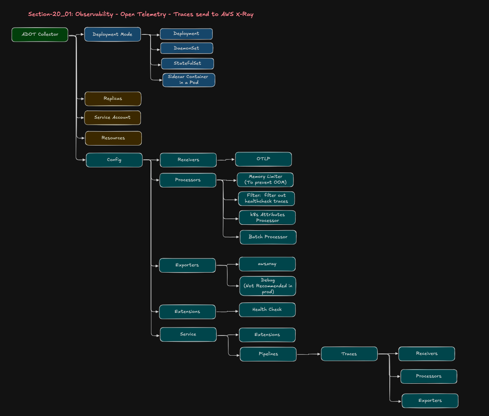
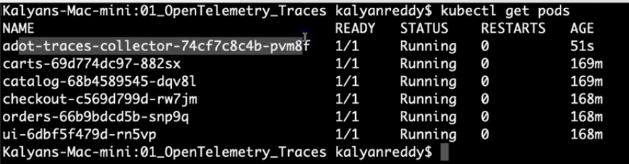
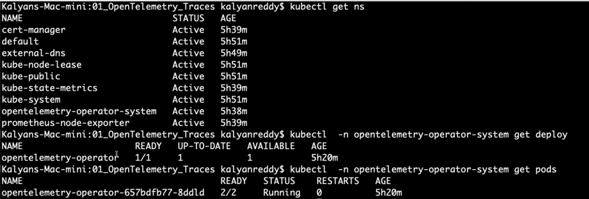
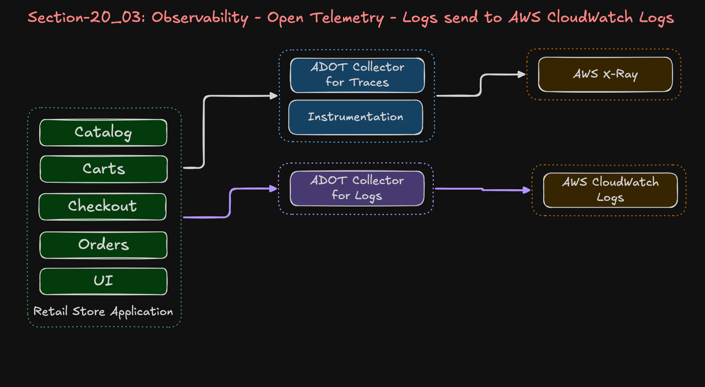
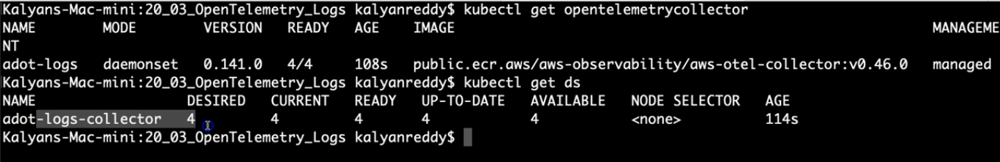
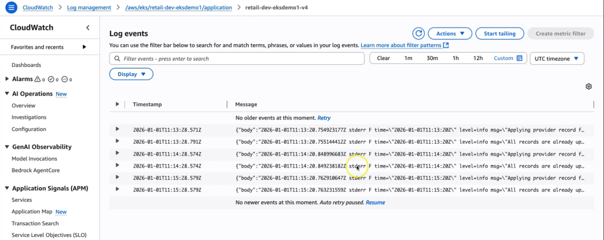

Observability
---

- Observability is the ability to understand the internal state of a system by analyzing its external outputs such as logs, metrics, and traces.

For interviews, certifications, and real DevOps understanding, the safest and most accepted definition is:

> **Observability is the ability to understand the internal state of a system by analyzing its external outputs such as logs, metrics, and traces.**

This definition is industry-standard and aligns with concepts used by:

* IBM
* Elastic
* Grafana Labs
* Datadog
* OpenTelemetry
* Amazon Web Services

For exams/interviews, remember this simple structure:

## Core Pillars of Observability

1. **Metrics** - tells what and when happens

   * CPU
   * Memory
   * Request count
   * Latency

2. **Logs** - what went wrong ? gives logs about failure

   * Application logs
   * Error logs
   * System logs

3. **Traces** - From where its brokens and why ? 

- Its gives whole journey about user send request to your apps and from where its brokens.

   * Request flow across microservices
   * Distributed tracing

Sometimes people add:

* Events
* Profiles

| Observability Component | AWS Service                                               |
| ----------------------- | --------------------------------------------------------- |
| Metrics                 | Amazon Managed Service for Prometheus / Amazon CloudWatch |
| Visualization           | Amazon Managed Grafana                                    |
| Logs                    | Amazon CloudWatch Logs                                    |
| Traces                  | AWS X-Ray                                                 |

> “Monitoring tells us that something is wrong, while observability helps us understand why it is wrong.”

What is OTEL Open Telemetry ?
---

- Open Telemetry is a std way to generate, create and send the telemtry data (logs, metrics, traces) to monitoring tools.

Telemtry data means: 
  - Apps logs,
  - Metrics,
  - Traces


**Before OTel**:
  - Every monitoring vendor had its own SDK/Agent, Dashboard.
  - Apps has vendor lock-in

  - If your monitoring vendor is Datadog and after few months you want to swith to Prometheus or Instana or ELK.

  - You would have to change setup and have to write code and configuration file to respected new Monitoring Vendors.

  - This is messy.

**After OTel**:

- You can easily switch between Monitoring Vendors just like from Datadog to ELK easily.

- You have to just make few configuration changes.

**Components of OTEL**

1. OTel Collector

- A Central agent/svc that will
  
  - Recives telemtry
  - Processes/filter data
  - export data to monitoring tools

2. Exporters

- Send data to tools like:
  
  - Aws CW
  - Aws Managed Svc for Prometheus
  - Aws managed Grafana
  - Aws X-Ray
  - Datadog
  - ElasticSerach
  - Jaeger

3. OTel SDK/Auto Instrumentations

- Code libraries/Agents added to apps


ADOT Aws Distro for Open Telemetry
---

ADOT is **AWS Managed OpenTelemetry Package**

- It helps to collect Metrics, Logs, Traces from apps and Kubernetes Workload on EKS and Send to AWS Observability Services.

- It is `AWS Managed EKS AddOns`.


ADOT Architecture
---

**1. OTEL Oeprator** 
 
  - It is AddOns for EKS.
  - We will install this **OTel Operatro**.

- It will automatically
  
  - Create collectors
  - Manage collectors
  - Updates colletors
  - Scales collectors
  - Validate configurations


  **OTEL OPerator NameSpace**
    
- This may contains:

| Component	| Purpose |
| --------- | ------- |
| operator-controller-manager deployment |	manages collectors |
| operator-controller-manager-metrics-service |	exposes operator metrics |
| operator-webhook-service | validates/mutates collector configs |


**2. OTel Collector**

- This will `Recives`, `Processes` and `Export` Telemetry Data.

- It is deployed as 4 ways:

- Install ADOT Collector managed by the Otel Operator.

- You can install OTel Collector as:

  1. Deploy as `Deployment`
  2. Deploy as `StatefulSet`
  3. Deploy as `SideCars` in your apps pods.
  4. Deploy as `DaemonSet`.

`When you install OTel Collector`, `In your application pods` **You have to enable OTel options** by helm.

Observability Components
---

**1. metrics-server**

- It will collect resource usage metrics from kubelets

- `CPU` , `Memory` usage of each `Pods` and `Nodes`.

**Use case**

- AutoScaling using Cluster Autoscaler or Karpenter.
- HPA for Pods using pods and nodes metrics.

**2. kube-state-metrics**

- It will read kubernetes API object and convert them into Prometheus metrics.

- It will raed whole kuberentes cluster state like No. of Deployments, Replicas, StatfulSets, How many pods are healthy and how many of pods are crashing etc.

| Kubernetes Object |	Example Metrics |
| ----------------- | --------------- |
| Pods |	running/pending/crashloop |
| Deployments	| replicas available |
| StatefulSets | ready replicas |
| Nodes | node conditions |
| PVCs	| bound/pending |
| Jobs |	succeeded/failed |

| **metrics-server** |	**kube-state-metrics** |
| ------------------ | ----------------------- |
| Resource usage |	Kubernetes object state |
| CPU/Memory metrics |	Pod/Deployment/Node status |
| Used by HPA |	Used by Prometheus/Grafana |

**3. Node Exporter**

- Node Exporter is a Prometheus Exporter that collects Node level Metrics/EC2 level Metrics.

- It will collect Infra and OS system metrics from kubernetes worker nodes.

- **Node Exporter will not collect `Kubernetes Object Metridcs`**.


| **Metric Type** |	**Examples** |
| --------------- | ------------ |
| CPU | node CPU usage |
| Memory | RAM usage |
|Disk | disk IO |
| Network	| packets/errors |
| Filesystem	| disk space |
| Load | system load |


### Step1: Install Metrics and OTel Addons

- Install ADOT Collector Addon

- Install Certificate Manager Addons

- Install Prometheus Node Exporter Addons

- Install Kube state metrics Addons

- Creae IAM policy and IAM role for all of this addons and attach role to PIA Associations.

### Step2: Create RBAC Role for ADOT Collector Pod

ADOT Collector Pod
        ↓
Uses ServiceAccount
        ↓
ServiceAccount attached to ClusterRole
        ↓
ClusterRole gives permissions
        ↓
Collector can read Kubernetes resources

- Your ADOT OTel Collector Pods wants to 

  - Scrape k8s metrics
  - Discover pods/svc
  - Read cluster metadat

- for OTel Collector Pod You have to attach role to PIA Associations, Create ServiceAccount to assume this role by OTel Collector Pod.

- Now, OTel Collector Pods perform K8s Ops like Discover Pods/svc, how many pods healhty and unhealthy, how many svc are there etc like kubect get svc, pods.

- To perform this ops by OTel collector Pods you also have to Provide its EKS Cluster Access by using **RBAC ClusterRole and ClusterRoleBinding**.

```bash
terraform apply -f 8.adot_rbac_rolebinding.tf
```

```bash
ADOT Collector Pod
        ↓
Uses ServiceAccount
        ↓
ServiceAccount attached to ClusterRole
        ↓
ClusterRole gives permissions
        ↓
Collector can read Kubernetes resources
```

### Step3 : Create Prometheus and Grafana

- Create IAM Policy and IAM Roles for AMG and AMP

- Attach to PIA Associations

```bash
terraform apply -f 9.amp_prometheus.tf 
terraform apply -f 10.amg_grafana_iam_policy.tf
terraform apply -f 11.amg_grafana_iam_role.tf
terraform apply -f 12.amg_grafanas.tf
```

### Step 4: Provision Pre-Requisites Resources

```bash
terraform apply -Rf ../04.TF_EKS_AddOns/
terraform apply -Rf ../05.RetailStore_Microservices_with_AWS_Data_Plane/
terraform apply -Rf ../06.Karpenter_Controller/

terraform apply -Rf 08/Observability/OpenTelemetry_manifests/
```


- Prometheus Workspace


- Grafana Workspace


- To enable instrumentation we will write below code in helm chart.
- In helm we will write all custom value like EndPoint of all Resources like RDS, PSQL, DynamoDB etc

```yml
# ----------------------------------------------------------------------------
# POD DISRUPTION BUDGET (PDB)
# ----------------------------------------------------------------------------
# Maintain minimum availability during voluntary disruptions (node drains, etc.)
podDisruptionBudget:
  enabled: true
  minAvailable: 2      # At least 2 pods must remain available
  maxUnavailable: 0    # Disable maxUnavailable (only minAvailable active)


opentelemetry:
  enabled: true
  instrumentation: "default-instrumentation"
```

- This will enabled OTel automatically in your pods while you deploy it.

- Pods will start to create trace, metircs, logs itself.

### Step 5: Deploy RetailStore MicroServices by Helm

```bash
./08.Observability/02_RetailStore_App_Environment/02_RetailStore_App_Helm_AWS_Data_Plane/01_HIGH_COST_retailstore_HELM/05-v2.0.0-install-remote-helm-charts.sh 
```

- This will execute script to install all microservices one by one with using secretsmanager secrets.

Observability - OTel - Traces send to AWS X-Ray
---

We will send traces from application to AWS X-Ray.


**1. Receivers** 

**2. Processors**

**3. Exporters**

**4. Extensions**

**1. Receivers** 




- Receivers are **Entry Points** into collector `Application → OTLP Receiver → Collector`.

- It uses 2 Protocols

  1. http - is a rest of protocol , easier to debug
  2. grpc - is a binary protocol which is more efficient.

```yml
receivers:
  http: 4318

  grpc: 4317
```

- Whatever your apps generates traces, it will receivers by this receivers.

**2. Processors**

- It will process your traces and keep only requires traces.

  **memory_limiter**

```yml
limit_mib: 512
```

- It will prevents from use more or out of limits memory while peak in traffics.

- It will prevent to OOM Killed.

- It will use max only 512 Mib Memory.

- If there are too many request increasing, too many traces will create at same time.

- It will recevies only that much traces which use max 512 Mib Memory.

- Rest of traces will be ignored and droped.

```bash
Too many traces
     ↓
memory_limiter drops extra traces
     ↓
Collector survives
```

  **filter health check**

  - It will filters traces only for those requires.
  - Else, it will create traces for all types like health check of alb, other health check points like kube-probe.

  **k8sattributes**

  - X-Ray only sees `service.name=orders` which is not enough, bcz which service is affected, which pod affected, which deployment/nodes affected that aslo requires for traces.


  - It will enriches traces with all requires k8s attributes info like

```bash
k8s.namespace.name
k8s.deployment.name
k8s.pod.name
k8s.node.name
```

  **batch**

  - It will wait for 10 seconds and collect 50 diff traces and make only 1 API Calls to create this 50 traces.

  - Without Batch it will create each API Calls for each trace requrest.

**Exporter**

- Send data outside collectors like AWS X-Ray.

**Extensions**

- Extensions help the collector itself by using diff requires extensions like `health_check` extensions.


**ServiceAccount**

Collector needs RBAC to create logs, traces

```bash
Retail Applications
      ↓
OTEL Auto Instrumentation
      ↓
ADOT Collector Deployment
      ↓
Receiver
      ↓
Processors
   ├── memory_limiter
   ├── filter
   ├── k8sattributes
   └── batch
      ↓
awsxray exporter
      ↓
AWS X-Ray
```

**Service**:

- It will connect `receivers`, `processors`, `exporters` together into an acutal pipelines.

  **without Service**
    
    - Collector know receivers, processors, exporters exists but it can't connect them.

- Whatever you written in this service: block only that functions will work.

- If you didn't receivers , it will never receives traces from applications.

INSTRUMENTATIONS
---

When you want to generate Traces, logs , Metrics in your application itself via observability.

It is called `Make your applicatoin Instrumentations` so your apps will create traces, logs etc itself.

This is done by Observability by `kind: Instrumentation`

- When you create `kind: Instrumentation` , the OpenTelemetry operator watches kubernetes pods.

- When pod has annotation like `instrumentation.opentelmetry.io/inject-java: "true"`, The OTel Operator will automatically:
  
  - Inject OTel Java Agent
  - Adds env vars of OTel
  - Configures exporter endpoint
  - Modifies pod startup

```bash
Instrumentation CR created
        ↓
OpenTelemetry Operator watches pods
        ↓
Pod annotation detected
        ↓
Operator injects OTEL auto-instrumentation
        ↓
Application starts generating traces
```

```yml
apiVersion: opentelemetry.io/v1alpha1
kind: Instrumentation
metadata:
  name: default-instrumentation
  namespace: default
spec:
  # ============ GLOBAL ENV (applies to all languages) ============
  env:
    # Enable SDK
    # This will create traces set to true and tracing enabled
    - name: OTEL_SDK_DISABLED
      value: "false"

    # Use OTLP over HTTP/protobuf
    # This is Exporter Protocol like grpc and http
    # This is http with protobuf protocol
    - name: OTEL_EXPORTER_OTLP_PROTOCOL
      value: "http/protobuf"

    # Enable AWS resource detection (EKS, EC2 metadata etc.)
    
    - name: OTEL_RESOURCE_PROVIDERS_AWS_ENABLED
      value: "true"

    # Export only TRACES for now (no metrics/logs)
    # Enable Traces only. Bcz of 1 collector for 1 metrics , 1 for traces , 1 for logs
    - name: OTEL_TRACES_EXPORTER
      value: "otlp"

    # Disable metrics export for now (no metrics pipeline yet)
    - name: OTEL_METRICS_EXPORTER
      value: "none"

    # Explicitly disable logs export
    - name: OTEL_LOGS_EXPORTER
      value: "none"

  # OTLP endpoint for all auto-instrumented apps
  exporter:
    endpoint: http://adot-traces-collector:4318

# This will send traces to ADOT OTel Collector on its service endpoint named adot-traces-colletcot and its svc port is 4318


  # ============ Cross-service tracing config =====================
  propagators:
    - tracecontext
    - baggage

  sampler:
    type: always_on
```

- otel-collector



### Step 1: deploy otel-traces

```bash
# Change Directory 
cd 20_02_OpenTelemetry_Traces

# Deploy ADOT Collector and Review Logs
kubectl apply -f 01_OpenTelemetry_Traces/01_adot_collector_traces.yaml

# Verify ADOT Collector and Deployment
kubectl get opentelemetrycollector
kubectl get deploy
kubectl describe deployment adot-traces

# Verify if this collector is part of ADOT Operator installed via EKS Addon
kubectl describe deployment adot-traces | grep operator

# Review ADOT Collector Logs
kubectl get pods
kubectl logs -f <POD-NAME>
or 
kubectl logs -f -l  app.kubernetes.io/name=adot-traces-collector

# Deploy ADOT Instrumentation 
kubectl apply -f 01_OpenTelemetry_Traces/02_adot_instrumentation_traces.yaml

# Verify ADOT Instrumentation
kubectl get instrumentation
```

- Get otel-collector



Set up ADOT OTel Collector for Sending Logs
---



- adot collector yml file will remain same as we did earlier for otel collector for traces.

- Just value will change for logs

- We will deploy OTel collector for logs as **DeamonSets**

- Bcz of, all pod's containers logs will return to the nodes local file system at path **/var/logs/pods**. So each Nodes has its own logs.


```yml
# ADOT Logs Collector - DaemonSet (One Pod Per Node)
# Sends container logs from EKS to CloudWatch Logs

apiVersion: opentelemetry.io/v1beta1
kind: OpenTelemetryCollector
metadata:
  name: adot-logs
  namespace: default
spec:
  mode: daemonset
  serviceAccount: adot-collector

  # Inject node name as environment variable
  env:
    - name: K8S_NODE_NAME
      valueFrom:
        fieldRef:
          fieldPath: spec.nodeName  
  
################################
  # Fix: Allow reading host filesystem /var/log/pods

  # This is we write podSecurityContext for root user by runAsUser: 0
  # Why ? Bcz logs is stored at Nodes loation at /var/logs/pods which requires ROOT PERMISSIONS.
  podSecurityContext:
    runAsUser: 0
    runAsGroup: 0
################################

   # MISSING: Add tolerations to run on all nodes
  tolerations:
    - operator: Exists
      effect: NoSchedule
    - operator: Exists
      effect: NoExecute

  resources:
    limits:
      cpu: 500m
      memory: 512Mi
    requests:
      cpu: 50m
      memory: 128Mi
  
  volumes:
    - name: varlogpods
      hostPath:
        path: /var/log/pods
  
  volumeMounts:
    - name: varlogpods
      mountPath: /var/log/pods
      readOnly: true
  
  config:
    receivers:
      filelog:
        include:
          - /var/log/pods/*/*/*.log
        exclude:
          - /var/log/pods/default_adot-*/*/*.log
          - /var/log/pods/kube-system_*/*/*.log
        start_at: end
    
    processors:
      memory_limiter:
        check_interval: 5s
        limit_mib: 400
      
      k8sattributes:
        extract:
          metadata:
            - k8s.namespace.name
            - k8s.pod.name
            - k8s.container.name
      
      batch:
        timeout: 10s
    
    exporters:
      awscloudwatchlogs:
        region: us-east-1# ADOT Logs Collector - DaemonSet (One Pod Per Node)
# Sends container logs from EKS to CloudWatch Logs

apiVersion: opentelemetry.io/v1beta1
kind: OpenTelemetryCollector
metadata:
  name: adot-logs
  namespace: default
spec:
  mode: daemonset
  serviceAccount: adot-collector

  # Inject node name as environment variable
  env:
    - name: K8S_NODE_NAME
      valueFrom:
        fieldRef:
          fieldPath: spec.nodeName  
  
  # Fix: Allow reading host filesystem /var/log/pods
  podSecurityContext:
    runAsUser: 0
    runAsGroup: 0
  
   # MISSING: Add tolerations to run on all nodes
  #  Ensure that pods of otel collector for logs should runs on every nodes.
  # Even that node is taint also
  tolerations:
    - operator: Exists
      effect: NoSchedule
    - operator: Exists
      effect: NoExecute

  resources:
    limits:
      cpu: 500m
      memory: 512Mi
    requests:
      cpu: 50m
      memory: 128Mi
  
  # Define volumes on Node's Local HostsPath: /var/log/pods
  volumes:
    - name: varlogpods
      hostPath:
        path: /var/log/pods
  
  # Mount this Node's local path /var/log/pods to containers path with readOnly.

  volumeMounts:
    - name: varlogpods
      mountPath: /var/log/pods
      readOnly: true
  
  config:
    receivers:
      filelog:
        include:
          - /var/log/pods/*/*/*.log
        exclude:
          - /var/log/pods/default_adot-*/*/*.log
          - /var/log/pods/kube-system_*/*/*.log
        start_at: end
    
    processors:
      memory_limiter:
        check_interval: 5s
        limit_mib: 400
      
      k8sattributes:
        extract:
          metadata:
            - k8s.namespace.name
            - k8s.pod.name
            - k8s.container.name
      
      batch:
        timeout: 10s
    
    exporters:
      awscloudwatchlogs:
        region: us-east-1
        log_group_name: "/aws/eks/retail-dev-eksdemo1/application"
        log_stream_name: "retail-dev-eksdemo1-v4"    # Single Stream
        # log_stream_name: "${K8S_NODE_NAME}"         # Per k8s Node 
    
    service:
      pipelines:
        logs:
          receivers: [filelog]
          processors: [memory_limiter, k8sattributes, batch]
          exporters: [awscloudwatchlogs]
        log_group_name: "/aws/eks/retail-dev-eksdemo1/application"
        log_stream_name: "retail-dev-eksdemo1-v4"    # Single Stream
        # log_stream_name: "${K8S_NODE_NAME}"         # Per k8s Node 
    
    service:
      pipelines:
        logs:
          receivers: [filelog]
          processors: [memory_limiter, k8sattributes, batch]
          exporters: [awscloudwatchlogs]

```

- Assign Root Permission for logs at /var/logs/pods

```yml

  # This is we write podSecurityContext for root user by runAsUser: 0
  # Why ? Bcz logs is stored at Nodes loation at /var/logs/pods which requires ROOT PERMISSIONS.
  podSecurityContext:
    runAsUser: 0
    runAsGroup: 0
```

- Mount Volume to container path for /var/log/pods

```yml
  # Define volumes on Node's Local HostsPath: /var/log/pods
  volumes:
    - name: varlogpods
      hostPath:
        path: /var/log/pods
  
  # Mount this Node's local path /var/log/pods to containers path with readOnly.
  
  volumeMounts:
    - name: varlogpods
      mountPath: /var/log/pods
      readOnly: true
```

- Let's see receviers

- We will use `filelog` for receivers to bring logs from Node's path at /var/log/pods/*/*/*.log and it will use by this OTel collector and send to AWS CloudWatch Logs.

- We had defined exclude to do not brign those log files.

```yml
  config:
    receivers:
      filelog:
        include:
          - /var/log/pods/*/*/*.log
        exclude:
          - /var/log/pods/default_adot-*/*/*.log
          - /var/log/pods/kube-system_*/*/*.log
        start_at: end
```

- Let's see processors

- This `memory_limiter` will use only max size of logs and logs files of 400Mib only to avoide OOM Killed Issue.

- It will brings logs at every 5s.

```yml
    processors:
      memory_limiter:
        check_interval: 5s
        limit_mib: 400
```

- Let's see exporter

- We will stores logs in `awscloudwatchlogs` so in which regions you have cloudwatch and its logs_group_name and its log_stream_name that we have to write here.

```yml
    exporters:
      awscloudwatchlogs:
        region: us-east-1
        log_group_name: "/aws/eks/retail-dev-eksdemo1/application"
        log_stream_name: "retail-dev-eksdemo1-v4"    # Single Stream
        # log_stream_name: "${K8S_NODE_NAME}"         # Per k8s Node 
```

### Step 1: Deploy logs otel collector as deamonsets

```bash
# Change Directory 
cd 20_03_OpenTelemetry_Logs

# Deploy Logs ADOT Collector and Review Logs
kubectl apply -f 01_OpenTelemetry_Logs/01_adot_collector_logs.yaml

# Verify ADOT Collector and Daemonset
kubectl get opentelemetrycollector
kubectl get ds
kubectl describe ds adot-logs-collector
kubectl get pods

# Verify if this collector is part of ADOT Operator installed via EKS Addon
kubectl describe ds adot-logs-collector | grep operator

# Restart Retail Apps
./restart-retailapp.sh

# Review ADOT Collector Logs
kubectl get pods
kubectl logs -f <POD-NAME>
or 
kubectl logs -f -l  app.kubernetes.io/name=adot-logs-collector --max-log-requests 10
```



- Varify on CW



###############################

Here is the complete, high-quality documentation based on the provided transcripts. It contains architectural explanations, an end-to-end configuration setup breakdown, and a clean `README.md` that explains your OpenTelemetry (ADOT) Custom Resource YAML manifest in detail.

---

# 📑 Amazon EKS Monitoring with ADOT, AMP, and AMG

## Architecture Overview

The system establishes an end-to-end cloud-native observability pipeline built on open standards:

```
[EKS Cluster Workloads] 
       │
       ▼ (Prometheus Scrape via Annotations / Core Metrics)
 ┌───────────┐
 │   ADOT    │ (AWS Distro for OpenTelemetry Collector Deployment)
 │ Collector │
 └─────┬─────┘
       │
       ▼ (Prometheus Remote Write API via SigV4 Authentication)
 ┌───────────┐
 │   AWS     │
 │ Managed   │ (Amazon Managed Service for Prometheus - AMP)
 │Prometheus │
 └─────┬─────┘
       │
       ▼ (Cross-Account / Native Data Source Integration)
 ┌───────────┐
 │   AWS     │
 │ Managed   │ (Amazon Managed Grafana - AMG authenticated by IAM Identity Center)
 │  Grafana  │
 └───────────┘

```

1. 
**Metrics Collection:** The AWS Distro for OpenTelemetry (ADOT) Collector runs inside the Amazon EKS Cluster. It is configured with a Prometheus receiver to discover, target, and scrape cluster-level components (API Server, Kubelet, cAdvisor) and custom application workloads based on specialized Pod annotations.


2. 
**Secure Forwarding:** Scraped metrics are buffered and processed in batches by the ADOT collector pipeline and forwarded using the `prometheusremotewrite` exporter to an Amazon Managed Service for Prometheus (AMP) workspace. Requests are securely signed using AWS SigV4 authentication via a cluster Service Account linked to an AWS IAM Role.


3. 
**Visualization & Access Control:** Visualizations are handled by Amazon Managed Grafana (AMG). Users authenticate via AWS IAM Identity Center (formerly AWS SSO) with multi-factor authentication (MFA) enabled. AMG queries the secure AMP data source to populate standard or custom dashboards.


---


# EKS Cluster Monitoring Pipeline: ADOT Collector to Amazon Managed Prometheus (AMP) & Grafana (AMG)

## Prerequisites & Add-ons Checklist

Before deploying the ADOT Collector manifest, ensure the following core dependencies and EKS add-ons are installed and active in your cluster:

* **EKS Pod Identity Agent or IRSA:** Required to bind IAM Roles to Kubernetes Service Accounts.

* **Cert-Manager:** Pre-requisite for installing the ADOT Operator Webhooks.

* **AWS Distro for OpenTelemetry (ADOT) Add-on:** Registers the `OpenTelemetryCollector` Custom Resource Definition (CRD).

* **Metrics Server:** Exposes core Kubernetes resource usage metrics.

* **Kube-State-Metrics:** Generates cluster-level metrics tracking object state (deployments, pods, resource capacities).

* **Prometheus Node Exporter:** Runs as a DaemonSet to capture underlying OS-level host metrics from EC2 worker nodes.


### Step 1: Provision Core Infrastructure via Terraform
Ensure your Terraform deployment creates the underlying AWS monitoring resources:
* An **Amazon Managed Service for Prometheus (AMP)** workspace.
* An **Amazon Managed Grafana (AMG)** workspace.
* An **IAM Role** containing a policy that permits writing to the AMP workspace (`aps:RemoteWrite`, `aps:GetSeries`, `aps:GetLabels`, `aps:GetMetricMetadata`).

### Step 2: Configure EKS Service Account Permissions

The ADOT Collector requires an IAM role to authorize its remote write API requests against AMP using SigV4 signing. 

Bind your IAM Policy to the `adot-collector` Service Account in the `default` namespace using EKS Pod Identity or IRSA.

### Step 3: Apply the OpenTelemetry Collector Configuration
1. Open your manifest file (`adot-collector-metrics.yaml`) and update the environment variables:
   * **CLUSTER_NAME:** Provide your exact EKS cluster identifier (e.g., `retail-dev-eksdemo1`).
   * **AWS_REGION:** Update to the AWS region where your AMP workspace resides (e.g., `us-east-1`).

   * **Endpoint URL:** Inside the `exporters.prometheusremotewrite` block, insert your unique Amazon Prometheus Workspace Remote Write URL.

2. Apply the manifest to your cluster:
```bash
   kubectl apply -f adot-collector-metrics.yaml
```

3. Verify the collector pod starts cleanly:

```bash
kubectl get pods -n default -l app.kubernetes.io/name=adot-metrics-prometheus

```


### Step 4: Configure Grafana Authentication via AWS IAM Identity Center

1. Navigate to the **AWS IAM Identity Center** console.
2. Provision administrative and viewer users (e.g., `Kalyan Reddy`) and enforce Multi-Factor Authentication (MFA).
3. Open the **Amazon Managed Grafana** console, locate your workspace, and select **Add new user or group**.
4. Assign the provisioned Identity Center user to the AMG workspace.
5. **Critical:** Change the user's workspace role from the default **Viewer** to **Admin** to grant dashboard creation and data-source configuration privileges.

### Step 5: Setup Data Sources and Import Dashboards

1. Retrieve the **Grafana Workspace URL** from the AWS console and navigate to it in your web browser.
2. Click **Sign in with AWS IAM Identity Center**, supply your credentials, and fulfill the MFA challenge.
3. Once logged in, navigate to **Connections** -> **Data Sources** -> **Add Data Source** and select **Prometheus**.
4. **Alternative / Efficient Method:** Navigate to **Apps** -> **AWS Data Sources** -> **Amazon Managed Service for Prometheus**. Select your deployment AWS Region. Click on your active Prometheus Workspace ID, and click **Add Data Source**. This configures SigV4 proxying behind the scenes automatically.
5. Go to the **Dashboards** section, select **Import**, input Community Dashboard ID `15661` (Kubernetes All-in-One Cluster Monitoring), select your newly mapped AMP data source, and click **Import**.


```yaml
apiVersion: opentelemetry.io/v1beta1
kind: OpenTelemetryCollector
metadata:
  name: adot-metrics-prometheus
  namespace: default
spec:
  mode: deployment
  replicas: 1
  serviceAccount: adot-collector 

```

* **apiVersion / kind:** Targets the OpenTelemetry Operator API to provision an isolated instance of the collector binary.
* **mode: deployment:** Launches the collector container as a standard Kubernetes Deployment. This architecture handles centralized scraping across the entire EKS cluster efficiently.
* **serviceAccount:** Binds the runtime pod to the `adot-collector` service account, ensuring it inherits AWS IAM privileges to write out to AMP and inspect core cluster resources.

### Resource Allocation & Environment

```yaml
  resources:
    limits:
      cpu: 1000m
      memory: 1Gi
    requests:
      cpu: 300m
      memory: 512Mi
  env:
    - name: CLUSTER_NAME
      value: "retail-dev-eksdemo1"
    - name: AWS_REGION
      value: "us-east-1"
    - name: NODE_NAME  
      valueFrom:
        fieldRef:
          fieldPath: spec.nodeName

```

* **resources:** Sets strict resource requests and limits to isolate the monitoring footprint and guard against resource exhaustion scenarios.
* **env:** Injects runtime context variables into the collector. `NODE_NAME` dynamically resolves the underlying node hosting the collector pod utilizing the Kubernetes Downward API.

---

### Engine Configurations (`spec.config`)

The configuration engine manages three operational processing blocks: **Receivers**, **Processors**, and **Exporters**, linked together by logical execution **Pipelines**.

#### 1. Receivers (Data Ingestion)

```yaml
    receivers:
      otlp:
        protocols:
          grpc:
            endpoint: 0.0.0.0:4317
          http:
            endpoint: 0.0.0.0:4318

```

* **otlp:** Standardizes an ingestion landing point for traces and metrics pushed directly out of custom applications that have been instrumented with the native OpenTelemetry SDK.

```yaml
      prometheus:
        config:
          global:
            scrape_interval: 30s
            scrape_timeout: 10s
            external_labels:
              cluster: ${CLUSTER_NAME}

```

* **prometheus:** Embeds a fully functional Prometheus scraping engine inside the collector instance.
* **global:** Instructs the scraping engine to hit discovery endpoints every 30 seconds.
* **external_labels:** Multi-cluster isolation point. Automatically appends a `cluster: <cluster-name>` tag to every single metric entry scraped by this instance. This enables seamless multi-cluster querying when multiple environments target a single shared AMP/AMG workspace.

##### 🎯 The Nine Core Prometheus Scrape Jobs Explained

The `scrape_configs` block defines exactly **9 separate discovery jobs** configured to automatically map cluster topology and discover endpoints dynamically via Kubernetes Service Discovery (`kubernetes_sd_configs`):

1. **`kubernetes-apiservers`:** Discovers endpoint resources mapped to the secure Kubernetes API server cluster-IP. Authenticates over HTTPS via the mounted service account token (`/var/run/secrets/kubernetes.io/serviceaccount/token`), dropping all irrelevant components to isolate server request metrics and etcd backend latencies.

2. **`kubernetes-nodes`:** Reaches out to the node directory API to scrape structural host-level statistics exposed natively by the internal Kubelet instance.

3. **`kubernetes-nodes-cadvisor`:** Targets the specific `/metrics/cadvisor` path exposed by the node-level Kubelet engine. This extracts critical container-level resource consumption data (CPU shares, active memory footprints, container networking throughput).

4. **`kubernetes-service-endpoints`:** Monitors all endpoints backing standard services. It searches cluster-wide for workloads carrying explicit annotations: `prometheus.io/scrape: "true"`. It automatically honors custom data paths and override ports designated by matching app annotations.

5. **`kubernetes-service-endpoints-slow`:** Identical to the endpoint detection engine detailed above, but engineered specifically for thick or heavy infrastructure applications. It overrides the default collection cycle with a slower **5-minute scrape interval** to protect targets from performance issues.

6. **`prometheus-pushgateway`:** Monitors custom batch or ephemeral short-lived cronjobs that cannot be scraped traditionally, discovering pushgateway instances carrying specific tracking flags.
7. **`kubernetes-services`:** Probes underlying HTTP network responsiveness, certificate expiration intervals, and endpoint connection failures by interfacing with an explicit blackbox exporter service.

8. **`kubernetes-pods`:** Connects directly to the underlying Pod IP addresses rather than routing through abstract services. It filters out non-running targets (such as `Pending`, `Succeeded`, or `Failed` execution states) to avoid unnecessary network calls, capturing runtime application telemetry from pods carrying standard Prometheus scrape annotations:

```yaml
metadata:
  annotations:
    prometheus.io/scrape: "true"
    prometheus.io/port: "8080"
    prometheus.io/path: "/metrics"

```


9. **`kubernetes-pods-slow`:** A slower fallback iteration targeting individual pod discovery blocks, throttling the polling frequency to a 5-minute interval for designated slow-tier microservices.

---

#### 2. Processors (Data Mutation & Refinement)

```yaml
    processors:
      memory_limiter:
        check_interval: 1s
        limit_percentage: 75
        spike_limit_percentage: 15
      batch:
        send_batch_size: 1000
        timeout: 60s
      resourcedetection:
        detectors: [env, eks, ec2, system]
        timeout: 2s

```

* **memory_limiter:** Acts as a vital safeguard. Tracks active container memory utilization and purposefully drops telemetry datasets before allowing the operating system to issue an Out-of-Memory (OOM) kill command to the collector pod.

* **batch:** Packages individual metrics into a collective block (up to 1,000 items) or holds them up to 60 seconds before initiating an API transmission. This heavily minimizes outbound API overhead, compressing thousands of independent operations into singular network calls to protect AMP endpoints from throttling.

* **resourcedetection:** Automatically queries local runtime environments to stamp outgoing telemetry with descriptive cloud infrastructure metadata tags (EKS cluster IDs, Amazon EC2 instance identifiers, underlying OS descriptors).

---

#### 3. Exporters & Extensions (Data Destination & Auth)

```yaml
    exporters:
      prometheusremotewrite:
        endpoint: "<your_prometheus_ep>"
        auth:
          authenticator: sigv4auth
      debug:
        verbosity: detailed

    extensions:
      sigv4auth:
        region: "us-east-1"
        service: "aps"

```

* **prometheusremotewrite:** Points directly to your secure AWS Prometheus cloud instance endpoint to ship off telemetry records permanently.

* **sigv4auth (Extension):** Implements AWS Signature Version 4 protocol parameters. Intercepts outgoing data frames from the `prometheusremotewrite` engine and injects valid cryptographic authorization headers using the localized service account's role profile.

* **debug:** Provides full logs tracking incoming metadata and pipeline operations.


#### 4. Service Pipelines (The Data Routing Engine)

```yaml
    service:
      extensions: [health_check, pprof, zpages, sigv4auth]
      pipelines:
        metrics:
          receivers: [otlp, prometheus]
          processors: [memory_limiter, resourcedetection, batch]
          exporters: [prometheusremotewrite, debug]
```

* **extensions:** Activates standard system checking helpers alongside the AWS IAM SigV4 validation adapter.
* **pipelines.metrics:** Orchestrates data flow. The collector links components together using a strict execution order. For example, telemetry passes through the `memory_limiter` first to safeguard resources, then through the enrichment and batching stages, before finally shipping out to your remote AWS Prometheus cloud backend.

**NOTE**

* **The Importance of External Labels:** If you handle multiple EKS clusters in an enterprise setup, **always** ensure the `external_labels` block maps the `${CLUSTER_NAME}` variable[cite: 1009, 1010]. [cite_start]When multiple collectors write back into a singular centralized AMP workspace, this parameter provides multi-tenant filtering in Grafana dashboard dropdowns[cite: 1010, 1013].

* **Processor Execution Order Matters:** In the pipeline definition, `memory_limiter` must always appear **first** among the active processors[cite: 759, 760].

* **If telemetry streams spikes dramatically, the container needs to intercept and drop metrics before processing or batching allocations exhaust memory resources and trigger an OOM crash[cite: 757, 759]**.