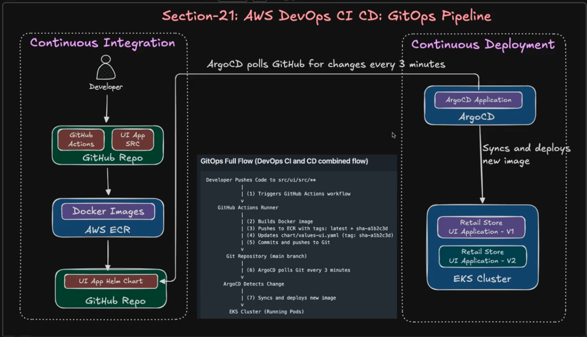
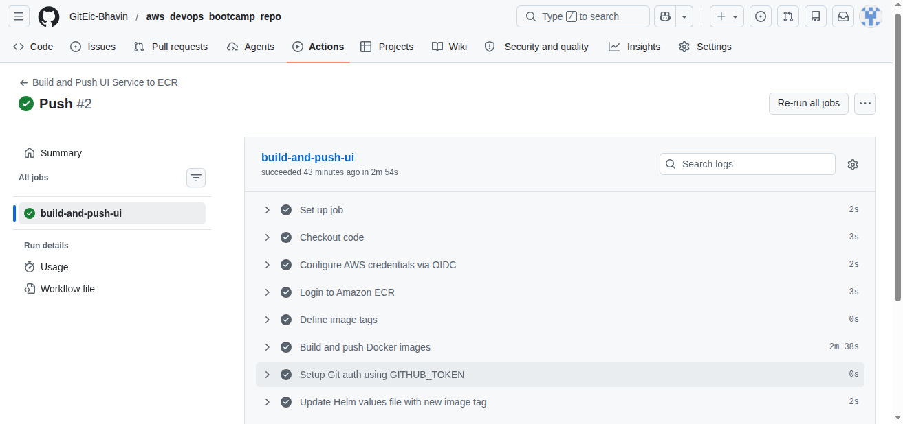
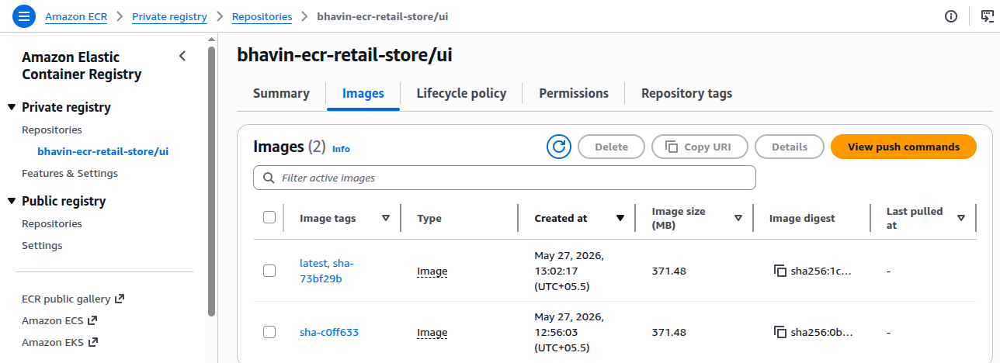
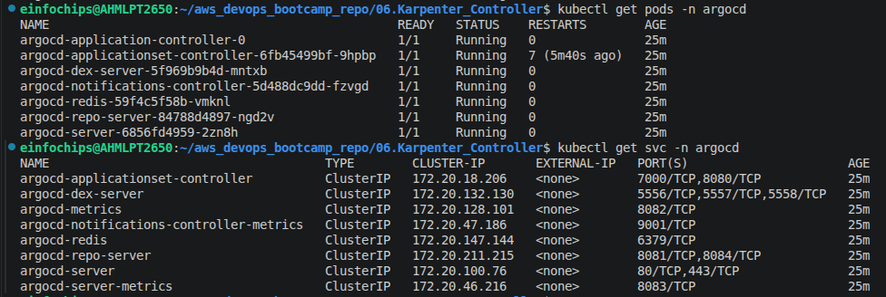
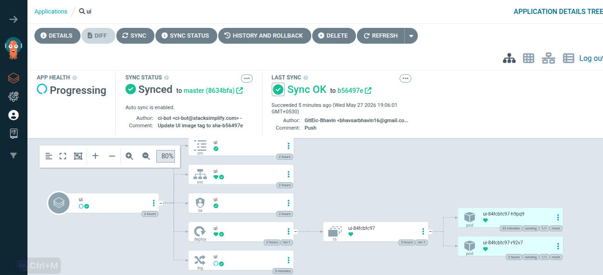

Build CI CD Pipeline to deploy Kubernetes Applications
---



- We will build CI Pipelines by Github Actions workflows

- We will build CD Pipelines by ArgoCD to deploy dift changes to your k8s cluster.

- In Github Pipelines we will write workflows to build docker images with docker image name and tag.

- After build docker image it will push to our AWS ECR.

- After push to ECR our helm chart's `values.yml` should be automatically updated for use new updated `docker image tags`. so, this new image tag will use by ArgoCD to deploy new versions of our apps.

- ArgoCD is a specifically designed for k8s resources managemnet and tracking, deploying purpose.

- ArgoCD is uses a git as a source of truth.

- Whatever we defined git path like / is root path so it will detach any changes to any dir and files on / path it will deploy your changes.

- So, we will defined path of `values.yml` only so it will detach only this changes to deplohy it.

Setup CI
---

## Step 1: Create ECR Repository

```bash
# Create ECR repository for UI microservice
aws ecr create-repository \
  --repository-name bhavin-ecr-retail-store/ui \
  --region ap-south-1
```

## Step 2: Create GitHub OIDC IAM Role

### Step 2.1: Set Environment Variables

```bash
# Set your configuration
AWS_REGION="ap-south-1"
ACCOUNT_ID=$(aws sts get-caller-identity --query Account --output text)
GITHUB_REPO="GitEic-Bhavin/aws_devops_bootcamp_repo"  # UPDATE with YOUR repo
ROLE_NAME="bhavin-github-actions-oidc-role-ui3"

# Verify variables are set correctly
echo "AWS Region: $AWS_REGION"
echo "Account ID: $ACCOUNT_ID"
echo "GitHub Repo: $GITHUB_REPO"
echo "IAM Role Name: $ROLE_NAME"
```

**IMPORTANT:** Replace `GITHUB_REPO` with your actual repository path (format: `owner/repo-name`)

---

### Step 2.2: Generate Trust Policy

```bash
# Generate trust-policy.json with automatic variable substitution
cat > trust-policy.json <<EOF
{
  "Version": "2012-10-17",
  "Statement": [
    {
      "Effect": "Allow",
      "Principal": {
        "Federated": "arn:aws:iam::${ACCOUNT_ID}:oidc-provider/token.actions.githubusercontent.com"
      },
      "Action": "sts:AssumeRoleWithWebIdentity",
      "Condition": {
        "StringLike": {
          "token.actions.githubusercontent.com:sub": "repo:${GITHUB_REPO}:*"
        }
      }
    }
  ]
}
EOF
```

**What this does:** Allows GitHub Actions from your repository to assume this IAM role using OIDC tokens (no AWS keys needed!)

### Step 2.3: Create role to assume this policy

```bash
 aws iam create-role \
  --role-name $ROLE_NAME \
  --assume-role-policy-document file://trust-policy.json`
```

### Step 2.4: Attach ECR Permissions

```bash
# Attach AWS managed policy for ECR push/pull access
aws iam attach-role-policy \
  --role-name $ROLE_NAME \
  --policy-arn arn:aws:iam::aws:policy/AmazonEC2ContainerRegistryPowerUser

# Verify policy is attached
aws iam list-attached-role-policies --role-name $ROLE_NAME
```

**What this grants:**
- [x] Push images to ECR
- [x] Pull images from ECR
- [x] Manage ECR repositories
- [x] Get ECR authentication tokens

### Step 2.5: Create the OIDC Provider in Your AWS Account

- GitHub is an external entity which is requires to Push our DockerImage into AWS ECR.

- So, GitHub also requires to Permission to Push DockerImage.

- So, here we will use OIDC to allow github to push image into ecr.

- OIDC will create temporary credentials for 1hr and give to github.

- Github will use this cred to push image into ECR.

```bash
# List OIDC Providers
aws iam list-open-id-connect-providers

# Create OIDC Provider
aws iam create-open-id-connect-provider \
  --url https://token.actions.githubusercontent.com \
  --client-id-list sts.amazonaws.com 

# List OIDC Providers
aws iam list-open-id-connect-providers
```


## Step 3: Configure GitHub Actions Workflow

### Step-03-01: Update Workflow File

Edit `.github/workflows/build-push-ui.yaml` and update the **role ARN**:

Update your branch name during push image stage

```yaml
- name: Configure AWS credentials via OIDC
  uses: aws-actions/configure-aws-credentials@v4
  with:
    role-to-assume: arn:aws:iam::<ACCOUNT_ID>:role/<IAM_Role_Name_to_Assume>  # Replace <ACCOUNT_ID>
    aws-region: ${{ env.AWS_REGION }}
```

**Replace `<ACCOUNT_ID>`** and `role_name` with your actual AWS account ID from Step-02-01.

- This workflow triggers only when there is changes in `src/ui/src/` only.

- So made changes and push it.

- Go to Github > Actions and varify workflow



- Varify Docker Image pushed in your ECR



Install ArogCD
---

## Step-01: Create Namespace for ArgoCD

```bash
kubectl create namespace argocd
```

## Step-02: Install ArgoCD Core Components

```bash
kubectl apply -n argocd -f https://raw.githubusercontent.com/argoproj/argo-cd/stable/manifests/install.yaml
```

This will installs:

* ArgoCD UI Server
* Repository Server
* Application Controller
* All ArgoCD CRDs




## Step-03: Access ArgoCD UI Locally (Port Forward)

```bash
kubectl port-forward svc/argocd-server -n argocd 8080:443
```

Then open your browser:

```
https://localhost:8080
```

## Step-04: Get ArgoCD Admin Password

```bash
# Get ArgoCD Admin Password
kubectl get secret argocd-initial-admin-secret -n argocd \
  -o jsonpath="{.data.password}" | base64 --decode && echo
```

Use username `admin` and the above password to log in to the web UI.

## Step-05: Login via `argocd` CLI (Optional but Recommended)
- [Install Argo CD CLI](https://argo-cd.readthedocs.io/en/stable/cli_installation/)
```bash
argocd login localhost:8080 --username admin --password <copied-password> --insecure
```

## Step-06: Change the Admin Password

```bash
argocd account update-password
```

> You must be logged in (`argocd login`) before running this.

## Step 7: Register your git repo to ArgoCD

```bash
# Template: Register Your GitHub Repo with ArgoCD
argocd repo add https://github.com/stacksimplify/aws-devops-github-actions-ecr-argocd3.git \
  --username <your-github-username> \
  --password <your-personal-access-token> \
  --name aws-devops-github-actions-ecr-argocd3


argocd repo add https://github.com/stacksimplify/aws-devops-github-actions-ecr-argocd3.git \
  --username GitEic-Bhavin \
  --password <Your_PAT_Token_Here> \
  --name aws-devops-github-actions-ecr-argocd3  
```


## Step 8: Create ArgoCD Applications

```yml
apiVersion: argoproj.io/v1alpha1
kind: Application
metadata:
  name: ui # This is application  name 
  namespace: argocd
spec:
  project: default
  source:
    repoURL: 'https://github.com/GitEic-Bhavin/aws_devops_bootcamp_repo.git'
    targetRevision: master
    path: src/ui/chart/
  destination:
    server: 'https://kubernetes.default.svc'
    namespace: default
  syncPolicy:
    automated:
      prune: true
      selfHeal: true
    syncOptions:
      - CreateNamespace=true
```

## Step 9: Deploy ArgoCD Apps

```bash
kubectl apply -f argocd-manifests/application-ui.yaml
```


