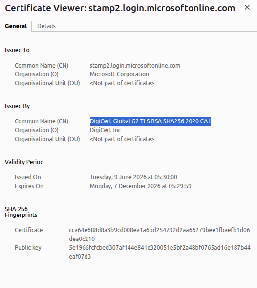
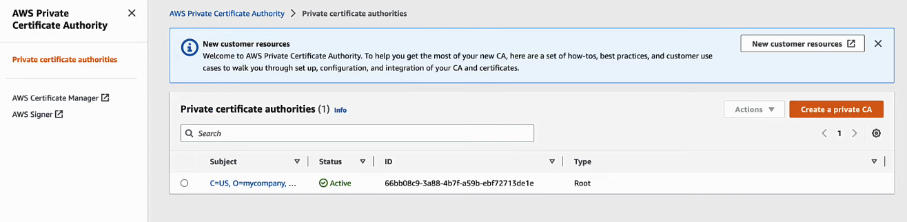
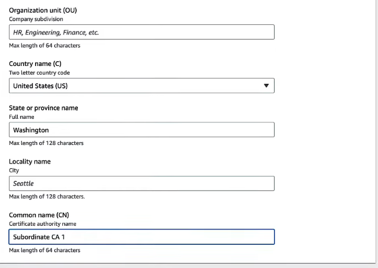
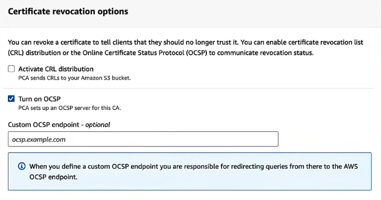
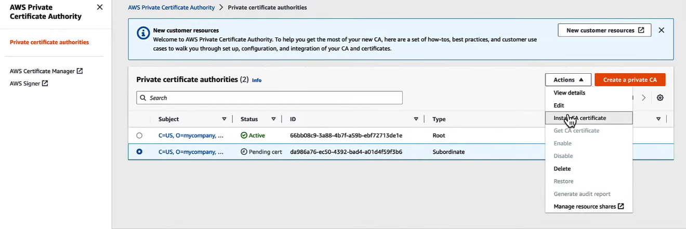
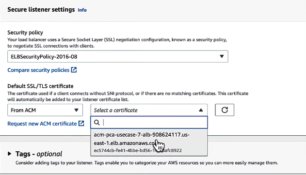
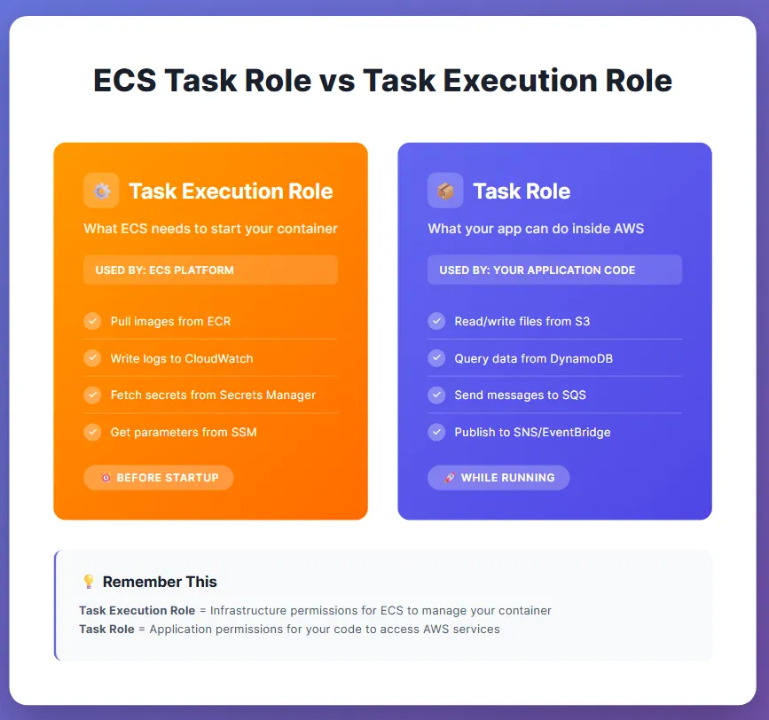
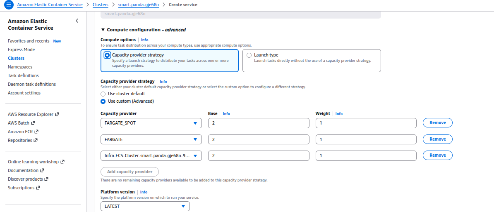

## Q-1 What is SLO,SLI,SLA ? Clear its concept ?

**SLO** = Service Level Object == Your Target to How much your svc and applications must be available ?

**SLO** == 99.9% - AWS Says, its serivces will must be available 99.9%

If your SLO is below 99.8% or like 99.5% You missed your SLO and SRE will investigate why its happens ? Where we should improve ?

**SLI** = Service Level Indicator == Its just your Actual value of Availability , Its measurement.

How healthy is my service ?

If your Service or Apps SLI is 99.5% and SLO is 99.9%. Your availability has measured 99.5% and You missed SLO.

```
100000 Requests

99800 Success

200 Failed

**SLI**

Availability

99800
  -
100000

=99.8%
```

**SLA** = Service Level Aggrement between the customer and company or cloud provider

- AWS ensure that its service must be available `99.5 %` every time.

- If your Apps has deployed in aws services and if disaster happens or maintenance happens or any down time happens from AWS side, At that time also your serivce must be available `99.5%`.

- If aws fails here, Customer will receives `Credits`, `Refund`, `Compensations`.

**Error Budget** - How much down time should be acceptable ?

If you missed your SLO , so how much down time , how much failure is acceptable ?

`SLO is 99.9%`

100 - 90% = 0.1%

`0.1%` is your `Error Budget`.

# Common Interview Questions

## Q1. What is the difference between SLI and CloudWatch Metrics?

CloudWatch collects raw infrastructure and application metrics.

SLIs are meaningful reliability indicators calculated from those metrics.

Example:

CloudWatch → Request Count & Error Count

↓

SLI → Success Rate

 

## Q2. How do you calculate Availability SLI?

Formula:

```text
Availability

Successful Requests
────────────────────────
Total Requests
```

  

## Q3. Why don't companies define a 100% SLO?

Because it is unrealistic, expensive, and impossible to guarantee in real production environments.

  

## Q4. What happens when the Error Budget is exhausted?

Typical SRE actions:

- Stop risky deployments
- Investigate incidents
- Improve service reliability
- Resolve recurring issues

 

## Q5. How would you build an SLO Dashboard?

Example stack:

```text
Application

↓

OpenTelemetry

↓

CloudWatch Metrics

↓

CloudWatch Dashboard

↓

SRE Team
```

Dashboard should include:

- Availability
- Error Rate
- Request Count
- Latency
- Error Budget Remaining
- Infrastructure Health

 

## Q6. What types of SLIs are commonly used?

- Availability
- Success Rate
- Error Rate
- Latency
- Throughput

 

# Common Interview Mistakes

❌ SLO only means availability.

✔️ SLO can also measure latency, throughput, or error rate.

 

❌ CloudWatch metrics are SLIs.

✔️ CloudWatch provides raw metrics. SLIs are derived from those metrics.

 

❌ SLA and SLO are the same.

✔️ SLA is a legal commitment. SLO is an internal engineering target.

 

❌ Error Budget means downtime only.

✔️ Error Budget represents the allowed amount of failure while still meeting the SLO. It can relate to availability, latency, or other SLOs.

 

# Quick Revision

| Concept | One-Line Definition |
|   -|       -|
| SLI | Actual measured performance of a service |
| SLO | Target reliability or performance objective |
| SLA | Legal agreement with customers |
| Error Budget | Allowed amount of failure before violating the SLO |

 

# Interview Answer

> SLI (Service Level Indicator) is the actual measured performance of a service, such as availability, latency, or success rate, over a defined time period.
>
> SLO (Service Level Objective) is the target value that the engineering or SRE team wants to achieve, for example maintaining 99.9% availability or keeping P95 latency below 200 ms.
>
> SLA (Service Level Agreement) is a legal agreement between the service provider and the customer. If the agreed service level is not achieved, the provider may offer service credits or compensation.
>
> Error Budget is the amount of failure allowed while still meeting the SLO. For example, with a 99.9% monthly availability SLO, the service has a 0.1% error budget, which is approximately 43.2 minutes of downtime in a 30-day month. If the error budget is exhausted, the team typically pauses risky deployments and focuses on improving service reliability.

 

# Final Memory Trick

```text
SLI
↓

Measure

↓

SLO
↓

Target

↓

SLA
↓

Legal Promise

↓

Error Budget
↓

Allowed Failure
```

> **Interview Tip:** Always explain these concepts with a real AWS production example (CloudFront → ALB → ECS Fargate → Aurora PostgreSQL → CloudWatch). This demonstrates practical understanding rather than just theoretical knowledge.


## What is mTLS concept ?

# 🔐 Mutual TLS (mTLS) - CloudOps & SRE Interview Notes

  

# Table of Contents

* What is mTLS?
* Why do we need mTLS?
* One-Way TLS vs mTLS
* How mTLS Works
* Production AWS Example
* Where is mTLS Used?
* AWS Services Using mTLS
* mTLS vs HTTPS
* Advantages
* Limitations
* Interview Questions & Answers
* Quick Revision
* Memory Trick

  

# What is mTLS?

**mTLS (Mutual Transport Layer Security)** is an extension of TLS where **both the client and the server authenticate each other using X.509 certificates before exchanging data.**

Unlike normal HTTPS, where only the **server proves its identity**, mTLS requires **both parties** to prove their identities.

  

# Why do we need mTLS?

HTTPS protects communication by:

* Encrypting traffic
* Verifying the server's identity

However, the server still doesn't know whether the connecting client is actually trusted.

Example:

```text
Payment API

https://payment.company.com
```

Anyone with network access could attempt to connect. They may still need credentials, but the TLS connection itself does not verify the client's identity.

With **mTLS**, the server requires a trusted **client certificate** before allowing the connection.

  

# One-Way TLS vs mTLS

| Feature               | HTTPS (TLS) | mTLS        |
| --------------------- | ----------- | ----------- |
|                |       -- |       -- |
| Server Certificate    | ✅           | ✅           |
| Client Certificate    | ❌           | ✅           |
| Server Authentication | ✅           | ✅           |
| Client Authentication | ❌           | ✅           |
| Data Encryption       | ✅           | ✅           |
| Browser Websites      | ✅           | Rare        |
| Microservices         | Optional    | Common      |
| AWS IoT               | Rare        | Very Common |

  

# How mTLS Works

## Normal TLS

```text
Client
   │
   │ Hello
   ▼
Server
   │
   │ Sends Server Certificate
   ▼
Client verifies certificate
   │
   ▼
Encrypted communication starts
```

  

## Mutual TLS (mTLS)

```text
Client
   │
   │ Hello
   ▼
Server
   │
   │ Sends Server Certificate
   ▼
Client verifies Server Certificate
   │
   ▼
Server requests Client Certificate
   │
   ▼
Client sends Client Certificate
   │
   ▼
Server verifies Client Certificate
   │
   ▼
Secure communication begins
```

**Additional Step:** Client authentication.

  

# Production AWS Example

Architecture

```text
               Users
                 │
           CloudFront
                 │
                ALB
                 │
          ECS Service A
                 │
         (mTLS Connection)
                 │
          ECS Service B
                 │
        Aurora PostgreSQL
```

Flow

1. Service A sends a request.
2. Service B presents its certificate.
3. Service A verifies the server certificate.
4. Service B requests Service A's certificate.
5. Service A sends its client certificate.
6. Service B verifies it.
7. Secure communication starts.

  

# AWS IoT Example

```text
IoT Device
      │
Client Certificate
      │
AWS IoT Core
```

AWS IoT Core verifies the device certificate before allowing it to connect.

Without a valid certificate:

```text
Connection Rejected
```

  

# Where is mTLS Used?

Common production use cases:

* Microservice-to-Microservice Communication
* AWS IoT Core
* Banking APIs
* Healthcare Systems
* Internal Enterprise APIs
* B2B Partner Integrations
* Zero Trust Networks
* Service Meshes (Istio, Linkerd, etc.)

  

# AWS Services Related to mTLS

| AWS Service               | Usage                                                        |
| ------------------------- | ------------------------------------------------------------ |
| AWS IoT Core              | Device Authentication                                        |
| Application Load Balancer | Client Certificate Authentication (supported configurations) |
| API Gateway               | Client Certificate Authentication (supported scenarios)      |
| AWS Private CA            | Issue Private Client Certificates                            |
| Amazon ECS / EKS          | Internal Service-to-Service Communication                    |
| CloudFront                | Server-side TLS only (not typical client mTLS termination)   |

  

# Where are Certificates Stored?

## Server Side

Examples:

* AWS Certificate Manager (ACM)
* Application Load Balancer
* CloudFront
* API Gateway

  

## Client Side

Examples:

* IoT Devices
* Applications
* Containers
* Virtual Machines
* Mobile Applications

  

# mTLS vs HTTPS

| HTTPS                          | mTLS                                                     |
| ------------------------------ | -------------------------------------------------------- |
| Only server is authenticated   | Both client and server are authenticated                 |
| Suitable for public websites   | Suitable for internal secure systems                     |
| Browser is the client          | Machines or trusted applications are usually the clients |
| No client certificate required | Client certificate is mandatory                          |

  

# Advantages

* Strong client authentication
* Strong server authentication
* Encrypted communication
* Prevents unauthorized clients from connecting
* Ideal for Zero Trust architectures
* Reduces impersonation risk
* Widely used for machine-to-machine communication

  

# Limitations

* Certificate lifecycle management
* Certificate renewal complexity
* Certificate distribution challenges
* Increased operational overhead
* Requires a Certificate Authority (CA)
* More complex than standard HTTPS

  

# Interview Questions & Answers

## Q1. What is mTLS?

**Answer**

mTLS (Mutual TLS) is a security protocol where both the client and the server authenticate each other using digital certificates before establishing an encrypted communication channel.

  

## Q2. Why do we need mTLS if HTTPS already encrypts traffic?

**Answer**

HTTPS encrypts traffic and authenticates the server only.

mTLS adds client authentication, ensuring that only trusted clients can communicate with the server.

  

## Q3. Does mTLS provide stronger encryption than HTTPS?

**Answer**

No.

Both use the same TLS encryption.

The difference is that mTLS adds **mutual authentication**, not stronger encryption.

  

## Q4. Where is mTLS commonly used?

**Answer**

* AWS IoT Core
* Microservices
* Banking APIs
* Healthcare Systems
* Enterprise Internal APIs
* Service Meshes

  

## Q5. Can JWT replace mTLS?

**Answer**

No.

JWT is used at the application layer for authentication and authorization after the secure connection is established.

mTLS authenticates both parties during the TLS handshake.

Many production systems use both together.

  

## Q6. What happens if the client certificate is invalid?

**Answer**

The server rejects the TLS handshake, and the secure connection is never established.

  

## Q7. Is a browser required to have a client certificate for normal HTTPS?

**Answer**

No.

Browsers normally verify only the server certificate.

Client certificates are required only when the server is configured for mTLS.

  

## Q8. What problem does mTLS solve?

**Answer**

It prevents unauthorized clients from communicating with a server by requiring both sides to prove their identities using certificates.

## Q9 - What is Root CA ?

- It is a Higher level of trust. It is a Trusted Organizations for Certificates.
- Browser comes with Pre-Installed This Root CA from where our browser can varify the Server's side certificates in the normal HTTPS and Mtls.

## Q-10 What is intermediate ca ?

- Instead of the Root CA issuing millions of certificates directly, it delegates that responsibility for Better security, easier certificate management, If an Intermediate CA is compromised, only it needs to be revoked—not the Root CA.

- `Amazon RSA 2048 M03` is a Intermediate ca

- `Amazon Root CA 1` is a Root CA

- Intermediate ca will send by your Applications.

- To see intermediate ca, go to browser




# Interview Answer

> **Mutual TLS (mTLS)** is an extension of TLS in which both the client and the server authenticate each other using digital certificates before establishing an encrypted connection. In standard HTTPS, only the server presents a certificate and proves its identity, while the client is typically authenticated later using credentials or tokens. With mTLS, the client must also present a valid certificate, allowing the server to verify that it is communicating with a trusted client. This makes mTLS ideal for machine-to-machine communication, such as microservices, AWS IoT Core devices, banking systems, healthcare applications, and other enterprise environments where strong identity verification is required.


## SSL Cert Authentication Handshake works

Your domain is xyz.mycompany.com

You created SSL Certificate using ACM and used by ALB or CloudFront.

While User hits your domain from his any of browsers, The flow will like this.

```
User
 |
 |
Browser already has installed Root CA
 |
 |
Intermediate CA - *-ca-chain.pem provided by servers. - Founded at your browser
 | 
 |
Server's SSL Cert - *.cert - Amazon_Root_CA_1.pem - /etc/ssl/certs/
```

If all this checks passed , your HTTPS will establish.

# Certificate Revocation — Interview Prep (CRL, OCSP, OCSP Stapling)

Part of the SSL/TLS interview series. Builds on: TLS handshake → certificate chain (root/intermediate CA) → **this topic**.

## Why this exists

A certificate can be technically valid (not expired, correctly signed, domain matches) and still be untrustworthy — for example, if its private key was stolen. Revocation is how a CA invalidates a certificate before its expiry date.

## Core concepts

### Certificate Revocation
A CA marks a certificate as invalid before its expiration date. Common triggers:
- Private key compromised
- Organization or domain ownership changed
- Certificate issued by mistake
- Weak/compromised cryptographic keys
- CA policy violation

### CRL (Certificate Revocation List)
A blacklist of revoked certificate serial numbers, published by the CA. The client downloads the full list and checks if the cert's serial number is in it.

- Pros: simple
- Cons: list can grow huge (millions of entries) for large CAs, slow to download/search, updated only periodically — not real-time

### OCSP (Online Certificate Status Protocol)
The client queries the CA's OCSP responder about a single certificate, instead of downloading the whole list. Response is one of: `Good`, `Revoked`, `Unknown`.

- Pros: smaller request, faster, near real-time
- Cons: adds an extra network round-trip on every connection, depends on OCSP server uptime, and leaks browsing activity to the CA (privacy issue)

### OCSP Stapling
The server — not the browser — periodically fetches a signed OCSP response from the CA and attaches ("staples") it to the TLS handshake.

- Removes the browser's separate OCSP round-trip → faster handshake
- Better privacy (CA doesn't see which sites users are visiting in real time)
- Reduces load on the OCSP responder

## Comparison table

| | CRL | OCSP | OCSP Stapling |
|---|---|---|---|
| What's checked | Full revoked list | Single certificate | Single certificate |
| Who asks | Browser downloads list | Browser queries CA | Server queries CA, browser gets it for free |
| Size/speed | Large, slow | Small, fast | Fastest (no extra browser round-trip) |
| Freshness | Periodic | Near real-time | Near real-time (cached + signed by CA) |
| Privacy | N/A | CA sees client's lookups | CA doesn't see per-client lookups |

## How it fits AWS

- **Public ACM certificates**: AWS/the issuing public CA manages revocation lifecycle; you don't configure CRL/OCSP yourself.
- **AWS Private CA**: if you run your own PKI, you're responsible for revocation — publishing CRLs and/or configuring OCSP depending on your design.
- **mTLS between services**: if a service's client certificate is stolen, revoking it means the next connection attempt is checked and rejected by the peer — this is what stops a compromised client from continuing to authenticate.

## Mental model / flow

```
Certificate issued → used → private key stolen?
   → yes → CA revokes certificate
        → CRL (download list) or OCSP (ask CA directly)
   → browser learns cert is revoked → connection blocked
```

This completes the SSL/TLS lifecycle covered so far:
`TLS handshake → server certificate → certificate chain → root CA → intermediate CA → revocation (CRL/OCSP)`

## Interview Q&A (rapid recall)

**Q: Why do we need certificate revocation if certificates already expire?**
A: Expiry is a fixed future date; revocation handles certificates that become untrustworthy *before* that date (e.g. key compromise) — you can't wait months for natural expiry.

**Q: What is a CRL?**
A: A CA-published list of revoked certificate serial numbers that clients download and check against.

**Q: What is OCSP?**
A: A protocol for asking the CA (or its OCSP responder) the real-time status of one specific certificate — Good, Revoked, or Unknown.

**Q: What is OCSP Stapling and why does it matter?**
A: The server fetches and caches a signed OCSP response from the CA, then includes it directly in the TLS handshake — removing the browser's separate OCSP call, which improves latency, privacy, and reduces load on the OCSP responder.

**Q: CRL vs OCSP — give the one-line distinction.**
A: CRL = full list, downloaded periodically. OCSP = single-certificate query, near real-time.

## Common mistakes to avoid saying

- "Certificates only become invalid at expiry." → Wrong, they can be revoked early.
- "CRL and OCSP are the same thing." → Wrong, CRL is a list; OCSP is a per-certificate query.
- "OCSP Stapling is an encryption method." → Wrong, it's a performance/privacy optimization for status checking, not encryption.

## Next topic in the series

**AWS Private Certificate Authority (Private CA)** — issuing and managing internal certificates for mTLS, internal services, and enterprise PKI.


# Demo - Private CA to revolke pvt certificates

## 1. Go to Private CA - Create Root Private CA



## 2. Create Subordinate Private CA

- Choose CA type - `Subordinate`.

- Fill Configurations

- Organizations Unit, Country, State, Command Name of CA - `Subordinate CA 1`.



## 3. Trun on Certificate Revocations options

- Choose OCSP - Its not install whole list of ca in your local or browser. User send request to this OCSP server, this server will look for that domains ca, if its good or bad, user will access or declined to your apps.



## 4. Installing CA Certificate to your Root CA



- 4.1 Add Subordinary CA to your Root CA

- 4.2 Set validatoins date.

## 5. Issuing a Certificate to the Load Balancer

- LB will required Certificate issued from ACM.

- Go to ACM > Request a `Private Certificate`

- Choose your Private CA common name here `Subordinary CA 1`.

- Choose your domain name.

- Go to LB

- Choose Listener Settings > Default SSL/TLS Certificate > Choose your Private ACM.



## Revokations of your Private CA

```bash
aws acm-pca revoke-certificate --certificate-authority-arn <Your_ACM_Private_CA_ARNs> --certificate-serial <Your_ACM_Cert_Sr_Number> --revocation-reason <Enter reasons>
```


Basic IAM
---

```json
// Policy
{
    "Version": "2012-10-17",
    "Statement": [
        {
            "Effect": "Allow",
            "Action": [
                "ec2:DescribeAvailabilityZones",
                "ec2:DescribeInstances",
                "ec2:DescribeInstanceTypes",
                "ec2:DescribeSnapshots",
                "ec2:DescribeTags",
                "ec2:DescribeVolumes",
                "ec2:DescribeVolumesModifications",
                "ec2:DescribeVolumeStatus"
            ],
            "Resource": "*"
        },
        {
            "Effect": "Allow",
            "Action": [
                "ec2:CreateSnapshot",
                "ec2:ModifyVolume"
            ],
            "Resource": "arn:aws:ec2:*:*:volume/*"
        }
      ]
}
   
// Trust Policy
{
    "Version": "2012-10-17",
    "Statement": [
        {
            "Effect": "Allow",
            "Principal": {
                "Service": "pods.eks.amazonaws.com"
            },
            "Action": [
                "sts:AssumeRole",
                "sts:TagSession"
            ]
        }
    ]
}
```

- This is trust policy where we used STS:AssumeRole.
- This roles will be assumed by whatever you defined in `Principles` like user, svc ARNs.

- Here `Priciple` is `pods.eks.amazonaws.com` which is pods insides in eks.

- In Policy whatever you given policy it will assumed by this pods.

## Cross Account Resource Access

- Acc A has S3

- Acc B want to Read this Acc A S3

### In Acc A

- Create Trust Policy to ensure who will assume this role which is defined in `Principles` like `user`, `svc`.

```json
{
  "Version": "2012-10-17",
  "Statement": [
    {
      "Effect": "Allow",
      "Principal": {
        "AWS": "arn:aws:iam::222222222222:root"
      },
      "Action": "sts:AssumeRole"
    }
  ]
}
```


- Create or Attach S3 Read Policy to this roles.

```json
{
  "Effect": "Allow",
  "Action": "s3:GetObject",
  "Resource": "arn:aws:s3:::my-bucket/*"
}
```

This Roles ARNs is `"arn:aws:iam::111111111111:role/CrossAccountS3ReadRole"`.


### In Acc B

- Create a policy to ask for permisions of Role created in Acc A.

```json
{
	"Version": "2012-10-17",
	"Statement": [
		{
			  "Effect":"Allow",
			  "Action":"sts:AssumeRole",
			  "Resource":"arn:aws:iam::111111111111:role/CrossAccountS3ReadRole"
		}
	]
}
```

## Practice Q&A
 
**Q1: What's the difference between a Trust Policy and a Permission Policy?**
> Trust policy defines who can assume the role (attached to the role, acts like a resource policy). Permission policy defines what the role can do once assumed. Both must align for access to work.
 
**Q2: Why would you never put long-term access keys in an ECS task or Lambda function?**
> Long-term keys don't rotate automatically, are easy to leak in code/logs/images, and if compromised give indefinite access. IAM roles give short-lived, auto-rotating credentials scoped to the task's lifecycle, and every assumption is logged in CloudTrail with context.
 
**Q3: Walk me through cross-account access setup end to end.**
> Trust policy in target account (who can assume) → assume-role permission in source account (who can call) → STS AssumeRole call → temp credentials returned → caller uses temp creds bound by target role's permission policy. Mention External ID if it's a third-party scenario.

  - **Step 1** - Create task role in Account A(current account)

```json
{
  "Version": "2012-10-17",
  "Statement": [
    {
      "Effect": "Allow",
      "Action": [
        "s3:GetObject",
        "s3:PutObject"
      ],
      "Resource": "arn:aws:s3:::remote-bucket-in-account-b/*"
    }
  ]
}
```

  - **Step B** - Create S3 bucket policy in Account B

```json
{
  "Version": "2012-10-17",
  "Statement": [
    {
      "Sid": "AllowCrossAccountECSTaskRole",
      "Effect": "Allow",
      "Principal": {
        "AWS": "arn:aws:iam::ACCOUNT_A_ID:role/your-ecs-task-role-name"
      },
      "Action": [
        "s3:GetObject",
        "s3:PutObject"
      ],
      "Resource": "arn:aws:s3:::remote-bucket-in-account-b/*"
    }
  ]
}
```


 
**Q4: What's the difference between ECS Task Role and Task Execution Role?**
> Execution role = ECS agent's permissions (pull image, push logs, fetch secrets at container start). Task role = the application's runtime permissions for AWS API calls.
 
> **Task Role** - Who use it ? - Application container running inside task = task = container. **Task Execution Role** - Who use it ? ECS Agent. While create container in ecs, ecs will inject this ecs agent inside your container. 

> **Purpose Task Role** - Access aws resources by your container/Application code. Ex. Upload/Read/Write image, object into S3 bucket.

| Feature | Task Role | Task Executio Role |
| ------- | --------- | ------------------ |
| Who use it ? | You application code inside container | ECS Agent deployed into your ECS nodes |
| Purpose | Access aws services by your applications for read/write s3, make query on rds etc | Prepares and builds the container environment. |
| Example | Connect aws services like S3, DynamoDB, SQS, SNS, EventBridge | ECR, CloudWatch Logs to write logs, Secret manager | 
| Benefit | Removes the hardcoded creds, env | Grants ECS permission to handle system setup. |



**Q5: 

**Ans**

- I will use **EC2 Launch Type**. This allows us to run **Multiple tasks can run on same EC2 Instance ECS Node**, allow me to optimze that ECS Node's resource usage and share instance across multiple tasks.

- This approach helps in **reducing costs** compared to the **Fargate Launch Type**, Where each tasks runs in its owned isolated environment with dedicated resources.

**Q6 An application running as a service on ECS Fargate is experiencing high network latency. How do you troubleshoot and optimize its network performance ?**

#### 1. Traffic Analysis & Telemetry
* **Enable VPC Flow Logs:** Capture and analyze IP traffic flowing to and from network interfaces in your VPC to locate routing or performance bottlenecks.
* **Monitor CloudWatch Metrics:** Audit network throughput metrics (`NetworkIn` and `NetworkOut`) to ensure tasks aren't hitting unexpected threshold limits.

#### 2. Firewall & Security Configuration
* **Verify Security Groups & NACLs:** Inspect configurations to confirm that health checks, internal microservice communication, or external traffic aren't hitting restrictive rules or causing unnecessary connection retries.

#### 3. Performance Optimization (Alternative Infrastructure)
* **Switch to ECS with EC2 Launch Type:** Fargate tasks run in an isolated environment with specific resource provisions. For extremely low-latency requirements, migrate the service to an EC2 launch type.
* **Implement Cluster Placement Groups:** Deploy the underlying EC2 instances inside a **cluster placement group** to ensure they are packed closely together within the AWS hardware fabric, achieving low-latency, high-throughput network performance.

| Placement Group Type | Physical Rack Allocation | Primary Use Case | Max Instances / Limits | Network Performance |
| :--- | :--- | :--- | :--- | :--- |
| **Cluster** | Same physical rack / cluster inside a single AZ | HPC, distributed ML, ultra-low latency tasks | Limited by rack physical capacity | Lowest latency, highest throughput |
| **Spread** | Distinct physical rack for every single instance | Critical standalone nodes needing high isolation | Max 7 running instances per AZ | Standard AZ network speed |
| **Partition** | Distributed partitions; partitions never share racks | Large distributed databases (Cassandra, HDFS, Kafka) | Max 7 partitions per AZ | Standard cross-partition network speed |

**Q7 You need to deploy a service on ECS and ensure zero downtime during deployments. How would you configure this ?**

### Resolution Strategy

* **Rolling Updates:** Configure the ECS service with a rolling update deployment type. Define the `minimumHealthyPercent` (e.g., 100%) and `maximumPercent` (e.g., 200%) parameters. This forces ECS to spin up new tasks and verify their health before terminating old tasks.
* **Blue/Green Deployments via AWS CodeDeploy:** Route traffic to a parallel environment. CodeDeploy installs the new task set (Green), runs health checks, and shifts production traffic from the old task set (Blue) to the new one dynamically via an Application Load Balancer.

### Configuration Implementation
These deployment boundaries are explicitly defined inside the **ECS Service definition** (under `deploymentConfiguration`), rather than the task definition. 

```json
"deploymentConfiguration": {
  "maximumPercent": 200,
  "minimumHealthyPercent": 100
}
```


**Q5: A user says "AccessDenied" even though the IAM policy looks correct. What do you check?**
> Check in order:
> 1. Explicit Deny anywhere (SCPs at Org level, permission boundaries, resource-based policies) — explicit deny always wins.
> 2. Trust policy if it's a role.
> 3. Resource-based policy on the target resource (e.g., S3 bucket policy) — for cross-account, both identity policy AND resource policy must allow.
> 4. Condition key mismatches (IP restriction, MFA requirement, PrincipalOrgID).
> 5. Use IAM Access Analyzer / Policy Simulator to debug.
 
**Q6: What is a Service Control Policy (SCP) and how does it differ from IAM policy?**
> SCP is applied at AWS Organizations level, sets the maximum permission boundary for all accounts under it — it can't grant permissions, only restrict. IAM policies grant/deny within an account. Even if IAM allows something, an SCP deny at the org level overrides it.
 
**Q7: What's a permissions boundary and when would you use it?**
> A managed policy that sets the max permissions an IAM entity can have, regardless of what identity policies grant. Used to let teams create their own roles safely without escalating privileges (e.g., a CI/CD pipeline creating roles for itself, capped by a boundary).
 
**Q8 (Scenario): "Your ECS container needs to access an S3 bucket in another AWS account. Design it."**
> Combine ECS Task Role + Cross-Account trust pattern: Task Role in your account has permission to `sts:AssumeRole` into a role in the target account; that role's trust policy allows your Task Role's ARN as principal; that role has S3 permissions.
> Simpler alternative (same-org): add a bucket policy in the target account allowing your Task Role ARN directly — S3 supports resource policies directly, no assume-role needed.

ECS + Fargate
---

Cluster - To run ECS Nodes we will requires cluster where all my tasks , svc will executes.

- While we create cluster - we are defining `CPU`, `Memory`. `4 vcpu`, `2 GiB Memory`.

- Based on this cpu and memory it will create a Node EC2 which will have this 4 vcpu and 2 GiB Memmory.

- In this nodes our Tasks and svc will executes.

- Whatever you defined CPU and Memory in this cluseter it will used by `Task Definitions`.

Task Definitions

  - **Task Size** - We mentions CPU and Memory in this Task Size. Task Size may have no of containers. So if you write 2 cpu and 2 Gib Memory in this `Task Size` and In containers you defined `1 Vcpu` and `1 Gib Memory` for `Container A`. `In Container B` you also uses `1 vCPU` and `1 Gib Memory` it will used from this `Task Size`. 

  - Now Your Task size has exhasted. Now here `Service Auto Scaling` will work. It will create new containers.

  - It will consume your EC2 Instance resources == Your ECS Nodes resources.

  - If your ECS Nodes Instance resources has exhasted your new Task will always goes into Pending State.
  - Bcz There is no more Memory and CPU is available.

  - Here `Cluster == ECS Nodes Auto Scaling/Cluster Auto Scaling work`. It will Scale your ECS Nodes and Rest of Pending state task will schedule in this new Nodes.

  - If you have Managed EC2 Instance - You don't requires to create Cluster Auto Scaling - AWS will manage itself.

  - If you have Self-Managed EC2 Instance - You must have to create Cluster Auto Scaling by below steps:

  ## How to create Cluster Auto Scaling (Classic)
  - Create an Auto Scaling Group.

  - Launch an ECS-optimized AMI.

  - Create an ECS Capacity Provider.

  - Attach the Auto Scaling Group to the Capacity Provider.

  - Enable:
    - Managed Scaling = ON

    - Managed Termination Protection = ON

  - Attach the Capacity Provider to the ECS Cluster.

  - Create your ECS Service using the Capacity Provider Strategy instead of Launch Type.

```
Pending Task

↓

Capacity Provider

↓

Auto Scaling Group

↓

Launch EC2

↓

EC2 registers with ECS

↓

Task starts
```

## What is an ECS capacity provider? 


It is a strategy that tells ECS where and how to run your tasks.

Think of ECS like a logistics manager.

ECS Scheduler

```
"I have a new task."

↓

Where should I run it?
```

It asks the `Capacity Provider`.

The Capacity Provider answers:

```
Run on:

✓ Fargate

or

✓ Fargate Spot

or

✓ EC2 Auto Scaling Group A

or

✓ Managed Instances
```

## Without Capacity Provider

```
Task

↓

Launch Type = EC2

↓

Find an EC2 instance

↓

Run Task
```

- So `Capacity Provider`  will tell - which Tasks should runs where like `On-EC2`, `On-Fargate`, `On-Fargate-Sport`.

- **During Creating Service, If you choose any one of this Capacity Provider like On-EC2 Capacity Provider, `If there is new Tasks it will be run on this` On-EC2**.

- `If you had created service` with `On-Fargate` , your new task will be scheduled on the `On-Fargate` Only.

## What if there are multiple-capacity in your created services



- You can see here `weight is set to 1` for eacg capacity provider.

- That means, if you have 6 Tasks , so it will be run like this

```
EC2 - Task 1

On-Fargate - Task 2

On-Fargtate Sport - Task 3

EC2 - Task 4

On-Fargate - Task 5

On-Fargate  Spot - Task 6
```

- So, if there are 6 tasks, `2 Tasks` will runs on `EC2` , `2 Tasks` will runs on `On-Fargate`, and `2 Tasks` will runs on `On-Fargate Spot`.

### What if ECS EC2 Nodes Instance has no resources ?

- So, ECS have managed and self-managed and Fargate CP.

- If you have **Managed CP**, You will not requires to do anythings.
- AWS will manage this **Cluster Auto Scaling**.

- If you have **Self-Managed CP**, You will must requires to create `Cluster Auto Scaling`.

- If you have **Fargate CP**, AWS provisions more compute automatically (subject to account quotas and regional capacity). No Cluster Auto Scaling to configure.

| Capacity Provider     | Who manages compute? | If CPU/Memory is full, what happens?                                                                                               |
| --------------------- | -------------------- | ---------------------------------------------------------------------------------------------------------------------------------- |
| **Fargate**           | AWS                  | AWS provisions more compute automatically (subject to account quotas and regional capacity). No Cluster Auto Scaling to configure. |
| **Managed Instances** | AWS                  | AWS manages the EC2 instances and scales them as needed. You don't configure Cluster Auto Scaling yourself.                        |
| **Self-managed EC2**  | You                  | You must configure an Auto Scaling Group + Capacity Provider with Managed Scaling (Cluster Auto Scaling).                          |


## Exalplain how to get ✅ Zero-downtime deployments


## Deployments


**Rolling update (default)**: replaces tasks gradually, respects minimumHealthyPercent / maximumPercent to control how many old/new tasks run simultaneously.

**Blue/Green (via CodeDeploy)**: spins up a full new task set, shifts traffic (all-at-once or canary), auto-rollback on failed health checks — the "SRE-grade" answer when asked about safe deploys.

**Circuit breaker**: ECS can auto-rollback a deployment if new tasks keep failing health checks — good to mention, shows production maturity.

### Q2: Fargate vs EC2 launch type — when would you choose each?

- Fargate for simplicity/no ops overhead/bursty workloads. EC2 for cost efficiency at steady high scale, GPU needs, or host-level control.


### Q3: How does an ECS Fargate task get a public IP or reach the internet?

- If in a public subnet with assignPublicIp: ENABLED, it gets a public IP directly. If in a private subnet, it needs a NAT Gateway for outbound internet, or VPC endpoints for AWS service calls without internet at all.

### Q-4 How do you achieve zero-downtime deployment in ECS?

- Rolling update with `minimumHealthyPercent: 100`, `maximumPercent: 200` ensures new tasks are healthy before old ones are killed, combined with ALB health checks and deployment circuit breaker for auto-rollback. 

- For higher safety, use CodeDeploy Blue/Green with canary traffic shifting.

### Q-5 What does cricuit breaker for zero-downtime ?

- `circuit breaker`

| Feature                               | Rolling Update          | Deployment Circuit Breaker |
| ------------------------------------- | ----------------------- | -------------------------- |
| Deploy new version                    | ✅ Yes                   | ❌ No                       |
| Replace tasks gradually               | ✅ Yes                   | ❌ No                       |
| Maintain availability (zero downtime) | ✅ Yes                   | ❌ No                       |
| Monitor deployment health             | Basic ECS health checks | ✅ Yes                      |
| Detect deployment failure             | ❌ Not intelligently     | ✅ Yes                      |
| Automatically rollback                | ❌ No                    | ✅ Yes                      |


Interview favorite: "Your Fargate task is stuck in PENDING and can't pull the image. Why?"

> Usually networking: task is in a private subnet with no NAT Gateway and no VPC endpoints for ECR/S3 → can't reach ECR to pull the image or CloudWatch Logs to write logs. Fix: add NAT Gateway or VPC endpoints (com.amazonaws.region.ecr.dkr, ecr.api, s3, logs).


Q-14 How would you design multi-region failover? Active-active vs active-passive tradeoffs?

A-14 This question asks how you would design a system to keep your application running if an entire AWS geographical area (Region) completely goes down.

Here is the breakdown of the question, the tradeoffs, and the example so you can easily understand it for the first time.

------------------------------
## Part 1: The Core Design (How it Works)

Think of an AWS Region as a physical data center. ECS and Fargate only live inside one specific region. If that region loses power or internet, your app dies.

To fix this, you must build a mirror image:

1. **The Compute Layer:** You spin up an identical ECS Cluster and Fargate services in a second AWS Region (e.g., Region A is Virginia, Region B is Oregon).
2. **The Traffic Cop (Route 53):** You use AWS Route 53 (DNS) to monitor your app. It constantly checks: "Is Region A healthy?" If Region A dies, Route 53 automatically sends users to Region B.
3. **The Hard Part (The Data):** Containers are easy to duplicate, but data is hard. Your database must constantly copy itself across regions using tools like Aurora Global Database or DynamoDB Global Tables so both regions have the exact same information.

------------------------------
## Part 2: Active-Passive vs. Active-Active (The Tradeoffs)

Imagine you own a restaurant and want a backup plan in case it floods.

### 🏢 Active-Passive (The Backup Restaurant)

* **What it is:** Your main restaurant (Active) is open. Your backup restaurant (Passive) is locked, dark, and empty.
* **The Good:** It is cheaper (you aren't paying for staff/electricity in the backup) and simpler (no one is mixing up orders between two locations).
* **The Bad (RTO):** If the main restaurant floods, it takes time to drive to the backup, unlock the doors, and turn on the kitchen. In tech, this delay is called RTO (Recovery Time Objective). Because it takes 1 to 5 minutes for Route 53 to notice the crash and update its records, you will experience a brief outage.

### 🏪 Active-Active (Two Open Restaurants)

* **What it is:** Both restaurants are open at the same time. Half your customers go to Restaurant A, half go to Restaurant B.
* **The Good:** If Restaurant A floods, customers simply walk over to Restaurant B. There is zero downtime (Near-zero RTO).
* **The Bad:** It doubles your costs because you are running two full operations. It also creates data chaos (Split-Brain Risk). If a customer buys the very last item in Restaurant A at the exact same millisecond someone buys it in Restaurant B, your system breaks. Your app must be smart enough to handle these data conflicts.

------------------------------
## Part 3: The Real-World Recommendation

The answer concludes with a realistic piece of advice for most companies: Don't over-engineer.

Full Active-Active is incredibly difficult and expensive. Unless you are a giant like Netflix, the answer recommends a hybrid approach: Active-Passive with a "Warm" Standby.

* **The Strategy:** Run your main region at 100%. In your backup region, keep the database synced, but only run 1 or 2 small containers (just enough to keep it "warm").
* **The Failover:** If the main region crashes, an automated script instantly tells AWS to scale those 2 containers up to 50 containers to handle the traffic. This strikes a perfect balance between saving money and recovering quickly.

## Q-22 How do you get container-level logs/metrics without host access?

This is another **very common SRE interview question**, but the explanation in books is often too theoretical.

Let's understand it as if you're working in production.


> **How do you get container logs and metrics in ECS/Fargate without logging into the server?**

Your first thought should be:

> **Wait... where is the server?**

For **Fargate**, there is **no server that you own**.

```text
Developer

↓

ECS Task

↓

AWS Fargate
```

You **cannot SSH** into the underlying machine because AWS manages it.

So the question becomes:

> **If I can't access the server, how do I see logs and metrics?**

Suppose your application is running.

```text
Spring Boot App

↓

Container
```

Inside the container, the application is continuously producing:

```text
Application

↓

INFO User Logged In

↓

INFO Payment Success

↓

ERROR Database Timeout

↓

WARN Memory High
```

These are **logs**.

At the same time, the container is consuming:

```text
CPU = 70%

Memory = 60%

Network = 120 Mbps
```

These are **metrics**.

### Normally (Traditional VM)

If this were a Linux server,

You would SSH into it.

```bash
ssh ec2-user@server
```

Then

```bash
cat /var/log/app.log
```

or

```bash
top
```

or

```bash
docker logs
```

Easy.

### But in Fargate...

There is **no SSH**.

```text
AWS

↓

Hidden Server

↓

Your Container
```

AWS says

> "You cannot access my server."

So how do you see logs?

### Method 1 — awslogs (Most Common)

Imagine your application prints

```text
Application

↓

stdout

↓

Hello

↓

User Login

↓

Database Error
```

The **awslogs log driver** simply copies everything written to **stdout/stderr** and sends it to **CloudWatch Logs**.

```text
Application

↓

stdout/stderr

↓

awslogs Driver

↓

CloudWatch Logs
```

You never SSH.

You just open CloudWatch.

## Example

Your application prints

```java
System.out.println("User Login");
```

or

```python
print("Payment Success")
```

Those messages automatically appear in CloudWatch Logs if you've configured the `awslogs` log driver in the task definition.

## Method 2 — FireLens

Now suppose your company doesn't use CloudWatch.

Instead they use

* Datadog
* Splunk
* Elasticsearch
* S3

Now what?

Instead of sending logs directly to CloudWatch,

AWS inserts another container.

```text
Application Container

↓

FireLens Container

↓

Datadog
```

FireLens acts like a **post office**.

Application says

> Here are my logs.

FireLens says

> I'll deliver them wherever you want.

---

Example

```text
Application

↓

FireLens

↓

Datadog
```

or

```text
Application

↓

FireLens

↓

Splunk
```

or

```text
Application

↓

FireLens

↓

Elastic
```


Logs tell us

> **What happened?**

Metrics tell us

> **How healthy is the application?**

For example

```text
CPU

Memory

Network
```

## Method 1 — Container Insights

AWS already collects

```text
Task CPU

Task Memory

Cluster CPU

Network

Running Tasks
```

These are displayed in

```text
CloudWatch

↓

Container Insights
```

Again

No SSH

No agent installation

AWS collects them automatically once Container Insights is enabled.

Suppose your API is slow.

CPU looks fine.

Memory looks fine.

You want to know

> Which function is slow?

Container Insights cannot answer that.

You need **APM (Application Performance Monitoring).**

### Sidecar Pattern

Imagine your task contains

```text
Task

├── My Application
└── Datadog Agent
```

The Datadog Agent is called a **sidecar container**.

It lives inside the same ECS Task.

It collects

* traces
* custom metrics
* service map
* exceptions

and sends them to Datadog.

Architecture

```text
          ECS Task
 ┌─────────────────────────────┐
 │                             │
 │ Application Container       │
 │        │                    │
 │        ▼                    │
 │ Datadog Agent Sidecar       │
 │        │                    │
 └────────┼────────────────────┘
          │
          ▼
      Datadog Cloud
```

### Why Sidecar?

Because on Fargate

❌ You cannot install software on the host.

On EC2 you might install:

```bash
Datadog Agent
```

directly on the VM.

On Fargate

No VM access.

So the monitoring agent itself runs as another container.

```text
                 ECS Task

      ┌─────────────────────────┐
      │                         │
      │  Application            │
      │                         │
      │  Logs                   │
      │      │                  │
      │      ▼                  │
      │ FireLens Sidecar        │
      │      │                  │
      │      ▼                  │
      │ Datadog                 │
      │                         │
      │ CPU Memory Traces       │
      │      │                  │
      │      ▼                  │
      │ Datadog Agent Sidecar   │
      │      │                  │
      └──────┼──────────────────┘
             │
             ▼
       Datadog Dashboard
```

### Real Production Example

Suppose a customer says:

> **"Payments are failing."**

As an SRE, here's what you do:

1. Open **Datadog**.
2. Look at **APM traces** from the Datadog Agent sidecar.
3. Find that `/payment` API is taking 8 seconds.
4. Open the **logs** routed by FireLens.
5. See repeated `Database timeout` errors.
6. Conclude the issue is with the database, not ECS.

Notice that **you never SSH into any server**. Everything you need comes from logs, metrics, and traces collected automatically or via sidecar containers.

### Interview Answer (Simple & Natural)

> **"In Fargate, I don't have host access because AWS manages the underlying infrastructure. For logs, I configure the `awslogs` log driver to send container stdout and stderr to CloudWatch Logs. If the organization uses external observability platforms like Datadog or Splunk, I use FireLens with Fluent Bit to route logs there. For infrastructure metrics such as CPU, memory, and network, I enable CloudWatch Container Insights. For application-level traces and custom metrics, I run a monitoring agent such as the Datadog Agent as a sidecar container within the ECS task, since I can't install agents on the host."**


AWS CDK with Pythons
---

# 🚀 AWS CDK CLI Interview Guide

A structured guide to the essential AWS Cloud Development Kit (CDK) commands, lifecycle workflows, and high-yield interview questions.

## 🏗️ Project Lifecycle Commands

### `cdk init`
* **Command:** `cdk init app --language python`
* **What it does:** Initializes a new CDK project template using a specified programming language.
* **Interview Context:** Sets up the core directory structure, virtual environment configurations (`.venv`), configuration files (`cdk.json`), and the primary execution entry points.

### `cdk synth`
* **Command:** `cdk synth`
* **What it does:** Synthesizes the CDK code into native, raw AWS CloudFormation templates (YAML/JSON).
* **Interview Context:** Acts as a local compiler. It catches programming mistakes, missing required resource properties, and validation errors *before* any resources are pushed to AWS.

### `cdk bootstrap`
* **Command:** `cdk bootstrap aws://<account-id>/<region>`
* **What it does:** Provisions baseline resources (like an S3 staging bucket, ECR container registries, and IAM operational roles) required by CDK to manage deployment assets.
* **Interview Context:** Must be run exactly once per AWS Account/Region environment. It establishes the "landing pad" for any physical file assets you deploy.

### `cdk diff`
* **Command:** `cdk diff`
* **What it does:** Compares your local code changes against the active state of resources currently deployed in your AWS cloud account.
* **Interview Context:** Crucial safety mechanism used in CI/CD automation pipelines to review upcoming mutations, additions, or resource deletions before approval.

### `cdk deploy`
* **Command:** `cdk deploy`
* **What it does:** Deploys the infrastructure stack by submitting the synthesized template directly to AWS CloudFormation.
* **Interview Context:** Orchestrates the live resource provisioning, safely handles rollback operations if a resource fails to create, and prints real-time creation logs inside the terminal terminal.

### `cdk destroy`
* **Command:** `cdk destroy`
* **What it does:** Wipes out and deletes the specified active CloudFormation stacks along with all associated cloud resources.
* **Interview Context:** Used to prevent unnecessary billing costs on developer sandbox environments when ephemeral infrastructure is no longer in use.

## 🔍 Discovery & Utility Commands

* **`cdk ls`**: Lists all the distinct stack identifiers defined in your multi-stack CDK application.
* **`cdk doctor`**: Prints diagnostic health information regarding your local CDK CLI version, Node framework paths, and underlying operating system details.

## 💡 High-Yield Interview Deep Dives

### 1. When can you skip `cdk bootstrap`?
**Answer:** You can skip bootstrapping if your application contains **only pure-configuration structural resources** (like an S3 bucket with basic settings, a VPC network, or a DynamoDB table) and you use a `LegacyStackSynthesizer` or native AWS CLI tools (`aws cloudformation deploy`). Bootstrapping becomes strictly mandatory the moment your project requires asset delivery, such as bundling local Python Lambda code or building local Docker images.

### 2. How do you handle multiple stacks in an application?
**Answer:** If an application defines multiple stacks, running a bare `cdk deploy` will prompt an error asking for clarification. You must specify the explicit stack name target or use wildcards to build everything at once:
```bash
# Deploy a targeted infrastructure stack
cdk deploy NetworkStack

# Deploy every stack in the application sequentially
cdk deploy --all
```

### 3. What is the difference between a Construct and a Stack?
**Answer:** 
* **Construct:** The basic building block of CDK apps. They represent a single AWS resource (like `s3.Bucket`) or a higher-level abstraction combining multiple resources (like an API Gateway backed by a Lambda function).
* **Stack:** The unit of deployment. All constructs must be scoped inside a Stack, and every Stack directly maps 1-to-1 to an AWS CloudFormation Stack.
