We have 5 diff microservices, 3 databases, 1 cache server, 1 Messaging server

so 10 containers will runs.

Take a real retailer applications like aws, flipkart.

While you visist this web/apps , first they should shows/visible their product from database.

- For that `catalog api` will use to show and lists all available product on web ui.

While you Add any of products into Carts or WishLists, it will added to the cart. So, Product Purchase/Added to Carts info. will stored into `DynamoDB`.

- To shows Added to cart / WishLists, we will use `Cart API`.

While you purchase products, its Purchase Info will stored into the Redis Cache `ElastiCache Redis`.

- While you Place the order by conform Payment and Billing Address, it will stores into the `PostgreSQL DB`


**Docker Commands**

1. List available all images in local

```bash
docker images
```

2. List all Running state Containers

```bash
docker ps
```

3. List all State of Containers Exited, Running, Stopped

```bash
docker ps -a
```

4. Show only Containers ID

```bash
docker ps -aq
```


5. Remove all stopped containers

```bash
docker rm $(docker ps -aq)
```

6. Remove docker images 

```bash
docker rmi <Image_Name> or <Image_ID>
```

7. List all Images ID

```bash
docker images -q
```


8. List all available images which is not used by any of conatiners

```bash
docker rmi $(docker images -q)
```

9. Show where your docker host and docker client has installed

```bash
docker version
```


10. Ensure Images are Exists in Docker Hub.

- Ensure from CLI

```bash
docker manifest inspect stacksimplify/retail-store-sample-ui:1.0.0

docker manifest inspect stacksimplify/retail-store-sample-ui:2.0.0
```

11. Run Containers


```bash
docker run --name <Container_Name> -p <Host_Port>:<Container_Port> -d <Image_Name>:<Tag>

docker run --name myapp1 -p 8888:80 -d stacksimplify/retail-store-sample-ui:1.0.0
```

12. Build with no-cache

```bash
docker build -t bhavin1099/retail-store-sample-ui:2.0.0-no-cache
```

13. Remove all build cache

```bash
docker builder prune

# It will ask for your permissions to confirm that you want to clean cache or not.

# To skip this steps
docker builder prune -f
```

14. Remove all build cache (including unused images and layers)

```bash
docker builder prune --all
```

15. clean Everything Unused (Stopped containers, Volumes, Cache, Images)

```bash
docker system prune

#  Including Volumes
docker system prune --volumes

docker system prune -a --volumes
```


**Docker Terminology**

- **Docker Hosts** - where your docker deamon exists/runnings . Ex. My PC , My EC2 Instance where i have installed Docker.

- So, My Docker Hosts is My PC or My EC2 Instances.

- **Docker Client** - where your docker commands executes by connecting to `Docker Hosts`.

- **Docker Deamon** - Its a Docker Engine installed in my Docker Hosts.

**We will make retailer apps changes and Push to Docker Hub**

```bash

# Download App sources
curl https://github.com/aws-containers/retail-store-sample-app/archive/refs/tags/v1.2.4.zip


# unzip it
unzip retail-store-sample-app-1.2.4

cd retail-store-sample-app-1.2.4/src/ui/src/main/resources/templates
```

**We will make changes in this home.html**

```bash
# Before
The most public <span class="text-primary-400">Secret Shop</span>

# After
The most public <span class="text-primary-400">Secret Shop - V2 Version</span>          
```

```bash
# use sed command to changes

sed -i 's/Secret Shop<\/span>/Secret Shop - V2 Version<\/span>/' home.html
```

**Build Docker Image and Push to Docker Hub**

- Go to UI dir where `Dockerfile` is present.

```bash
docker build -t bhavin1099/retail-store-sample-app:2.0.0

# login to docker repo
docker login

docker push bhavin1099/retail-store-sample-app:2.0.0
```


**Varify in docker repo**


**Test v2 app in local first**

`I will use host port is 81`

```bash
docker run --name myapp2 -p 81:8080 -d bhavin1099/retail-store-sample-app:2.0.0
```


**In EC2**


**Tag Docker image to your Docker Repo**

```bash
docker tag retail-store-sample-ui:1.0.0 bhavin1099/retail-store-sample-ui:2.0.0
```


**Docker Instructions**


## Docker Compose

- Docker Compose is a simplified orchestrations for microservices

`Dependencies`

Q-1 How do i ensure catalog service starts only after catalog-db is healthy ?

Q-2 What if orders-db is not ready and orders API crashes ?

`Configuration & Maintainanbility`

Q-1 Where do i define container settings like ports, volumes, env vars ?

Q-2 How do i make the setup repeatable for my team ?

`Deployment Challenges`

Q-1 How do i start everything with one command ?

`Networking`

Q-1 How do services talk to each other - UI to Cart, Cart to DB ?

Q-2 Do i need to create and manage custom docker networks manually ?

`Dev lifecycle`

Q-1 How can i test the whole system locally  end-to-end ?

Q-2 Can i tear it all down with a single command ?

**Multi-Container Start-Up**

```bash
docker compose up
# Start 10 containers in one shot
```

**Multi-Container Stop**

```bash
docker compose down
```

**Dependencies**

- Compose supports **depends_on** and also supports to `health checks` to control start up orders.

`This is your questions ans`

`Q-1 How do i ensure catalog service starts only after catalog-db is healthy ?`

- By defining health check you can ensure catalog services will start only after if your catalog-db's health check passed.

- Docker Compose will wait for service become healthy before start another service/container which is depends on that services (where you have defined health check)

`Docker Compose files structure`

```yml
name: retail-sample
network: # define default network name here
  default:
    name: retail-sample_default

services: # define all containers and its configurations like ports, services etc
  cart:
    cap_add:
      - NET_BIND_SERVICE
    cap_drop:
      - all
    depends_on:
      carts-db:
        condition: service_healthy # Define healthcheck of carts-db is healthy then and then this cart service will start
        required: true
    
    environment:
      - SERVER_TOMCAT_ACCESSLOG_ENABLED=true
      - RETAIL_CART_PERSISTENCE_PROVIDER=dynamodb
      -  RETAIL_CART_PRESISTENCE_DYNAMODB_ENDPOINT=http://carts-db:8000
      - RETAIL_CART_PERSISTENCE_DYNAMODB_CREATE_TABLE=true
      - AWS_ACCESS_KEY_ID=key
      - AWS_SECRET_ACCESS_KEY=dymmy

    healthcheck:
      interval: 10s
      retries: 3
      start_period: 15s # This gives the service 15 seconds to warm up before health check starts
      test:
        - CMD_SHELL
        - curl -f http://localhost:8000/actuator/health || exit 1
      timeout: 10s

    hostname: carts
    networks:
      default: null

    ports: []

    read_only: true
    restart: always
    security_opt: 
      - no-new-privileges: true
    
    tmpfs:
      - /tmp:rw,noexec,nosuid
    
    image: public.ecr.aws/aws-containers/retail-store-sample-cart:1.3.0

  carts-db:
    cap_add: # Add capability of linux for file permissions
      - CHOWN
      - SETGID
      - SETUID
    
    cap_drop:
      - all

    # for health check
    healthcheck:
      interval: 5s
      retries: 3
      test:
        - CMD-SHELL
        - exit 0
      timeout: 15s

    hostname: carts-db # set hostname of your this dynamodb conatiners

    image: amazon/dynamodb-local:1.20.0

    # attach netwrok here
    networks:
      default: null
    
    # filesystem is locked as read-only mode

    read_only: true
    restart: always # container will always restarts while it failed.

    tmpfs:
      - /tmp:rw,noexec,nosuid
    
```

## Install Docker Compose

```bash
sudo apt-get update
sudo apt-get install docker-compose-plugin

docker compose version
```

### Docker compose Up / Down / Logs

```bash
# Create Directory
mkdir demo-compose
cd demo-compose

# Download the Docker Compose file
wget https://github.com/aws-containers/retail-store-sample-app/releases/download/v1.3.0/docker-compose.yaml

# Set environment variable
export DB_PASSWORD='mydbkalyan101'

# Start all services
## Important Note:  if your file name is docker-compose.yaml dont need to specify -f with file
docker compose -f docker-compose.yaml up
docker compose up 

# OR start in detached mode (background)
docker compose -f docker-compose.yaml up -d
docker compose up -d

# Stop all services (gracefully) (NOT NEEDED NOW - JUST FOR REFERENCE)
docker compose down
```

- Docker compose up

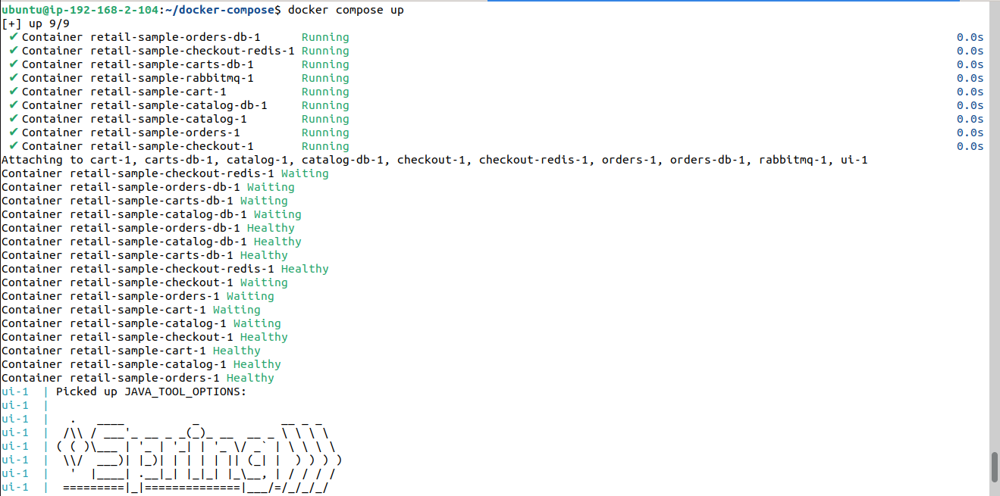

- UI of apps

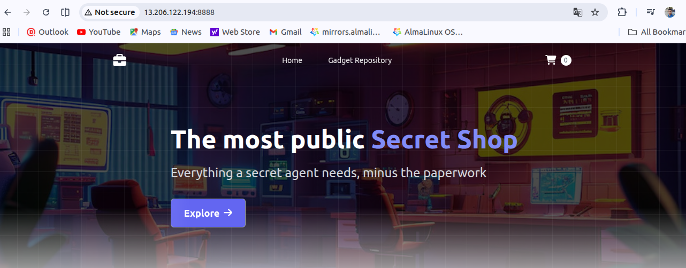


#####################
- Catelog Service trigger

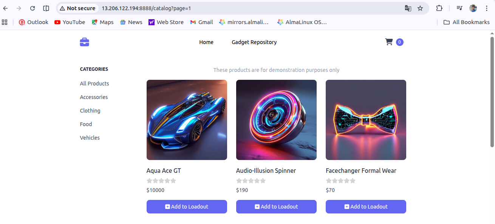

- After added product to cart, cart service trigger

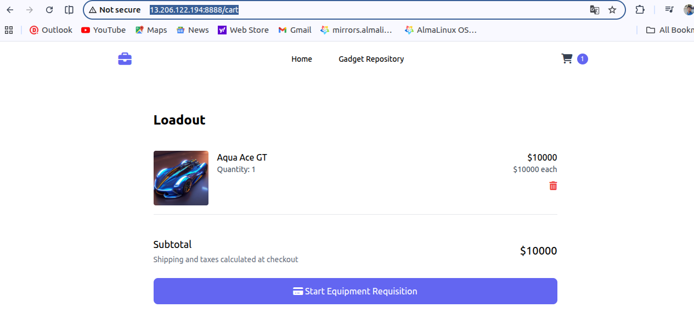

- After checkout , checkout service will trigger

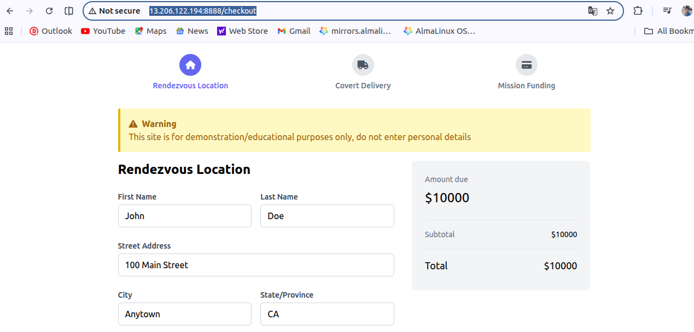

- Delivery service

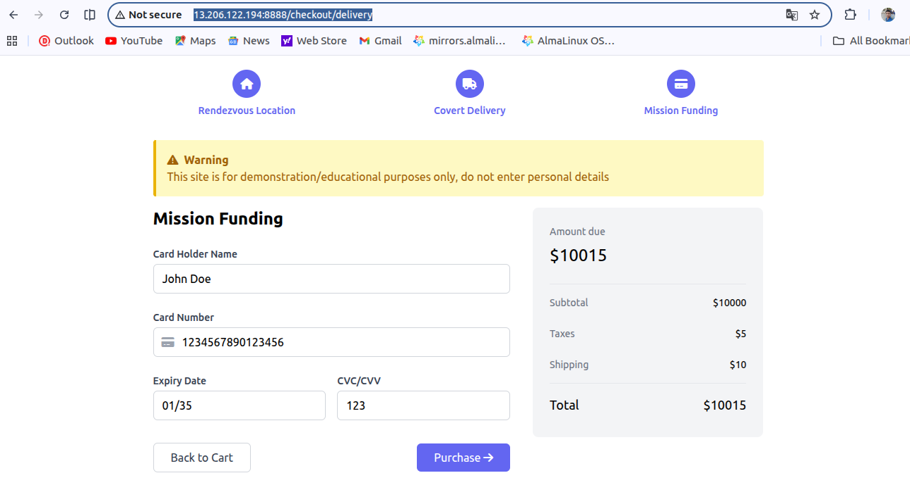

- Payment

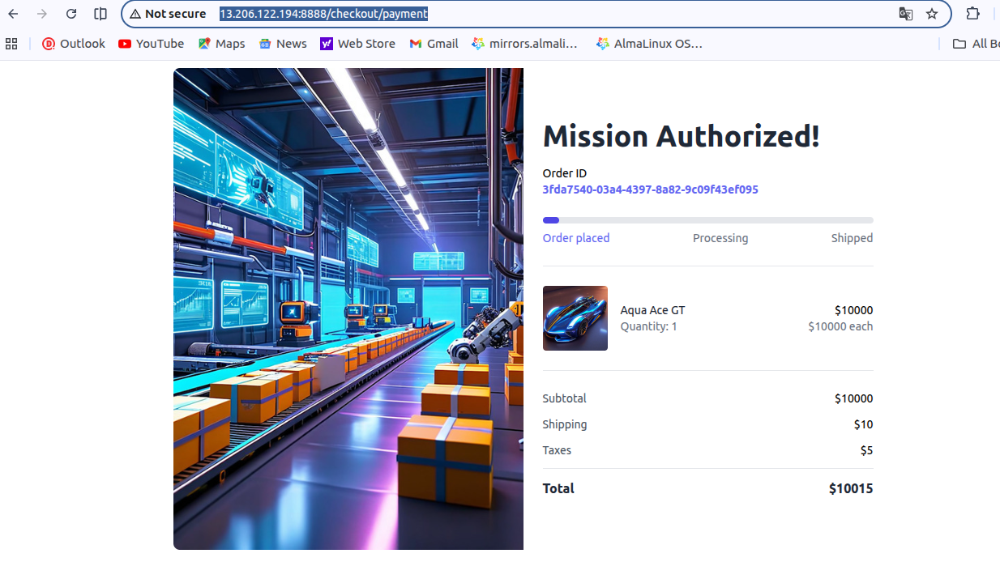

### Test Apps after Docker Compose Up

```bash
ec2_ip:8888
```

- Ensure all services are healthy by topology

```bash
ec2_ip:8888/topology
```

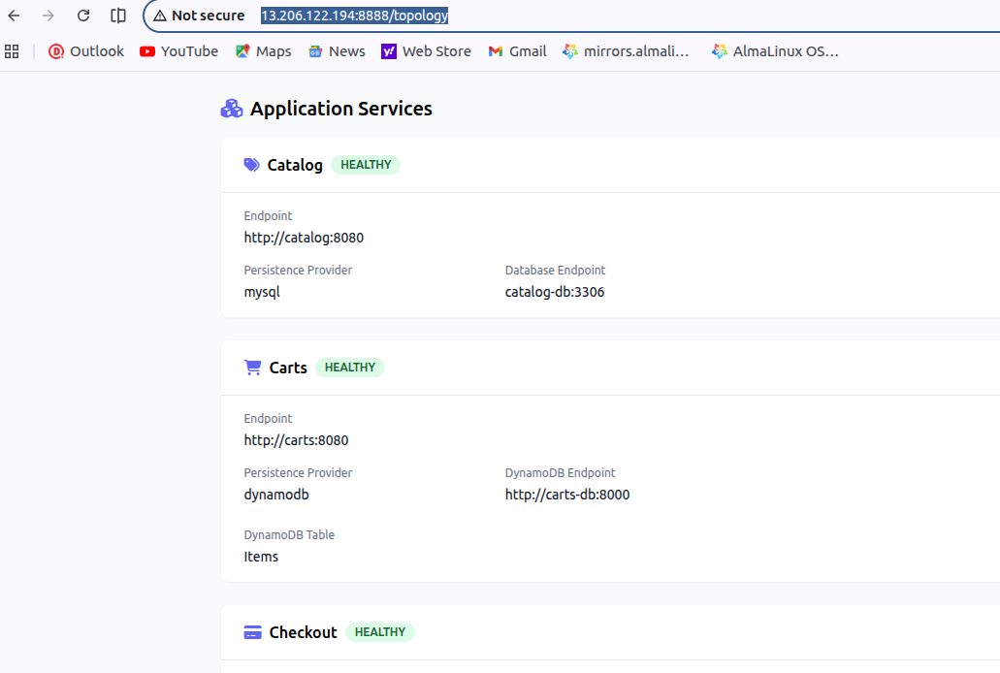


## Docker Compose Commands

1. List Running Services

```bash
docker compose ps
```

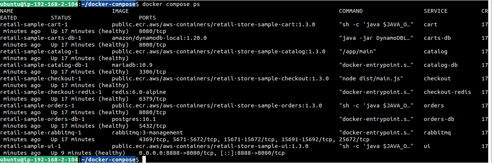

2. Stop/Start Single Services

```bash
docker compose stop orders

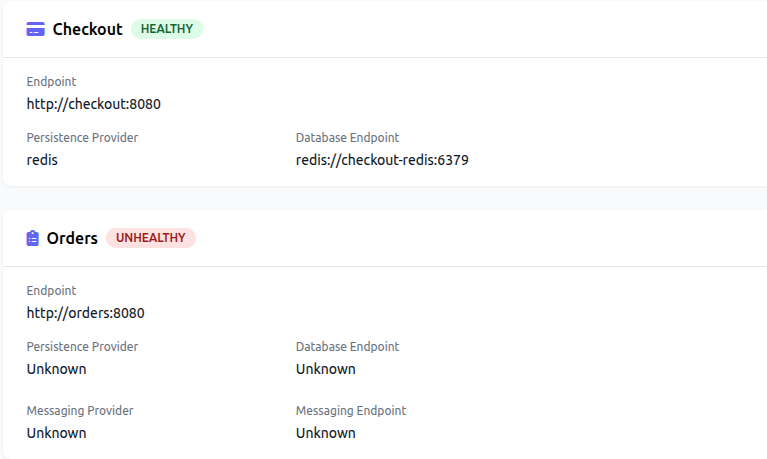

# Ensure it really Stopped ?
docker compose ps
docker compose ps -a

# Start it
docker compose start orders
```

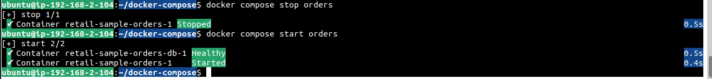

3. Restart a single service

```bash
docker compose restart cart

docker compose ps
```

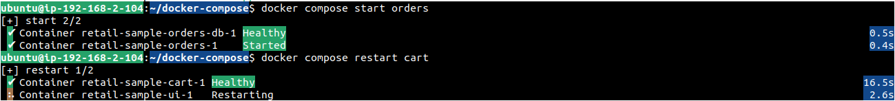

4. View logs of single service

```bash
# Logs for all services
docker compose logs

# Logs for a single service
docker compose logs checkout

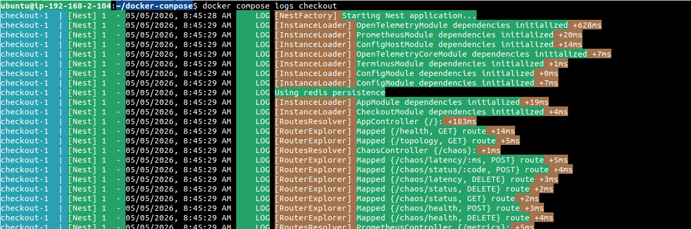

# Live Logs
docker compose logs -f checkout
```

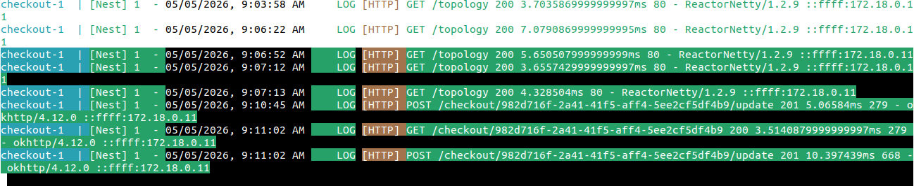


### Docker Compose Stats

- It will display a live stream of container resource usage

```bash
docker compose stats

docker compose stats <container_name>
docker compose stats ui
```

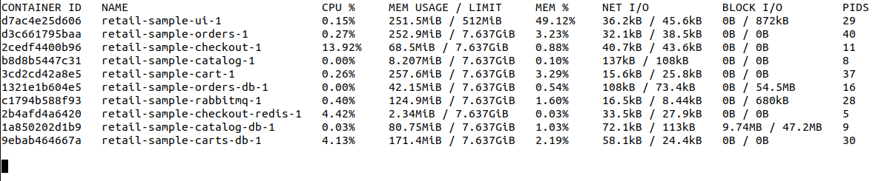


### Show current process in containers

```bash
# for all containers
docker compose top 

# for a single container
docker compose top ui
```

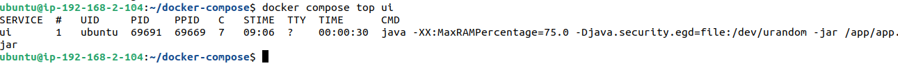


## Explore --force-recreate commands

- We will change in ui service and then we will up containers by docker compose to see its impact is really bring to new changes

- Bydefault our apps uses **Blue** color which is set to default.

- We can ensure by below table where default env has set for our **UI** Service.

| Name                              | Description                                                                 | Default                  |
|----------------------------------|-----------------------------------------------------------------------------|--------------------------|
| PORT                             | The port which the server will listen on                                   | 8080                     |
| RETAIL_UI_THEME                  | Name of the theme for the UI (default, green, orange, teal)                | "default"                |
| RETAIL_UI_DISABLE_DEMO_WARNINGS  | Disable the UI messages warning about demonstration content                | false                    |
| RETAIL_UI_PRODUCT_IMAGES_PATH    | Overrides the location of sample product images                            | ""                       |
| RETAIL_UI_ENDPOINTS_CATALOG      | Endpoint of catalog API (false = mock implementation)                      | false                    |
| RETAIL_UI_ENDPOINTS_CARTS        | Endpoint of carts API (false = mock implementation)                        | false                    |
| RETAIL_UI_ENDPOINTS_ORDERS       | Endpoint of orders API (false = mock implementation)                       | false                    |
| RETAIL_UI_ENDPOINTS_CHECKOUT     | Endpoint of checkout API (false = mock implementation)                     | false                    |
| RETAIL_UI_CHAT_ENABLED           | Enable the chat bot UI                                                     | false                    |
| RETAIL_UI_CHAT_PROVIDER          | Chat provider (bedrock, openai, mock)                                      | ""                       |
| RETAIL_UI_CHAT_MODEL             | Chat model to use (depends on provider)                                    | ""                       |
| RETAIL_UI_CHAT_TEMPERATURE       | Model temperature                                                          | 0.6                      |
| RETAIL_UI_CHAT_MAX_TOKENS        | Maximum response tokens                                                    | 300                      |
| RETAIL_UI_CHAT_PROMPT            | Model system prompt                                                        | (see source)             |
| RETAIL_UI_CHAT_BEDROCK_REGION    | Amazon Bedrock region                                                      | ""                       |
| RETAIL_UI_CHAT_OPENAI_BASE_URL   | Base URL for OpenAI endpoint                                               | http://localhost:8888    |
| RETAIL_UI_CHAT_OPENAI_API_KEY    | API key for OpenAI endpoint                                                | ""                       |

- **We will change default blue to like `Green` color**.

- Go to container named `ui` in docker compose.

- Add env `RETAIL_UI_THEME=green`.

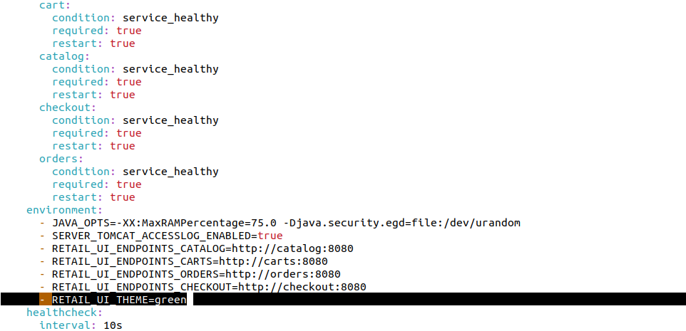

- stop and start ui containers.

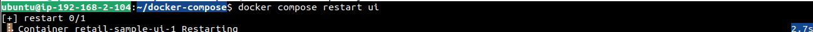

- **Will it changed from blue to Greens ?**

- `NO`.


`Lets See on UI`.


**Bcz, To bring new changes in docker container, `IT MUST RECREATED THE CONTAINERS`**.

- You can ensure directly by exec to grep all env.

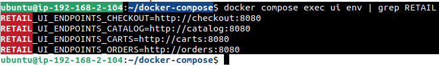

- Still it has not added new env here.

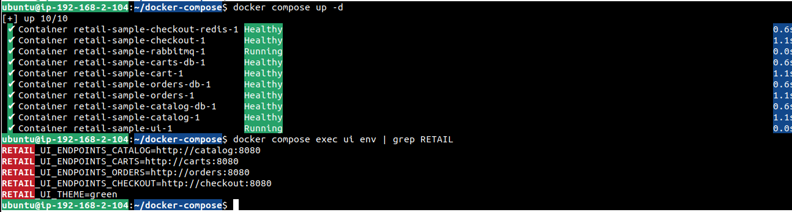

- `Use --force-recreate to bring new changes`

```bash
docker compose up -d --force-recreate ui
```

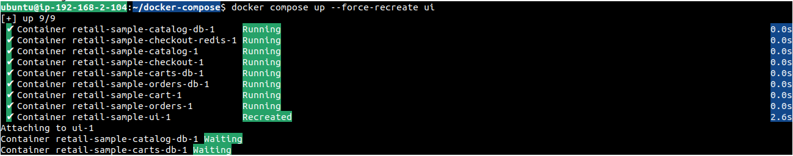

- Go to UI

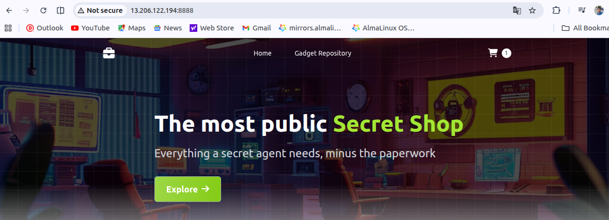

```bash
docker compose exec ui | grep RETAIL
```

- It should show new added envs

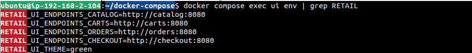


# Builx - Multi-platform Docker Image

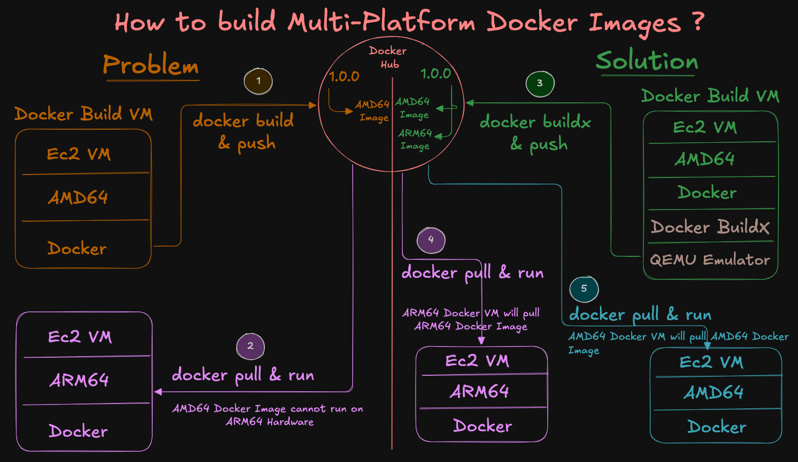

- For instance, we build docker image on platform of `AMD64` EC2 and push to docker hub repo.

- Same Docker Image we pulled into another EC2 which has platform of `ARM64`.

- This image will never work on `ARM64`.

- This is key challanges we are facing todays.

- For that we have to build `Multi Platform Docker Image` by usig **buildx**.

- `builx` uses **QEMU Emulator** which is generally slows to build images.

- **QEMU Emulator** can help us to build multi-platform docker image with `Same docker image tag like 1.0.0` which will have both image `ARM64` and `AMD64`.

- Whenever you pull docker image with same tag `1.0.0` in ec2 it will pull based on your EC2 platform.

## Procedure for buildx multi-platform docker image

### Step 1: Check your platform

- Check our platform

```bash
uname -m
# x86_64 - which is AMD64
```

### Step 2: Ensure Buildx is available

```bash
docker buildx version
# github.com/docker/buildx v0.33.0 f7897eba028583e0071642db3c011e860444f8cf

export DOCKER_BUILDKIT=1
```

### Step 3: Install QEMU Emulator

```bash
# Reinstall QEMU binfmt handlers
docker run --privileged --rm tonistiigi/binfmt --install all

# OR explicitly for arm64 + amd64
docker run --privileged --rm toinstiigi/binfmt --install arm64,amd64
```

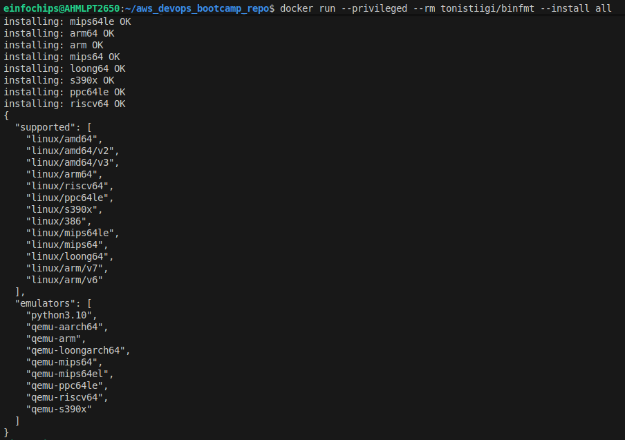

### Step 4: Create a containerized Buildx builder

```bash
# Create a new multiarch builder that uses BuildKit in a container
docker buildx create --name multiarch --driver docker-container --use

# To activate this multiarch Buildx QEMU Emulator you will required to Bootstrap to detect all supported platforms
docker buildx inspect --bootstrap

# List Buildx Builders
docker buildx ls
```

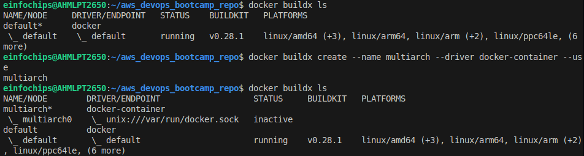


### Step 5: Docker hub login & Variables

```bash
export DOCKERHUB_USER="bhavin1099"
export DH_REPO="retail-ui-multiarch"
export TAG="1.0.0"

export IMAGE="${DOCKERHUB_USER}/${DH_REPO}:${TAG}"
echo $IMAGE

# Loing to Docker Repo
docker login -u "${DOCKERHUB_USER}"
```

## Step 6: Use your App Code to Build Buildx

```bash
# create dir
mkdir demo-multiarch
cd demo-multiarch

# Download App code
wget https://github.com/aws-containers/retail-store-sample-app/archive/refs/tags/v1.3.0.zip

# Unzip Application Source
unzip v1.3.0.zip

# Change Directory to UI Source folder
cd retail-store-sample-app-1.3.0/src/ui
cat Dockerfile
```

### Step 7: Build Buildx Docker Image

```bash
DOCKER_BUILDKTI=1 docker buildx build \
  --platform linux/arm64,amd64 \
  -t "${IMAGE}" \
  --push .

# This image will build for linux arm64 aned linux amd64 platform
```


