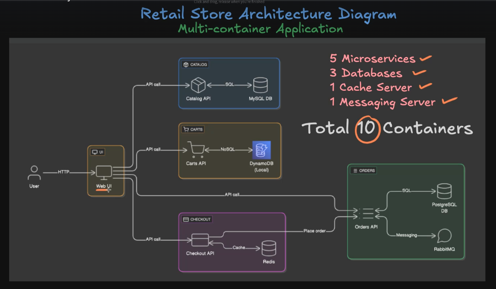
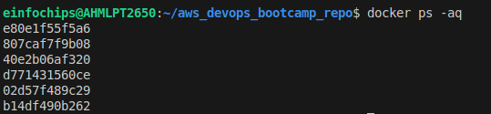
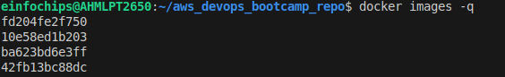
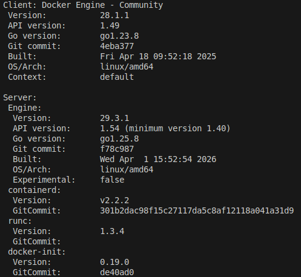
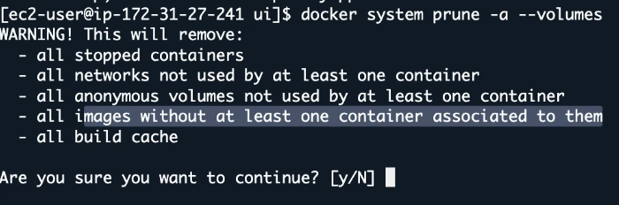
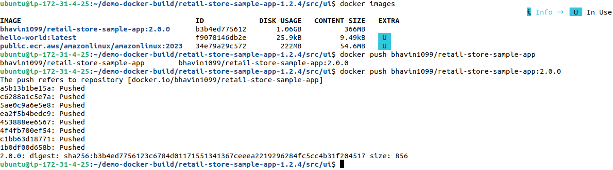
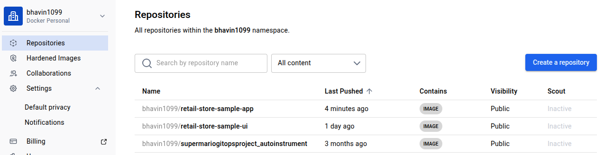
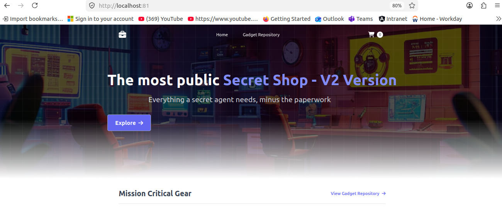
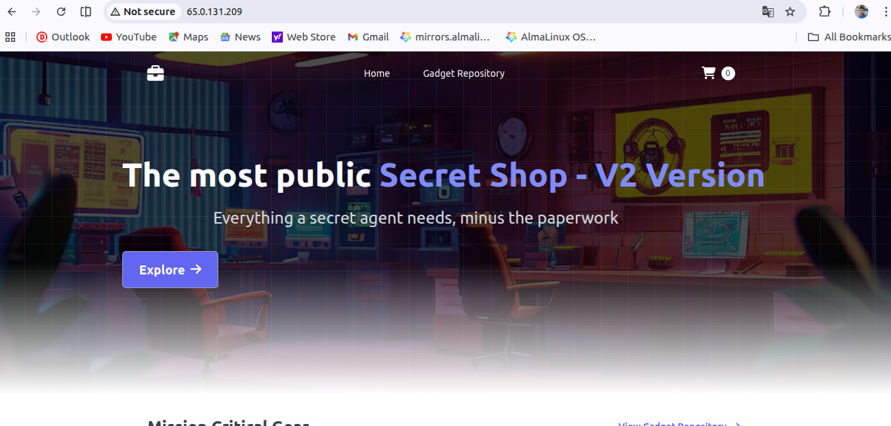
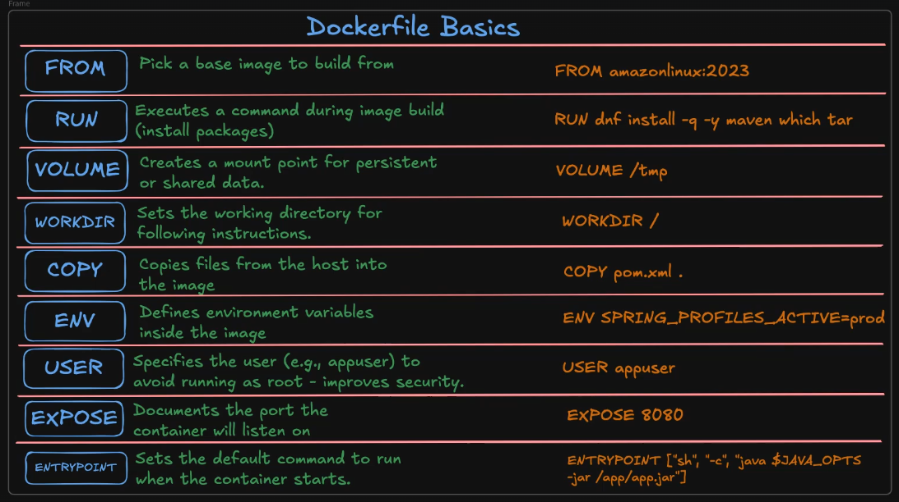

We have 5 diff microservices, 3 databases, 1 cache server, 1 Messaging server

so 10 containers will runs.

Take a real retailer applications like aws, flipkart.

While you visist this web/apps , first they should shows/visible their product from database.

- For that `catalog api` will use to show and lists all available product on web ui.

While you Add any of products into Carts or WishLists, it will added to the cart. So, Product Purchase/Added to Carts info. will stored into `DynamoDB`.

- To shows Added to cart / WishLists, we will use `Cart API`.

While you purchase products, its Purchase Info will stored into the Redis Cache `ElastiCache Redis`.

- While you Place the order by conform Payment and Billing Address, it will stores into the `PostgreSQL DB`


**Docker Commands**

1. List available all images in local

```bash
docker images
```

2. List all Running state Containers

```bash
docker ps
```

3. List all State of Containers Exited, Running, Stopped

```bash
docker ps -a
```

4. Show only Containers ID

```bash
docker ps -aq
```



5. Remove all stopped containers

```bash
docker rm $(docker ps -aq)
```

6. Remove docker images 

```bash
docker rmi <Image_Name> or <Image_ID>
```

7. List all Images ID

```bash
docker images -q
```



8. List all available images which is not used by any of conatiners

```bash
docker rmi $(docker images -q)
```

9. Show where your docker host and docker client has installed

```bash
docker version
```




10. Ensure Images are Exists in Docker Hub.

- Ensure from CLI

```bash
docker manifest inspect stacksimplify/retail-store-sample-ui:1.0.0

docker manifest inspect stacksimplify/retail-store-sample-ui:2.0.0
```

11. Run Containers


```bash
docker run --name <Container_Name> -p <Host_Port>:<Container_Port> -d <Image_Name>:<Tag>

docker run --name myapp1 -p 8888:80 -d stacksimplify/retail-store-sample-ui:1.0.0
```

12. Build with no-cache

```bash
docker build -t bhavin1099/retail-store-sample-ui:2.0.0-no-cache
```

13. Remove all build cache

```bash
docker builder prune

# It will ask for your permissions to confirm that you want to clean cache or not.

# To skip this steps
docker builder prune -f
```

14. Remove all build cache (including unused images and layers)

```bash
docker builder prune --all
```

15. clean Everything Unused (Stopped containers, Volumes, Cache, Images)

```bash
docker system prune

#  Including Volumes
docker system prune --volumes

docker system prune -a --volumes
```



**Docker Terminology**

- **Docker Hosts** - where your docker deamon exists/runnings . Ex. My PC , My EC2 Instance where i have installed Docker.

- So, My Docker Hosts is My PC or My EC2 Instances.

- **Docker Client** - where your docker commands executes by connecting to `Docker Hosts`.

- **Docker Deamon** - Its a Docker Engine installed in my Docker Hosts.

**We will make retailer apps changes and Push to Docker Hub**

```bash

# Download App sources
curl https://github.com/aws-containers/retail-store-sample-app/archive/refs/tags/v1.2.4.zip


# unzip it
unzip retail-store-sample-app-1.2.4

cd retail-store-sample-app-1.2.4/src/ui/src/main/resources/templates
```

**We will make changes in this home.html**

```bash
# Before
The most public <span class="text-primary-400">Secret Shop</span>

# After
The most public <span class="text-primary-400">Secret Shop - V2 Version</span>          
```

```bash
# use sed command to changes

sed -i 's/Secret Shop<\/span>/Secret Shop - V2 Version<\/span>/' home.html
```

**Build Docker Image and Push to Docker Hub**

- Go to UI dir where `Dockerfile` is present.

```bash
docker build -t bhavin1099/retail-store-sample-app:2.0.0

# login to docker repo
docker login

docker push bhavin1099/retail-store-sample-app:2.0.0
```



**Varify in docker repo**



**Test v2 app in local first**

`I will use host port is 81`

```bash
docker run --name myapp2 -p 81:8080 -d bhavin1099/retail-store-sample-app:2.0.0
```



**In EC2**




**Tag Docker image to your Docker Repo**

```bash
docker tag retail-store-sample-ui:1.0.0 bhavin1099/retail-store-sample-ui:2.0.0
```


**Docker Instructions**




## Docker Compose

- Docker Compose is a simplified orchestrations for microservices

`Dependencies`

Q-1 How do i ensure catalog service starts only after catalog-db is healthy ?

Q-2 What if orders-db is not ready and orders API crashes ?

`Configuration & Maintainanbility`

Q-1 Where do i define container settings like ports, volumes, env vars ?

Q-2 How do i make the setup repeatable for my team ?

`Deployment Challenges`

Q-1 How do i start everything with one command ?

`Networking`

Q-1 How do services talk to each other - UI to Cart, Cart to DB ?

Q-2 Do i need to create and manage custom docker networks manually ?

`Dev lifecycle`

Q-1 How can i test the whole system locally  end-to-end ?

Q-2 Can i tear it all down with a single command ?

**Multi-Container Start-Up**

```bash
docker compose up
# Start 10 containers in one shot
```

**Multi-Container Stop**

```bash
docker compose down
```

**Dependencies**

- Compose supports **depends_on** and also supports to `health checks` to control start up orders.

`This is your questions ans`

`Q-1 How do i ensure catalog service starts only after catalog-db is healthy ?`

- By defining health check you can ensure catalog services will start only after if your catalog-db's health check passed.

- Docker Compose will wait for service become healthy before start another service/container which is depends on that services (where you have defined health check)

`Docker Compose files structure`

```yml
name: retail-sample
network: # define default network name here
  default:
    name: retail-sample_default

services: # define all containers and its configurations like ports, services etc
  cart:
    cap_add:
      - NET_BIND_SERVICE
    cap_drop:
      - all
    depends_on:
      carts-db:
        condition: service_healthy # Define healthcheck of carts-db is healthy then and then this cart service will start
        required: true
    
    environment:
      - SERVER_TOMCAT_ACCESSLOG_ENABLED=true
      - RETAIL_CART_PERSISTENCE_PROVIDER=dynamodb
      -  RETAIL_CART_PRESISTENCE_DYNAMODB_ENDPOINT=http://carts-db:8000
      - RETAIL_CART_PERSISTENCE_DYNAMODB_CREATE_TABLE=true
      - AWS_ACCESS_KEY_ID=key
      - AWS_SECRET_ACCESS_KEY=dymmy

    healthcheck:
      interval: 10s
      retries: 3
      start_period: 15s # This gives the service 15 seconds to warm up before health check starts
      test:
        - CMD_SHELL
        - curl -f http://localhost:8000/actuator/health || exit 1
      timeout: 10s

    hostname: carts
    networks:
      default: null

    ports: []

    read_only: true
    restart: always
    security_opt: 
      - no-new-privileges: true
    
    tmpfs:
      - /tmp:rw,noexec,nosuid
    
    image: public.ecr.aws/aws-containers/retail-store-sample-cart:1.3.0

  carts-db:
    cap_add: # Add capability of linux for file permissions
      - CHOWN
      - SETGID
      - SETUID
    
    cap_drop:
      - all

    # for health check
    healthcheck:
      interval: 5s
      retries: 3
      test:
        - CMD-SHELL
        - exit 0
      timeout: 15s

    hostname: carts-db # set hostname of your this dynamodb conatiners

    image: amazon/dynamodb-local:1.20.0

    # attach netwrok here
    networks:
      default: null
    
    # filesystem is locked as read-only mode

    read_only: true
    restart: always # container will always restarts while it failed.

    tmpfs:
      - /tmp:rw,noexec,nosuid
    
```