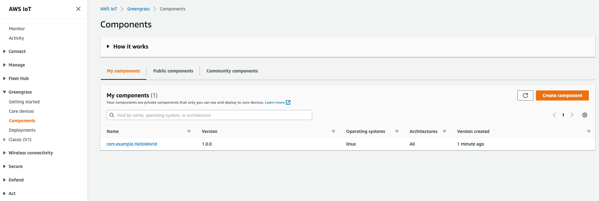
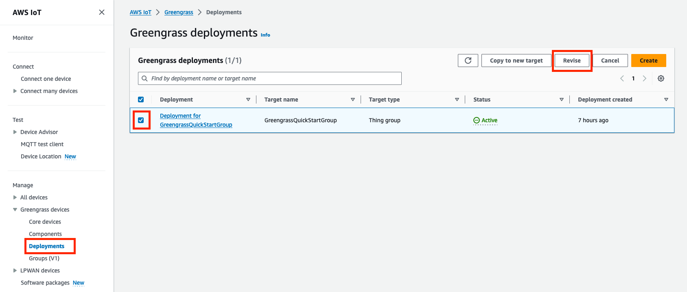
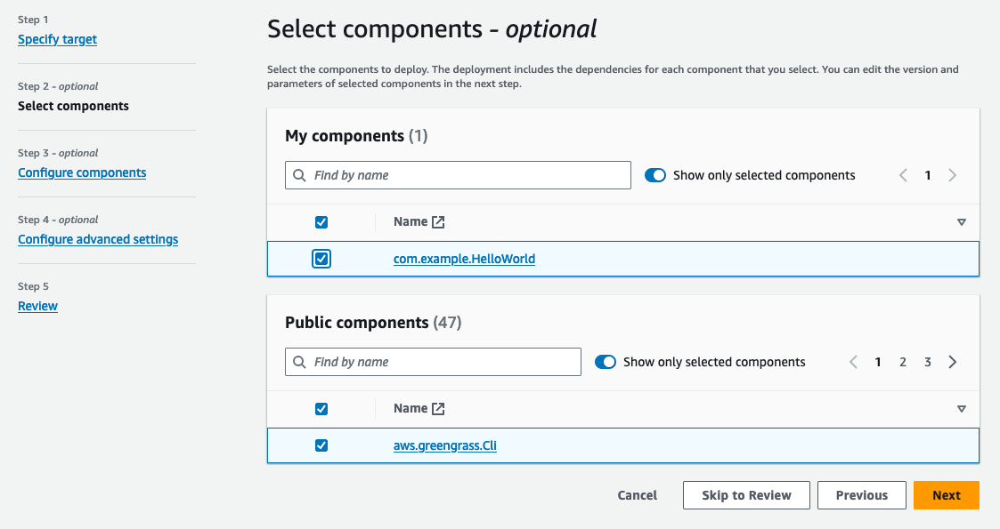
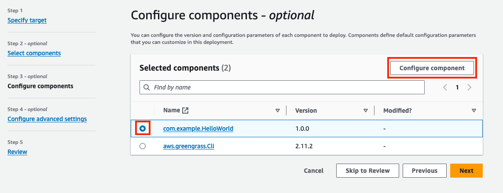

# AWS IoT Greengrass V2 - Core Concepts

- AWS IoT Greengrass is a tool from Amazon that helps you run software directly on "edge devices" (like a smart camera, a factory sensor, or a mini-computer like a Raspberry Pi) rather than running everything up in the cloud. 


## 🏗️ Main Concepts

### 1. Greengrass Core Device
This is your physical hardware (the device on your desk or in a factory) that has the Greengrass software installed on it. Once installed, AWS treats this device as an "IoT Thing" that it can talk to and manage.

### 2. Components
Think of components as the Lego blocks of your software. Instead of writing one massive, messy program, you break your code into smaller, reusable pieces.

*   **The Nucleus:** This is the most important component. It is the mandatory "brain" or engine that manages all the other Lego blocks, handles updates, and lets components talk to each other locally.
*   **Optional/Pre-built Components:** Ready-made blocks provided by AWS so you don't have to write code from scratch (e.g., blocks for streaming data or running a machine learning model).
*   **Custom Components:** Blocks you build yourself using your own code, Docker containers, or Lambda functions.

### 3. Recipes and Artifacts
To make a component, you need two things:
*   **Recipe:** A simple text file (JSON or YAML configuration) that explains what the component is, what it needs to run, and how it should behave.
*   **Artifact:** The actual muscle—the code, script, or binary file that does the real work.

### 4. Dependencies

- This is how components rely on each other. 
- If Component A (like a data processor) needs Component B (an encryption tool) to work, Greengrass links them. 
- If you update the encryption tool, Greengrass automatically restarts the data processor so everything keeps working smoothly.

### 5. Deployment

- This is the process of pushing your components and configurations from the AWS cloud down to your physical devices. 
- If you have 100 devices in the field, you can deploy your software to all of them at once through the AWS console.


## 💡 Why Use It?

- It allows your devices to make decisions locally and instantly without waiting for a round-trip internet connection to the cloud, and it keeps them running even if the internet goes down temporarily.

## 🛠️ Workshop Project: What You Are Going to Build (1.1)

Here is exactly what you will do step-by-step:

1. **Install the Core Engine:** You will download and set up the main AWS IoT Greengrass software onto your virtual machine so it can act as the "brain."
2. **Build Local Communicators:** You will create two custom, small blocks of software that talk directly to each other on the device without needing the internet.
   * **The Publisher:** A software block that sends out data.
   * **The Subscriber:** A software block that listens for and catches that data.
3. **Bridge to the Cloud:** You will set up an "MQTT bridge." This acts like a data highway that lets your local device easily pass its messages up to the AWS Cloud when it needs to.


### 2.3 Greengrass Service Role

- To allow the Greengrass cloud service to securely verify your local devices and manage their connection info, you have to assign it an ID badge called a **Service Role**. 

- In this step, you install a utility command (`jq`) in your terminal and run the provided AWS scripts to automatically create and link this permission role to your account.

- 1. Install jq

```bash
sudo apt install -y jq
```

- 2. Create GreenGrass service role

```bash
aws iam create-role --role-name Greengrass_ServiceRole --assume-role-policy-document '{
  "Version": "2012-10-17",
  "Statement": [
    {
      "Effect": "Allow",
      "Principal": {
        "Service": "greengrass.amazonaws.com"
      },
      "Action": "sts:AssumeRole",
      "Condition": {
        "ArnLike": {
          "aws:SourceArn": "arn:aws:greengrass:region:account-id:*"
        },
        "StringEquals": {
          "aws:SourceAccount": "account-id"
        }
      }
    }
  ]
}'
```

- 3. Associate the service role with the AWS IoT Greengrass service in your account and region.

```bash
ACCOUNT_ID=$(aws sts get-caller-identity | jq -r '.Account')
ROLE_ARN=$(aws iam get-role --role-name Greengrass_ServiceRole | jq -r '.Role.Arn')
aws greengrassv2 associate-service-role-to-account --role-arn $ROLE_ARN --region $AWS_DEFAULT_REGION
```

### 3.1 Greengrass Setup (How to Install the Core Engine)
To turn your Linux machine (the client EC2 / VS Code Server environment) into a Greengrass device, follow these exact steps:

1. **Go to the AWS Console:** Open the AWS IoT Core console in your browser and make sure your top-right Region matches your project area.
2. **Find the Menu:** On the left side menu, click on **Greengrass devices** and then choose **Core devices**.
3. **Start the Setup:** Click the button that says **Set up core device** (or **Set up one core device**).
4. **Name Your Device:** Give your device a name and a group name (or keep the default names AWS gives you).


5. **Pick the OS & Software:** Choose **Linux** as your platform and choose **Nucleus Classic** as your software type.


6. **Copy the Magic Command:** AWS will instantly show you a long text command on the screen. Click the copy button next to it.


7. **Run the Installer:** Open your VS Code terminal (your local/client EC2 environment), paste that command, and hit **Enter**.

**What happens next?** The script automatically downloads the software, creates security certificates so your device can safely talk to the cloud, installs the main **Nucleus** brain, and marks it as active!

- To check status of greengrass service

```bash
sudo systemctl status greengrass.service
```

- To start greengrass service

```bash
sudo systemctl enable greengrass.service
```

### 3.2 Core Device Role (Device Permissions)

- To allow your physical/virtual device to talk back to AWS Cloud services securely, it needs an IAM permission pass called a **Core Device Role**. 

*   **What it does:** It gives the device permission to upload local logs to AWS CloudWatch and pull required software deployment files down from Amazon S3 buckets.

*   **Workshop Note:** These IAM policies and roles have already been pre-built for your lab environment, meaning you don't need to manually configure them during this step.

* IAM Roles for core devices to perform action like send logs to S3 Bucket, access IoT Services etc

```json
# Create Policy workshop_s3_iot_gg_policy

{
    "Version": "2012-10-17",
    "Statement": [
        {
            "Sid": "S3BucketActions",
            "Effect": "Allow",
            "Action": [
                "s3:CreateBucket",
                "s3:GetBucketLocation",
                "s3:PutObject",
                "s3:GetObject"
            ],
            "Resource": [
                "arn:aws:s3:::ggcv2-workshop-*",
                "arn:aws:s3:::ggcv2-workshop-*/*"
            ]
        },
        {
            "Sid": "S3ListBuckets",
            "Effect": "Allow",
            "Action": [
                "s3:ListAllMyBuckets"
            ],
            "Resource": "*"
        },
        {
            "Sid": "IoTActions",
            "Effect": "Allow",
            "Action": [
                "iot:*"
            ],
            "Resource": "arn:aws:iot:*:*:*"
        },
        {
            "Sid": "GreengrassActions",
            "Effect": "Allow",
            "Action": [
                "greengrass:*"
            ],
            "Resource": "arn:aws:greengrass:*:*:*"
        }
    ]
}
```

### 4.1 Create components

- You have already installed greengrass software to your test ec2. So its become a IoT Device.

- Now we will run simple Hello.py which will print your name with current time.

- Create `Artifact/` dir and create hello.py

```bash
mkdir -p ~/environment/GreengrassCore/artifacts/com.example.HelloWorld/1.0.0 && touch ~/environment/GreengrassCore/artifacts/com.example.HelloWorld/1.0.0/hello_world.py
```

- Edit hello.py

```py
# Copyright Amazon.com, Inc. or its affiliates. All Rights Reserved.
# SPDX-License-Identifier: MIT-0
import sys
import datetime
import time

while True:

    message = f"Hello, {sys.argv[1]}! Current time: {str(datetime.datetime.now())}."

    # Print the message to stdout.
    print(message)

    # Append the message to the log file.
    with open('/tmp/Greengrass_HelloWorld.log', 'a') as f:
        print(message, file=f)

    time.sleep(1)
```

- Create `Recipe/` where all configuration for your component and help to execute your hello.py

**Recepies** - Will help to execute your hellp.py from local and from repote like S3 bucket.

### 4.2 Create Recipe

```bash
mkdir -p ~/environment/GreengrassCore/recipes && touch ~/environment/GreengrassCore/recipes/com.example.HelloWorld-1.0.0.json
```

```py
{
   "RecipeFormatVersion": "2020-01-25",
   "ComponentName": "com.example.HelloWorld",
   "ComponentVersion": "1.0.0",
   "ComponentDescription": "My first AWS IoT Greengrass component.",
   "ComponentPublisher": "Amazon",
   "ComponentConfiguration": {
      "DefaultConfiguration": {
         "Message": "world"
      }
   },
   "Manifests": [
      {
         "Platform": {
            "os": "linux"
         },
         "Lifecycle": {
            "Run": "python3 -u {artifacts:path}/hello_world.py '{configuration:/Message}'\n"
         }
      }
   ]
}
```

### 4.3 Publish component

- Publish component recipe into your s3 as zip file and from S3 use this unzip file hello.py to execute on your greengrass IoT Device EC2.

- Go to IoT GreenGrass > Component > Create recipe.

```py
{
   "RecipeFormatVersion": "2020-01-25",
   "ComponentName": "com.example.HelloWorld",
   "ComponentVersion": "1.0.0",
   "ComponentDescription": "My first AWS IoT Greengrass component.",
   "ComponentPublisher": "Amazon",
   "ComponentConfiguration": {
      "DefaultConfiguration": {
         "Message": "world"
      }
   },
"Manifests": [
      {
         "Platform": {
            "os": "linux"
         },
         "Lifecycle": {
            "Run": "python3 -u {artifacts:path}/hello_world.py '{configuration:/Message}'\n"
         },
         "Artifacts": [
            {
               "URI": "s3://[YOUR BUCKET NAME]/artifacts/com.example.HelloWorld/1.0.0/hello_world.py"
            }
         ]
      }
   ]
}
```

- Upload your zip hello.py on S3.

```bash
aws s3 cp --recursive ~/environment/GreengrassCore/ s3://$S3_BUCKET/
```



### 4.4 Deploy Components

- Go the AWS IoT Core console and select Greengrass devices -> Deployments. Check Deployment for GreengrassQuickStartGroup and click Revise:



- In Step 1 - Specify target, you can leave all values as default.

- In Step 2 - Select components, select the com.example.HelloWorld component. Leave the public component aws.greegrass.Cli checked (otherwise it would be uninstalled).



- In Step 3 - Configure components, select your custom component and choose Configure component:




- Leave all other options as default and choose Confirm.

- Review and deploy it.

- **Now go to your EC2 Component VS Code**

- **Execute this to ensure your components is working after deploy**

```bash
tail -F /tmp/Greengrass_HelloWorld.log

#OutPut
Hello, this was deployed from AWS IoT Core! Current time: 2023-08-28 07:24:00.406775.
```

## 5. Publisher and Subscriber

### 5.1 Publisher Implementations

- We will create a DymmySensor which will create a randome nearet value for mean=1000, variance=20.

This data will be shared to `Topic` named `my/topic` GreenGrasssV2 Components.

`Msg` will like this `12 July 2026, 998.10`.

- Create dummy_sensor.py

```py
# Copyright Amazon.com, Inc. or its affiliates. All Rights Reserved.
# SPDX-License-Identifier: MIT-0
from random import gauss

class DummySensor(object):
    def __init__(self, mean=1000, variance=20):
        self.mu = mean
        self.sigma = variance
        
    def read_value(self):
        return float("%.2f" % (gauss(self.mu, self.sigma)))

if __name__ == '__main__':
    sensor = DummySensor()
    print(sensor.read_value())
```

- Create example_publisher.py

```py
# Copyright Amazon.com, Inc. or its affiliates. All Rights Reserved.
# SPDX-License-Identifier: MIT-0
import time
import datetime
import json
from awsiot.greengrasscoreipc.clientv2 import GreengrassCoreIPCClientV2
from awsiot.greengrasscoreipc.model import (
    PublishMessage,
    JsonMessage
)
from dummy_sensor import DummySensor

TIMEOUT = 10
publish_rate = 1.0

# Create the IPC client using V2
ipc_client = GreengrassCoreIPCClientV2()

sensor = DummySensor()

topic = "my/topic"

while True:
    message = {"timestamp": str(datetime.datetime.now()),
               "value": sensor.read_value()}

    # In V2, we can directly publish to a topic without creating a request object
    # Create the JsonMessage and PublishMessage
    json_message = JsonMessage(message=message)
    publish_message = PublishMessage(json_message=json_message)

    # Publish directly using the client
    ipc_client.publish_to_topic(
        topic=topic,
        publish_message=publish_message
    )

    print(f"Message published is {publish_message}")
    time.sleep(1/publish_rate)
```

- Create `receipe` folder.

```bash
mkdir -p ~/environment/GreengrassCore/recipes/ && cd ~/environment/GreengrassCore/recipes/
touch ~/environment/GreengrassCore/recipes/com.example.Publisher-1.0.0.json 
```

- Create receipe and use in a publisher components.

- This will installed Pre-Requisites (awsiotsdk, numpy) on each Components IoT Devices using "Script".

- This will run a Publisher Script on a each devices by "Run".


```json
{
  "RecipeFormatVersion": "2020-01-25",
  "ComponentName": "com.example.Publisher",
  "ComponentVersion": "1.0.0",
  "ComponentDescription": "A component that publishes messages.",
  "ComponentPublisher": "Amazon",
  "ComponentConfiguration": {
    "DefaultConfiguration": {
      "accessControl": {
        "aws.greengrass.ipc.pubsub": {
          "com.example.Publisher:pubsub:1": {
            "policyDescription": "Allows access to publish to all topics.",
            "operations": [
              "aws.greengrass#PublishToTopic"
            ],
            "resources": [
              "*"
            ]
          }
        }
      }
    }
  },
  "Manifests": [
    {
      "Lifecycle": {
        "Install": {
          "Script": "python3 -m venv .venv\n. .venv/bin/activate\npip install pip --upgrade\npip install awsiotsdk numpy",
          "Timeout": 600
        },
        "Run": {
          "Script": ". {work:path}/.venv/bin/activate\npython3 -u {artifacts:path}/example_publisher.py"
        }
      }
    }
  ]
}
```

